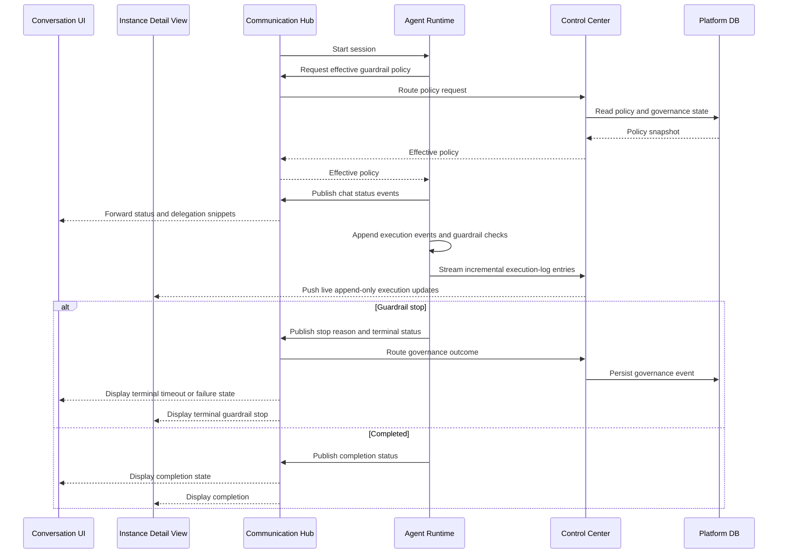
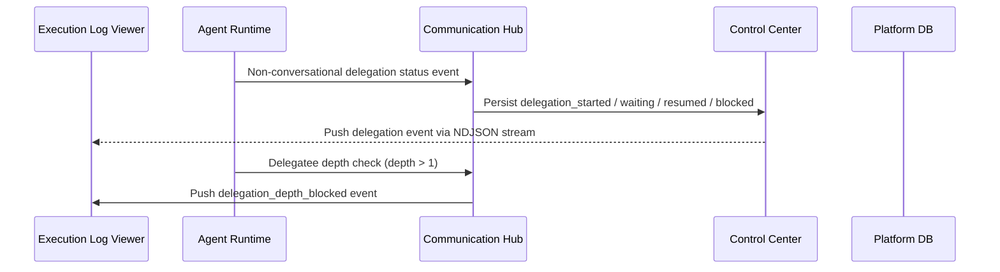
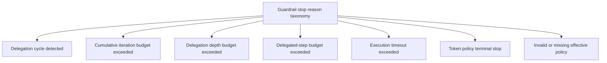

# Execution Logs

```mermaid
sequenceDiagram
    participant CHAT as Conversation UI
    participant UI as Instance Detail View
    participant CH as Communication Hub
    participant AR as Agent Runtime
    participant CC as Control Center
    participant DB as Platform DB

    CH->>AR: Start session
    AR->>CH: Request effective guardrail policy
    CH->>CC: Route policy request
    CC->>DB: Read policy and governance state
    DB-->>CC: Policy snapshot
    CC-->>CH: Effective policy
    CH-->>AR: Effective policy
    AR->>CH: Publish chat status events
    CH-->>CHAT: Forward status and delegation snippets
    AR->>AR: Append execution events and guardrail checks
    AR->>CC: Stream incremental execution-log entries
    CC-->>UI: Push live append-only execution updates
    alt Guardrail stop
        AR->>CH: Publish stop reason and terminal status
        CH->>CC: Route governance outcome
        CC->>DB: Persist governance event
        CH-->>CHAT: Display terminal timeout or failure state
        CH-->>UI: Display terminal guardrail stop
    else Completed
        AR->>CH: Publish completion status
        CH-->>CHAT: Display completion state
        CH-->>UI: Display completion
    end
```

```mermaid
sequenceDiagram
    participant LOG as Execution Log Viewer
    participant AR as Agent Runtime
    participant CH as Communication Hub
    participant CC as Control Center
    participant DB as Platform DB

    AR->>CH: Non-conversational delegation status event
    CH->>CC: Persist delegation_started / waiting / resumed / blocked
    CC-->>LOG: Push delegation event via NDJSON stream
    AR->>CH: Delegatee depth check (depth > 1)
    CH->>LOG: Push delegation_depth_blocked event
```

```mermaid
flowchart TB
    SR[Guardrail stop reason taxonomy]
    CYC[Delegation cycle detected]
    ITER[Cumulative iteration budget exceeded]
    DEP[Delegation depth budget exceeded]
    DSB[Delegated-step budget exceeded]
    TMO[Execution timeout exceeded]
    TOK[Token policy terminal stop]
    DEN[Invalid or missing effective policy]

    SR --> CYC
    SR --> ITER
    SR --> DEP
    SR --> DSB
    SR --> TMO
    SR --> TOK
    SR --> DEN
```

## Delegation Status Timeline

The execution log viewer includes a **Delegation Status Timeline** that renders delegation lifecycle events in real time. Events are emitted by the Agent Runtime for non-conversational agent executions:

- `delegation_started` — parent agent initiated delegation to a sub-agent (purple icon)
- `delegation_waiting` — sub-agent is executing, parent waiting (amber icon)
- `delegation_resumed` — sub-agent completed, parent resumed (green icon)
- `delegation_depth_blocked` — depth guard blocked sub-agent's delegation attempt (red icon)
- `delegation_timeout` — sub-agent exceeded timeout (red icon)
- `delegation_failed` — sub-agent encountered runtime error (red icon)

These events are delivered through the existing NDJSON live log stream and require no manual refresh. Previously persisted events are replayed on stream reconnect.

## Task Intervention Dialog

When a delegated sub-agent in a non-conversational execution calls `human_intervene`, the execution log viewer displays an **inline intervention dialog** at the event position in the timeline:

- **Approval mode**: Approve/Deny buttons
- **Choice mode**: Radio-button list with selectable options
- **Text mode**: Textarea with Submit button
- After response: "Response submitted" resolved state
- After expiry: "Request no longer valid" overlay with disabled controls

A persistent **Intervention Pending Banner** (sticky, top of log) appears when the inline dialog is dismissed or scrolled out of view while an intervention is pending. The banner includes a "Respond Now" button that scrolls to and focuses the inline dialog.
