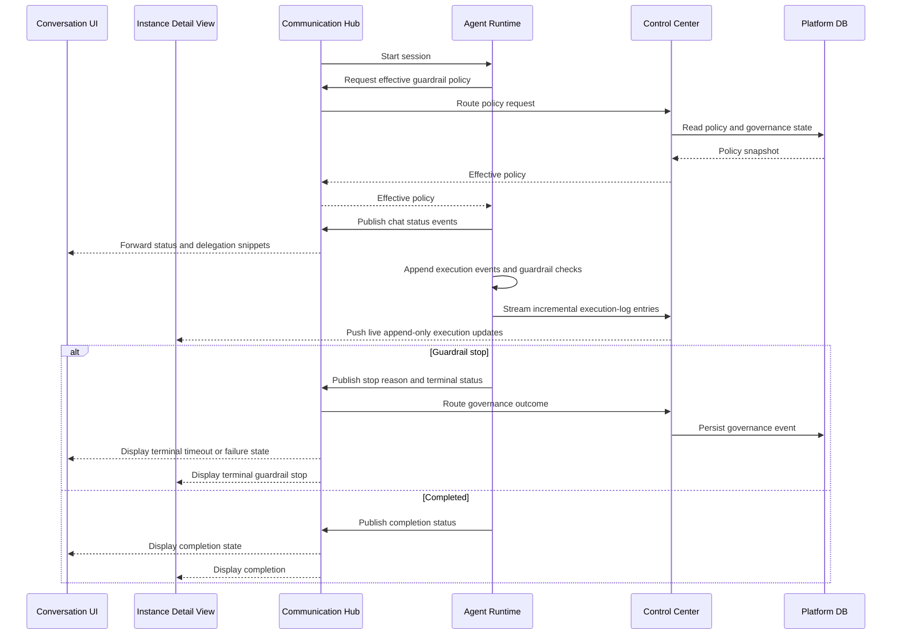
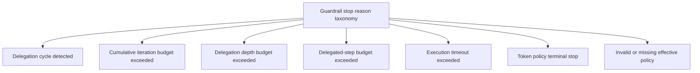

# Execution Logs

```mermaid
sequenceDiagram
    participant CHAT as Conversation UI
    participant UI as Instance Detail View
    participant CH as Communication Hub
    participant AR as Agent Runtime
    participant CC as Control Center
    participant DB as Platform DB

    CH->>AR: Start session
    AR->>CH: Request effective guardrail policy
    CH->>CC: Route policy request
    CC->>DB: Read policy and governance state
    DB-->>CC: Policy snapshot
    CC-->>CH: Effective policy
    CH-->>AR: Effective policy
    AR->>CH: Publish chat status events
    CH-->>CHAT: Forward status and delegation snippets
    AR->>AR: Append execution events and guardrail checks
    AR->>CC: Stream incremental execution-log entries
    CC-->>UI: Push live append-only execution updates
    alt Guardrail stop
        AR->>CH: Publish stop reason and terminal status
        CH->>CC: Route governance outcome
        CC->>DB: Persist governance event
        CH-->>CHAT: Display terminal timeout or failure state
        CH-->>UI: Display terminal guardrail stop
    else Completed
        AR->>CH: Publish completion status
        CH-->>CHAT: Display completion state
        CH-->>UI: Display completion
    end
```

```mermaid
flowchart TB
    SR[Guardrail stop reason taxonomy]
    CYC[Delegation cycle detected]
    ITER[Cumulative iteration budget exceeded]
    DEP[Delegation depth budget exceeded]
    DSB[Delegated-step budget exceeded]
    TMO[Execution timeout exceeded]
    TOK[Token policy terminal stop]
    DEN[Invalid or missing effective policy]

    SR --> CYC
    SR --> ITER
    SR --> DEP
    SR --> DSB
    SR --> TMO
    SR --> TOK
    SR --> DEN
```
