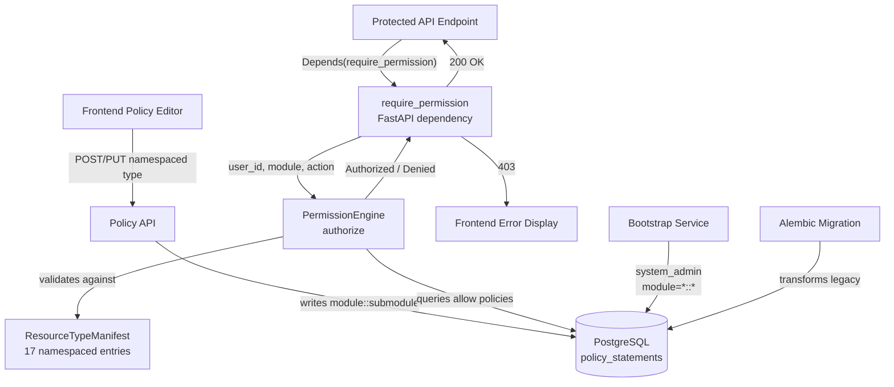
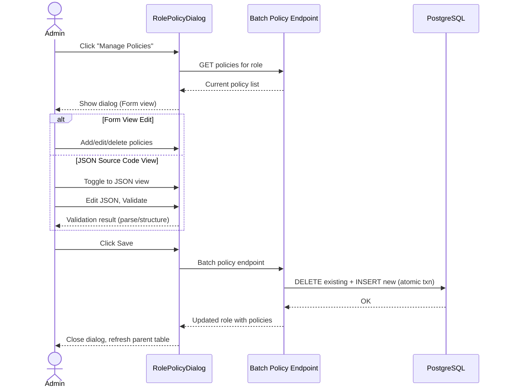

# Identity and Access Management (IAM)

## Overview

The IAM module governs user and agent identity, role assignment, and policy-based permission authorization. The permission enforcement model is **deny-by-default with policy-based allow**: a role is assigned policies, each policy declares allowed actions on resource types, and the Permission Engine resolves effective permissions at request time.

> **Note**: The core enforcement model (deny-by-default, policy-based allow, role → policy → resource resolution) is **unchanged** from the legacy system. The only difference is that resource type identifiers now use the `module::submodule` naming convention instead of flat identifiers.

## Authorization Flow

Policy creation and runtime authorization check flow through the same namespaced pipeline:

### Three-Level Wildcard Resolution

At authorization check time, the Permission Engine resolves effective permissions at three specificity levels, evaluated most-specific-first:

| Level | Pattern | What it Matches |
|---|---|---|
| Exact | `agent::roles` | Only the specified `module::submodule` |
| Module wildcard | `agent::*` | Any submodule under the specified module |
| Global wildcard | `*::*` | Every registered resource type |

Wildcards are additive — a role holding both `agent::*` and `system::audit` can access all agent submodules plus system audit.

## Component Responsibilities

| Component | Responsibility |
|---|---|
| **Permission Management UI** | Provides administrators with interfaces to manage user roles, policies, and resource permissions |
| **require_permission** | FastAPI dependency factory that resolves the authenticated user and calls `PermissionEngine.authorize()` with a `(resource_type, action)` tuple; raises `HTTPException(403)` on denial |
| **Permission Engine** | Central `authorize()` method that evaluates policy statements against the requested resource type and action; evaluates wildcard policies at three levels of specificity (exact match → module-level `agent::*` → global `*::*`) |
| **ResourceTypeManifest** | Central registry in `backend/app/core/resource_types.py` mapping all `module::submodule` resource types to their allowed actions; validated at startup; mirrored in the frontend as `RESOURCE_TYPE_MANIFEST` |
| **Policy Statements** | Database-backed policy rules linking user roles to allowed resources, actions, and optional tag conditions |

## Resource Type Naming Convention

All resource types follow the two-level namespaced format `module::submodule`:

| Module | Example Resource Types |
|---|---|
| `agent` | `agent::management`, `agent::roles`, `agent::identities`, `agent::trails`, `agent::data`, `agent::outputs`, `agent::skills`, `agent::sops`, `agent::model_configs`, `agent::schedules`, `agent::data_types`, `agent::api_keys`, `agent::human_intervention`, `agent::runtime_control` |
| `integration` | `integration::mcp_hub`, `integration::notifications` |
| `system` | `system::observability`, `system::permissions`, `system::system_config` |

## Key Flows

| Flow | Path |
|---|---|
| **API authorization** | Endpoint → `require_permission(resource_type, action)` → `PermissionEngine.authorize()` → ResourceTypeManifest validation → Policy Statement evaluation → Allow/Deny |
| **System startup** | `PermissionEngine` validates `ResourceTypeManifest` entries at init; unknown resource types are rejected before any wildcard evaluation |

## RolePolicyDialog: Batch Save Flow

Administrators manage role policies through the **RolePolicyDialog**, which replaces the legacy inline-table expansion pattern. The dialog supports two editing modes and commits all policies in a single atomic batch operation.

The batch policy endpoint serves both editor views through a single atomic transaction. Sending an empty array clears all policies for the role.

## Policy Input

Policy editors support both structured form-based input and raw JSON editing, with free-text wildcard pattern entry for custom resource type specifications. The frontend mirrors the backend `ResourceTypeManifest` to validate resource types at input time.

This pattern supports entering partial wildcards (`agent::mana*`), module wildcards (`agent::*`), global wildcards (`*`), and exact namespace matches — either by selecting from the grouped dropdown or by typing directly. The Autocomplete component renders manifest options grouped by module (Agents, Integrations, System) while accepting free-text input that passes through to the API unchanged.
