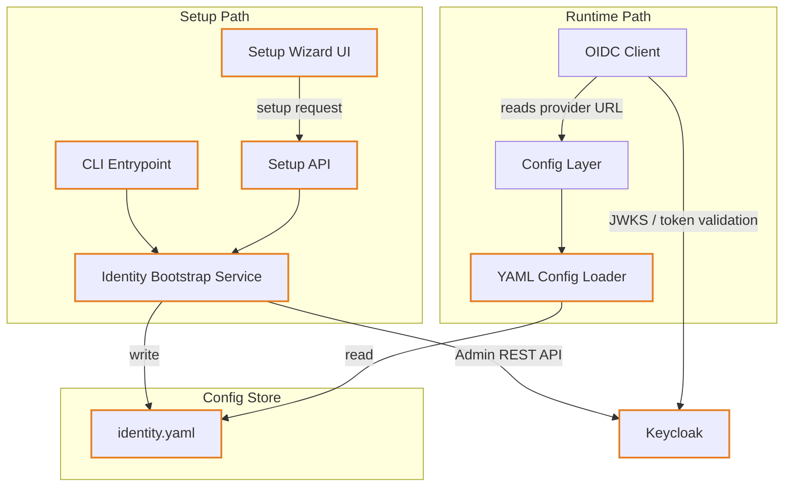

# Identity

## Overview

Identity is a foundational concern that controls authentication for all users and agent types. The platform ships with a bundled Keycloak instance that is provisioned automatically on first run. Operators may replace Keycloak with any external OIDC-compliant provider by supplying the provider URL and credentials during setup. All runtime token validation is handled by the OIDC Client, which resolves its configuration from a merged YAML-plus-environment-variable config layer.

## Component Architecture

> **Legend** — Orange border: new component introduced by the Keycloak Identity Bootstrap change

## Component Responsibilities

| Component | Responsibility |
|---|---|
| **Setup Wizard UI** | React multi-step wizard shown on first run; guides the admin through provider selection, credentials entry, and verification |
| **CLI Entrypoint** | Headless alternative to the wizard; accepts provider type and credentials as arguments and delegates to the Identity Bootstrap Service |
| **Setup API** | Unauthenticated REST endpoints (`/setup/identity-status`, `/setup/identity`) consumed by the wizard and CLI to check configuration state and trigger provisioning |
| **Identity Bootstrap Service** | Orchestrates first-run detection; provisions the Keycloak realm, clients, and initial admin user via the Keycloak Admin REST API; persists resolved settings to `identity.yaml` |
| **YAML Config Loader** | Reads `config/identity.yaml` and merges with environment-variable overrides; exposes resolved OIDC settings to the Config Layer |
| **Config Layer** | Unified settings object for the backend; delegates OIDC settings to the YAML Config Loader |
| **OIDC Client** | Singleton that validates tokens via JWKS and performs token introspection; resolves its provider URL dynamically from the Config Layer, enabling provider switching without restart |
| **Keycloak** | Default bundled OIDC provider; hosts the Parthenon realm, issues access and refresh tokens, and exposes the Admin REST API for provisioning |
| **identity.yaml** | Persistent config file written by the Identity Bootstrap Service; contains the active provider URL and client credentials |

## Provider Modes

| Mode | Description |
|---|---|
| **Bundled Keycloak** | Keycloak runs as a Docker Compose service alongside the platform; provisioned automatically on first run |
| **External OIDC** | Operator supplies an existing OIDC provider URL and client credentials during setup; no Keycloak container is started |
