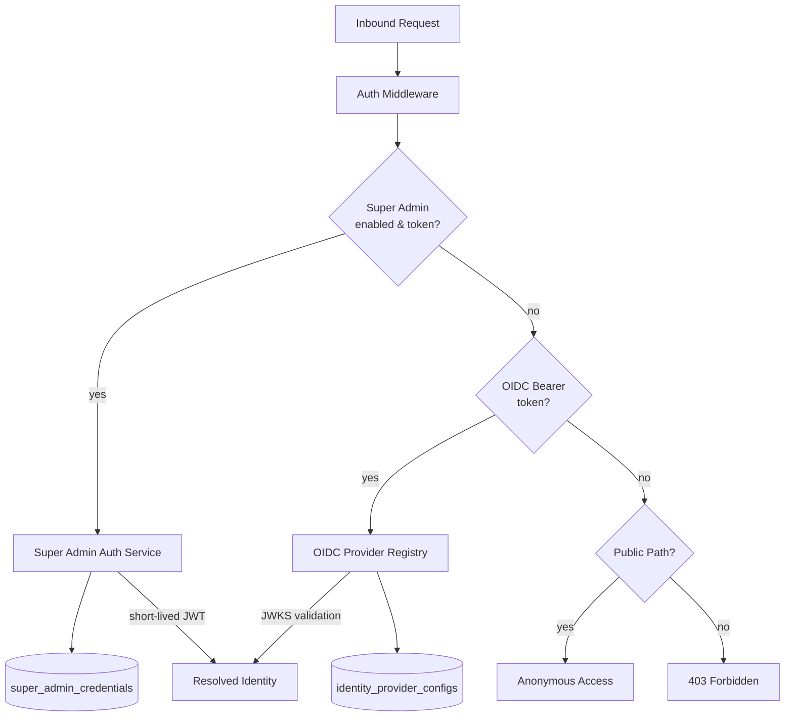
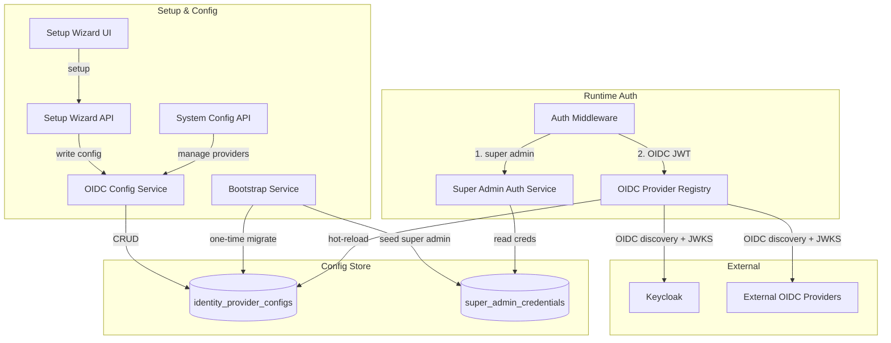
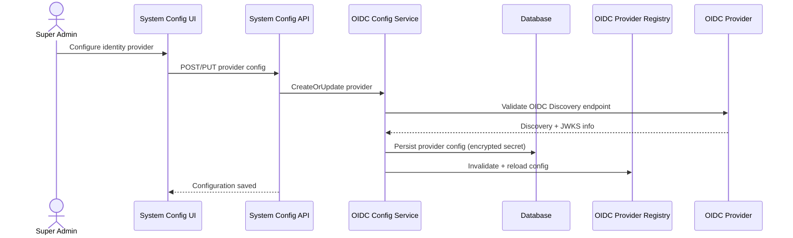

# Identity

## Overview

Identity is a foundational concern that controls authentication for all users and agent types. The platform supports two authentication paths for agents:

- **mTLS Certificates** — Used by internal Agent Runtime instances. Certificates are issued by the Control Center CA.
- **API Keys** — Used by external third-party AI agents connecting to the Communication Hub MCP endpoint. Keys are provisioned by platform administrators and validated via mTLS-secured internal calls from CH to CC.

The platform ships with a bundled Keycloak instance that is provisioned automatically on first run. Operators may configure any external OIDC-compliant provider (Keycloak, Azure Entra ID, or any standards-compliant IdP) via the System Config UI or Setup Wizard. All OIDC configuration is stored in the database as the source of truth; a one-time migration from the legacy `config/identity.yaml` file runs on startup when upgrading from an earlier version.

Multiple OIDC providers can be configured concurrently — one for human users and one for agent identities — each with its own issuer URL, client credentials, and claims mapping. Runtime token validation uses per-provider JWKS keys cached in memory by the OIDC Provider Registry for hot-reload without service restart.

Regardless of which authentication path is used (mTLS cert, API key, or OIDC JWT), the **identity → role → permission resolution chain is unchanged**. Each path adds a new entry point but does not alter the underlying permission model.

## Authentication Pipeline

```mermaid
flowchart TD
    REQ[Inbound Request] --> AM[Auth Middleware]

    AM --> SA{Super Admin<br/>enabled & token?}
    SA -->|yes| SAR[Super Admin Auth Service]
    SAR --> SAC[(super_admin_credentials)]
    SAR -->|short-lived JWT| ID[Resolved Identity]

    SA -->|no| OIDC{OIDC Bearer<br/>token?}
    OIDC -->|yes| OPR[OIDC Provider Registry]
    OPR --> IPC[(identity_provider_configs)]
    OPR -->|JWKS validation| ID

    OIDC -->|no| PUB{Public Path?}
    PUB -->|yes| ANON[Anonymous Access]
    PUB -->|no| DENY[403 Forbidden]
```

### Tier 1: Super Admin Auth

- Validates username/password against bcrypt-hashed credentials in `super_admin_credentials` table
- Issues short-lived JWT (configurable expiry, default 15 minutes) signed with Control Center's internal key
- Toggleable: when disabled via system config, all super admin login attempts are refused
- Credentials bootstrapped from environment variables on first launch

### Tier 2: OIDC JWT

- Auth Middleware determines provider type (user vs agent) from token claims or request context
- Queries OIDC Provider Registry for active provider config and JWKS keys
- Validates JWT signature, audience, expiry, and claims mapping per provider
- Supports concurrent user and agent providers from different issuers

### Tier 3: Public Fallback

- Routes marked public (setup wizard, OIDC callback, health checks) skip authentication entirely

## Component Architecture

```mermaid
flowchart TB
    subgraph Setup["Setup & Config"]
        WZ[Setup Wizard UI]
        SW[Setup Wizard API]
        SCAPI[System Config API]
        OCR[OIDC Config Service]
        BS[Bootstrap Service]
    end

    subgraph Runtime["Runtime Auth"]
        AM[Auth Middleware]
        SAR[Super Admin Auth Service]
        OPR[OIDC Provider Registry]
    end

    subgraph External
        KC[Keycloak]
        EXT[External OIDC Providers]
    end

    subgraph Store["Config Store"]
        IPC[(identity_provider_configs)]
        SAC[(super_admin_credentials)]
    end

    WZ -->|setup| SW
    SW -->|write config| OCR
    SCAPI -->|manage providers| OCR
    OCR -->|CRUD| IPC
    BS -->|one-time migrate| IPC
    BS -->|seed super admin| SAC

    AM -->|1. super admin| SAR
    AM -->|2. OIDC JWT| OPR
    SAR -->|read creds| SAC
    OPR -->|hot-reload| IPC
    OPR -->|OIDC discovery + JWKS| KC
    OPR -->|OIDC discovery + JWKS| EXT
```

## Component Responsibilities

| Component | Responsibility |
|---|---|
| **Setup Wizard UI** | React multi-step wizard shown on first run; guides admin through provider selection and credentials entry |
| **Setup Wizard API** | Unauthenticated REST endpoints for first-run identity configuration; delegates persistence to OIDC Config Service |
| **System Config API** | JWT-protected REST endpoints for CRUD on identity providers, super admin enable/disable, OIDC connectivity test, and test-login validation |
| **OIDC Config Service** | Full CRUD for identity provider configurations in the database (replacing static `identity.yaml`); validates OIDC Discovery endpoints; encrypts client secrets at rest |
| **Bootstrap Service** | Startup initialisation: one-time migration from `identity.yaml` to database, super admin credential seeding from environment variables, OIDC Provider Registry initialisation |
| **Auth Middleware** | Three-tier pipeline: super admin local auth → OIDC JWT validation → public fallback; per-request provider resolution |
| **Super Admin Auth Service** | Local credential validation against stored hashes; short-lived JWT issuance; enable/disable toggle |
| **OIDC Provider Registry** | In-memory cache of provider configs from database; per-provider JWKS key cache with TTL refresh; hot-reload without restart; multi-provider resolution for Auth Middleware |

## Provider Modes

| Mode | Description |
|---|---|
| **Bundled Keycloak** | Keycloak runs as a Docker Compose service; provisioned automatically on first run |
| **External OIDC** | Operator configures any OIDC-compliant provider via System Config UI; no Keycloak container required |
| **Multi-Provider** | Separate user and agent OIDC providers can be active concurrently, each with independent issuer, credentials, and claims mapping |

## Data Flow: OIDC Configuration

```mermaid
sequenceDiagram
    actor SA as Super Admin
    participant UI as System Config UI
    participant SYS as System Config API
    participant OCR as OIDC Config Service
    participant DB as Database
    participant OPR as OIDC Provider Registry
    participant IDP as OIDC Provider

    SA->>UI: Configure identity provider
    UI->>SYS: POST/PUT provider config
    SYS->>OCR: CreateOrUpdate provider
    OCR->>IDP: Validate OIDC Discovery endpoint
    IDP-->>OCR: Discovery + JWKS info
    OCR->>DB: Persist provider config (encrypted secret)
    OCR->>OPR: Invalidate + reload config
    SYS-->>UI: Configuration saved
```

## Agent Authentication Paths

Both agent authentication paths converge at the same permission engine. The resolution chain — `identity → role → policy evaluation → allowed tools/skills/SOPs` — is identical regardless of whether the agent authenticated via mTLS certificate or API key. For the full dual-auth architecture with Mermaid diagrams, see [Communication Hub Architecture](communication-hub/architecture.md#dual-authentication-flow).
