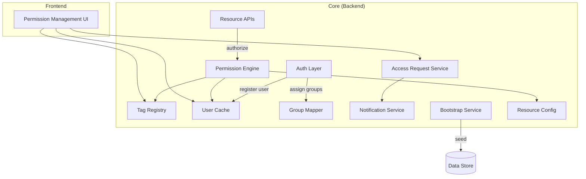

# User Permission Management — Module Architecture

## Overview

The User Permission Management system controls human user access to Parthenon features and resources through a tag-based policy model. It operates independently of the agent permission system. Authorization decisions are centralised in the Permission Engine, which is consulted by every protected Resource API before executing an operation.

## Component Architecture

## Component Responsibilities

| Component | Responsibility |
|---|---|
| **Permission Management UI** | Provides administrators with interfaces to manage roles, policies, tags, groups, and access requests |
| **Auth Layer** | Verifies user identity on every request; registers new users in the User Cache and triggers group assignment on first login |
| **Resource APIs** | Delegate all authorization decisions to the Permission Engine before executing protected operations |
| **Permission Engine** | Evaluates whether a user may perform an action on a resource by applying tag-based policy conditions; returns an allow or deny decision |
| **Tag Registry** | Manages permission tag definitions — their allowed values and scope — serving as the reference for policy authoring and enforcement |
| **User Cache** | Tracks authenticated users to support permission lookups and administrative visibility; kept current at login time |
| **Group Mapper** | Automatically assigns users to groups based on identity claims received at login; operates idempotently |
| **Access Request Service** | Manages the lifecycle of user requests to join groups — covering submission, review, and approval or rejection by group owners |
| **Notification Service** | Alerts group owners on new join requests and notifies requesting users when their request status changes |
| **Bootstrap Service** | Seeds foundational system roles and policies on startup; safe to run on every startup without side effects |
| **Resource Config** | Defines recognised resource types and their permitted actions; acts as the authoritative schema for policy authoring and runtime enforcement |
| **Data Store** | Persists users, groups, tags, policies, and access requests |

## Key Flows

| Flow | Path |
|---|---|
| **User login** | Auth Layer → User Cache + Group Mapper |
| **API authorization** | Resource APIs → Permission Engine → Tag Registry + User Cache + Resource Config |
| **Access request** | Access Request Service → Notification Service → group owner |
| **System startup** | Bootstrap Service → Data Store (seed roles and policies) |
