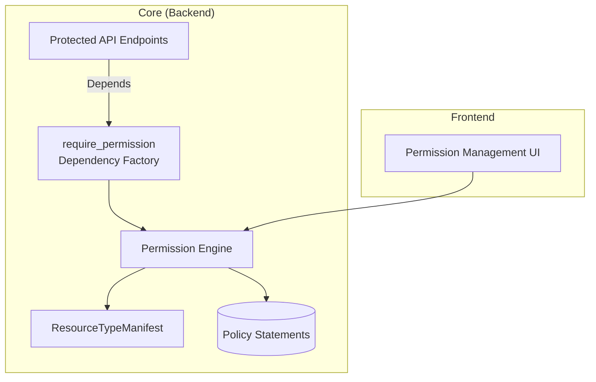

# IAM & Permission Management — Module Architecture

## Overview

The IAM system controls user and agent access to Parthenon features and resources through a policy-based, deny-by-default authorization model. Resource types use the `module::submodule` namespace convention (e.g., `agent::roles`, `integration::mcp_hub`, `system::permissions`). The `PermissionEngine` evaluates policy statements before any protected operation proceeds, and wildcards (`agent::*`, `*::*`) support broad grants without compromising auditability.

## Component Architecture

```mermaid
flowchart TD
    subgraph Frontend
        UI[Permission Management UI]
    end

    subgraph Core["Core (Backend)"]
        EP[Protected API Endpoints]
        PP["require_permission<br>Dependency Factory"]
        PE[Permission Engine]
        RT[ResourceTypeManifest]
        PS[(Policy Statements)]
    end

    EP -->|Depends| PP
    PP --> PE
    PE --> RT
    PE --> PS
    UI --> PE
```

## Component Responsibilities

| Component | Responsibility |
|---|---|
| **Permission Management UI** | Provides administrators with interfaces to manage user roles, policies, and resource permissions |
| **require_permission** | FastAPI dependency factory that resolves the authenticated user and calls `PermissionEngine.authorize()` with a `(resource_type, action)` tuple; raises `HTTPException(403)` on denial |
| **Permission Engine** | Central `authorize()` method that evaluates policy statements against the requested resource type and action; evaluates wildcard policies at three levels of specificity (exact match → module-level `agent::*` → global `*::*`) |
| **ResourceTypeManifest** | Central registry in `backend/app/core/resource_types.py` mapping all `module::submodule` resource types to their allowed actions; validated at startup; mirrored in the frontend as `RESOURCE_TYPE_MANIFEST` |
| **Policy Statements** | Database-backed policy rules linking user roles to allowed resources, actions, and optional tag conditions |

## Resource Type Naming Convention

All resource types follow the two-level namespaced format `module::submodule`:

| Module | Example Resource Types |
|---|---|
| `agent` | `agent::management`, `agent::roles`, `agent::identities`, `agent::trails`, `agent::data`, `agent::outputs`, `agent::skills`, `agent::sops`, `agent::model_configs`, `agent::schedules`, `agent::data_types`, `agent::api_keys`, `agent::human_intervention`, `agent::runtime_control` |
| `integration` | `integration::mcp_hub`, `integration::notifications` |
| `system` | `system::observability`, `system::permissions`, `system::system_config` |

### Wildcard Evaluation Rules

The Permission Engine evaluates policies in this order:
1. **Exact match** — e.g., `agent::roles` with `manage` action
2. **Module-level wildcard** — e.g., `agent::*` covers all agent submodules
3. **Global wildcard** — `*::*` covers every resource type

## Key Flows

| Flow | Path |
|---|---|
| **API authorization** | Endpoint → `require_permission(resource_type, action)` → `PermissionEngine.authorize()` → ResourceTypeManifest validation → Policy Statement evaluation → Allow/Deny |
| **System startup** | `PermissionEngine` validates `ResourceTypeManifest` entries at init; unknown resource types are rejected before any wildcard evaluation |
