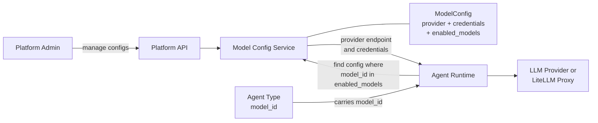

# Model Configuration Service

## Overview

The Model Configuration Service decouples LLM provider details from agent type definitions. Administrators manage provider configurations centrally; agent types carry only a `model_id` string (e.g. `"gpt-4o"`). At runtime, the Agent Runtime resolves the correct provider endpoint and credentials through the service before dispatching any LLM inference call. Both direct LLM provider APIs and a LiteLLM proxy are supported as backends.

## Component Architecture

## ModelConfig Entity

| Field | Description |
|---|---|
| **provider_type** | Provider category (e.g. `openai`, `anthropic`, `litellm_proxy`) |
| **api_endpoint** | Provider API URL |
| **credentials** | API key or auth token, encrypted at rest |
| **enabled_models** | Array of model IDs available via this provider config (e.g. `["gpt-4o", "gpt-4o-mini"]`) |

## Model Binding (Runtime Resolution)

Agent types do not hold a foreign key to a `ModelConfig`. Instead, the binding is resolved at runtime — the **Model Binding Layer**:

1. The Agent Runtime receives the agent type's `model_id` (e.g. `"gpt-4o"`).
2. The Model Config Service scans `ModelConfig` records to find the one whose `enabled_models` array contains that `model_id`.
3. The matched provider endpoint and decrypted credentials are returned to the Agent Runtime.
4. The Agent Runtime calls the provider directly using the resolved values.

This late binding means swapping a provider or rotating credentials requires updating only the `ModelConfig` record. As long as the same `model_id` remains in `enabled_models`, no agent type changes are needed.

## Supported Backend Types

| Backend | Description |
|---|---|
| **Direct provider API** | Calls OpenAI, Anthropic, or similar provider APIs directly using the configured endpoint and credentials |
| **LiteLLM proxy** | Routes inference through a LiteLLM proxy instance; useful for unified credential management and model aliasing across providers |
