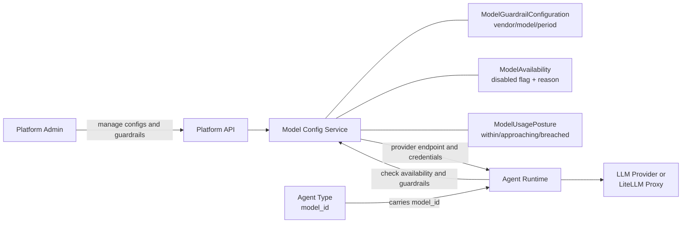

# Model Configuration Service

## Overview

The Model Configuration Service decouples LLM provider details from agent type definitions. Administrators manage provider configurations centrally; agent types carry only a `model_id` string (e.g. `"gpt-4o"`). At runtime, the Agent Runtime resolves the correct provider endpoint and credentials through the service before dispatching any LLM inference call. Both direct LLM provider APIs and a LiteLLM proxy are supported as backends.

The service also governs **model-usage guardrails** organised under a **vendor → model → guardrail hierarchy**. Each model carries one to four guardrail records, one per period (hour, day, week, or month), and operators can temporarily disable individual models or entire vendors.

## Component Architecture

```mermaid
flowchart LR
    Admin[Platform Admin]
    API[Platform API]
    MCS[Model Config Service]
    MGC[ModelGuardrailConfiguration\nvendor/model/period]
    MAV[ModelAvailability\ndisabled flag + reason]
    MUP[ModelUsagePosture\nwithin/approaching/breached]
    AT[Agent Type\nmodel_id]
    AR[Agent Runtime]
    LLM[LLM Provider or\nLiteLLM Proxy]

    Admin -->|manage configs and guardrails| API
    API --> MCS
    MCS --- MGC
    MCS --- MAV
    MCS --- MUP
    AT -->|carries model_id| AR
    AR -->|check availability and guardrails| MCS
    MCS -->|provider endpoint and credentials| AR
    AR --> LLM
```

## ModelConfig Entity

| Field | Description |
|---|---|
| **provider_type** | Provider category (e.g. `openai`, `anthropic`, `litellm_proxy`) |
| **api_endpoint** | Provider API URL |
| **credentials** | API key or auth token, encrypted at rest |
| **enabled_models** | Array of model IDs available via this provider config (e.g. `["gpt-4o", "gpt-4o-mini"]`) |

## Model Guardrail Hierarchy (Vendor → Model → Guardrail)

The previous flat per-model configuration has been replaced with a three-level hierarchy:

| Level | Entity | Description |
|---|---|---|
| **Vendor** | Model availability (vendor-level disable) | A vendor groups its models. Disabling a vendor cascades to every model under it; the per-model disable affordances remain visible to show the cascade source. |
| **Model** | `ModelGuardrailConfiguration` (per-period), `ModelAvailability` (disabled flag + reason) | A model may have one to four guardrail records, one per period (hour, day, week, month). Each model can be temporarily disabled. |
| **Guardrail** | `ModelGuardrailConfiguration` (period, threshold, posture) | A single guardrail scoped to one period. Each guardrail has its own enforcement posture (`terminate` or `observe-only`) and can be individually enabled, disabled, or removed. |

### ModelGuardrailConfiguration

| Field | Description |
|---|---|
| `vendor` | Vendor name (e.g. `openai`, `anthropic`) |
| `model_name` | Model ID (e.g. `gpt-4o`) |
| `period` | One of `hour`, `day`, `week`, `month` |
| `max_units` | Maximum units allowed within the period |
| `enforcement_posture` | `terminate` (default) or `observe-only` |
| `is_active` | Per-guardrail enable flag |

Unique constraint: `(model_id, model_name, period)` — one `ModelConfig` row can host multiple model names, and each model name has at most one guardrail per period.

### ModelAvailability

| Field | Description |
|---|---|
| `model_id` | FK to `ModelConfig` |
| `model_name` | Model ID (e.g. `gpt-4o`) |
| `is_disabled` | Per-model disable flag |
| `disabled_reason` | `vendor_disabled` (cascade), `model_disabled` (manual), or `null` |
| `disabled_at` | Timestamp of disable |

A `null` reason and `is_disabled=False` indicates the model is available. A non-null reason blocks execution.

### ModelUsagePosture

| Field | Description |
|---|---|
| `model_id`, `model_name`, `period` | Same key as the guardrail |
| `posture_state` | `within_limit`, `approaching_limit`, `breached` |
| `current_units` | Current usage against the guardrail threshold |
| `last_updated_at` | Timestamp of last posture update |

When `posture_state` is `breached` and the guardrail's `enforcement_posture` is `terminate`, the agent execution is blocked and the block is surfaced in execution logs. When the posture is `observe-only`, the breach is logged as an alert but execution continues.

## Pre-Execution Check

Agent Runtime calls a Control Center endpoint to check model availability and guardrail posture before any LLM call. The check returns one of:

- `available` — proceed
- `unavailable` — execution is blocked; reason is `vendor_disabled`, `model_disabled`, or `guardrail_breached`
- Multi-vendor `guardrail_breached` reasons are merged; the most severe reason dominates

## Model Binding (Runtime Resolution)

Agent types do not hold a foreign key to a `ModelConfig`. Instead, the binding is resolved at runtime — the **Model Binding Layer**:

1. The Agent Runtime receives the agent type's `model_id` (e.g. `"gpt-4o"`).
2. The Model Config Service scans `ModelConfig` records to find the one whose `enabled_models` array contains that `model_id`.
3. The matched provider endpoint and decrypted credentials are returned to the Agent Runtime.
4. The Agent Runtime calls the provider directly using the resolved values.

This late binding means swapping a provider or rotating credentials requires updating only the `ModelConfig` record. As long as the same `model_id` remains in `enabled_models`, no agent type changes are needed.

## Supported Backend Types

| Backend | Description |
|---|---|
| **Direct provider API** | Calls OpenAI, Anthropic, or similar provider APIs directly using the configured endpoint and credentials |
| **LiteLLM proxy** | Routes inference through a LiteLLM proxy instance; useful for unified credential management and model aliasing across providers |
