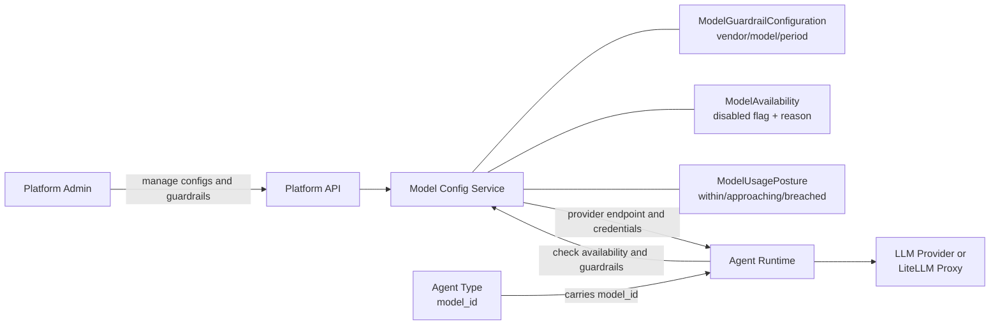

# Model Configuration Service

## Overview

The Model Configuration Service decouples LLM provider details from agent type definitions. Administrators manage provider configurations centrally; agent types carry only a `model_id` string (e.g. `"gpt-4o"`). At runtime, the Agent Runtime resolves the correct provider endpoint and credentials through the service before dispatching any LLM inference call. Both direct LLM provider APIs and a LiteLLM proxy are supported as backends.

The service also governs **model-usage guardrails** organised under a **vendor → model → guardrail hierarchy**. Each model carries one to four guardrail records, one per period (hour, day, week, or month), and operators can temporarily disable individual models or entire vendors.

## Component Architecture

```mermaid
flowchart LR
    Admin[Platform Admin]
    API[Platform API]
    MCS[Model Config Service]
    MGC[ModelGuardrailConfiguration\nvendor/model/period]
    MAV[ModelAvailability\ndisabled flag + reason]
    MUP[ModelUsagePosture\nwithin/approaching/breached]
    AT[Agent Type\nmodel_id]
    AR[Agent Runtime]
    LLM[LLM Provider or\nLiteLLM Proxy]

    Admin -->|manage configs and guardrails| API
    API --> MCS
    MCS --- MGC
    MCS --- MAV
    MCS --- MUP
    AT -->|carries model_id| AR
    AR -->|check availability and guardrails| MCS
    MCS -->|provider endpoint and credentials| AR
    AR --> LLM
```

## ModelConfig Entity

Stores provider type (one of twelve supported provider keys across two dispatch families: OpenAI-compatible and native-API), API endpoint, encrypted credentials, and enabled model IDs.

## Model Guardrail Hierarchy (Vendor → Model → Guardrail)

The previous flat per-model configuration has been replaced with a three-level hierarchy:

| Level | Entity | Description |
|---|---|---|
| **Vendor** | Model availability (vendor-level disable) | A vendor groups its models. Disabling a vendor cascades to every model under it. |
| **Model** | Guardrail configuration (per-period), Model availability (disabled flag + reason) | A model may have one to four guardrail records, one per period (hour, day, week, month). |
| **Guardrail** | Guardrail configuration (period, threshold, posture) | A single guardrail scoped to one period with enforcement posture (`terminate` or `observe-only`). |

Each model name has at most one guardrail per period. The `ModelUsagePosture` tracks current usage against guardrail thresholds (`within_limit`, `approaching_limit`, `breached`). When posture is `breached` and enforcement is `terminate`, agent execution is blocked.

## Pre-Execution Check

Agent Runtime calls a Control Center endpoint to check model availability and guardrail posture before any LLM call. The check returns one of:

- `available` — proceed
- `unavailable` — execution is blocked; reason is `vendor_disabled`, `model_disabled`, or `guardrail_breached`
- Multi-vendor `guardrail_breached` reasons are merged; the most severe reason dominates

## Model Binding (Runtime Resolution)

Agent types do not hold a foreign key to a `ModelConfig`. Instead, the binding is resolved at runtime — the **Model Binding Layer**:

1. The Agent Runtime receives the agent type's `model_id` (e.g. `"gpt-4o"`).
2. The Model Config Service scans `ModelConfig` records to find the one whose `enabled_models` array contains that `model_id`.
3. The matched provider endpoint and decrypted credentials are returned to the Agent Runtime.
4. The Agent Runtime calls the provider directly using the resolved values.

This late binding means swapping a provider or rotating credentials requires updating only the `ModelConfig` record. As long as the same `model_id` remains in `enabled_models`, no agent type changes are needed.

## Supported Backend Types

| Backend | Dispatch Family | Supported Providers |
|---|---|---|
| **OpenAI-compatible API** | `openai_compat` | `openai`, `azure_openai`, `litellm_proxy`, `mistral`, `groq`, `together`, `fireworks`, `perplexity`, `deepseek` |
| **Native-API providers** | `native` | `anthropic` (Messages API), `gemini` (generateContent API), `cohere` (/chat API) |
| **LiteLLM proxy** | `openai_compat` | `litellm_proxy` (routes through a LiteLLM proxy instance; useful for unified credential management and model aliasing) |

The dispatcher routes incoming calls by lookup against the provider registry, which maps each provider key to its dispatch-family tag and default API base URL. Adding a new provider is an engineering-led release activity that registers the provider in the platform's provider registry, model lister, and admin UI — no dynamic registration at runtime.
