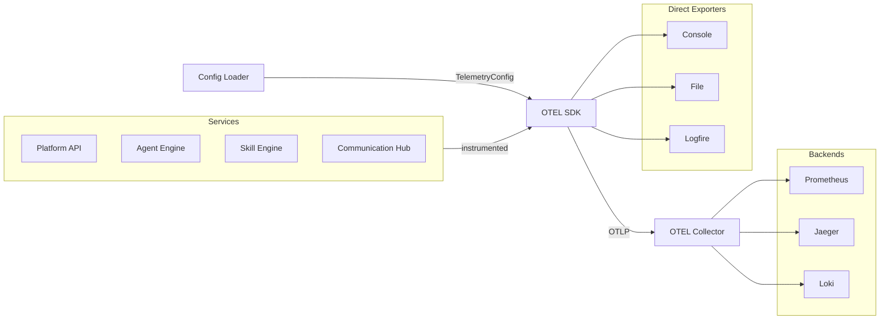

# Observability

## Overview

Observability is a cross-cutting concern applied uniformly across all platform services. Every component is instrumented with the OpenTelemetry SDK to emit traces, metrics, and logs. Telemetry is exported over OTLP to a central OTEL Collector, which fans out to purpose-built backends for storage and querying.

## Telemetry Pipeline

## Signal Types

| Signal | Backend | Purpose |
|---|---|---|
| **Metrics** | Prometheus | Request rates, latencies, error counts, instance utilisation, queue depths |
| **Traces** | Jaeger | Distributed request tracing across service boundaries — from gateway to LLM call and back |
| **Logs** | Loki | Structured log aggregation correlated with trace IDs for drill-down diagnostics |

## Instrumentation Strategy

- **Automatic instrumentation** — HTTP, gRPC, and database client libraries are instrumented via OTEL SDK auto-instrumentation, capturing spans and metrics with no application-level code changes
- **Manual spans** — Key business operations (agent instance creation, skill execution, MCP tool calls, LLM inference) emit custom spans with domain-relevant attributes
- **Trace propagation** — All inter-service calls propagate W3C Trace Context headers, ensuring a single trace captures an end-to-end request from client to external tool server and back
- **Metric cardinality** — Metrics are scoped to service, agent type, and operation — avoiding high-cardinality dimensions that degrade Prometheus performance
- **Config-driven exporter selection** — The active set of exporters (OTEL Collector, Console, File, Logfire, or Custom) is resolved at startup from a `TelemetryConfig`; each signal type (traces, metrics, logs) can be independently enabled or disabled, yielding a no-op provider when disabled so instrumented code requires no changes

## Telemetry Configuration

Telemetry settings are resolved in priority order: config file (`telemetry.yaml`) provides the base values, which environment variable overrides can supersede at runtime (12-factor pattern). This allows per-deployment defaults alongside per-pod or per-environment overrides without changing application code.

The frontend fetches its telemetry settings from the backend at startup via `/api/v1/telemetry/config`, avoiding configuration duplication and ensuring the frontend always uses the same export target as the backend.

**Supported export targets:**

| Target | Use Case |
|---|---|
| **OTEL Collector** | Primary production pipeline; fans out to Prometheus, Jaeger, and Loki |
| **Console** | Local development diagnostics |
| **File (with rotation)** | Air-gapped or offline deployments |
| **Logfire** | Managed observability SaaS |
| **Custom Endpoint** | Arbitrary OTLP-compatible backends |

Multiple targets may be active simultaneously for the same signal (e.g., Console + OTEL Collector during local debugging).
