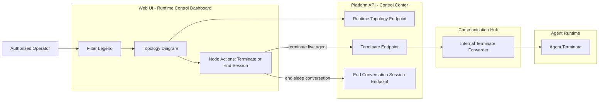

# Runtime Control Dashboard

## Overview

The Runtime Control Dashboard is a read-only operator view of currently running agents, their delegation topology, configured model-usage guardrails, and current usage posture. It supports operator-controlled termination actions for authorized users, with cascade termination of delegated children, and a "End session" action for conversation sessions that have no live agent job. The dashboard is part of the [Agent Instance Dashboard](agent-instance-dashboard.md) and uses the same backend query endpoints, plus a runtime topology endpoint that merges three sources — `AgentJob`, `ConversationSession`, and `AgentInstance`.

## Component Architecture

The topology endpoint merges data from: `AgentJob` (live agent runs), `ConversationSession` (conversation sessions), `AgentInstance` (agent instances), `Model Guardrail Configuration`, and `Model Usage Posture`.

## Topology View

The topology view merges three node kinds:

- **agent** — `AgentJob` records (live agent runs), with status `queued` / `running` / `completed` / `failed` / `terminated`
- **conversation** — `ConversationSession` records, with a synthetic `active` / `sleep` runtime status derived from the backing `AgentJob` state and the conversation's persisted status (`active` / `closed` / `archived` / `error`)
- **instance** — `AgentInstance` records, with status `created` / `active` / `closed` / `error`

Edges are derived from the agent session parent/child relationship graph: a parent `AgentJob` is connected to each delegated child `AgentJob`. Conversation nodes that share a session id with an `AgentJob` are shown as siblings in the same depth group.

## Filter Legend

The legend is a tickable list of every `(kind, status)` combination. The dashboard maintains a `Set<string>` filter state; default-visible keys include all kinds and statuses except `conversation:sleep` (operators opt in to see sleep conversations). Hidden nodes are rendered at reduced opacity.

Status is rendered as a color-coded dot in the top-right corner of each node box. The box shape varies by node kind: `agent` is solid and rounded, `conversation` is dashed with a more rounded corner, `instance` has a tabbed left edge.

## Node Actions

For each visible node, the operator can issue:

- **Terminate** — for live agent nodes (status `queued` or `running`). The request is routed from Control Center through the Communication Hub to Agent Runtime. Agent Runtime cancels the in-flight task and updates the `AgentJob` status to `terminated`. Terminating a parent cascades to all active delegated children.
- **End session** — for sleep conversation nodes (no live agent job). The request closes the `ConversationSession` directly; no terminate call is made to Agent Runtime.
- **No action** — for terminal-status nodes (`completed`, `failed`, `closed`, `archived`, `error`).

If the operator lacks the required permission, the action button is hidden and the request would be rejected with a clear user-visible message.

## Cascade Termination

When a parent `AgentJob` is terminated, Agent Runtime cancels the parent's in-flight task and walks the delegation graph to cancel all active delegated children. The cascade is bounded by the depth and step limits of the parent's guardrail profile.

## Service Boundaries

- All topology reads are performed by the Control Center — only Control Center connects to the database
- All terminate requests are routed Control Center → Communication Hub → Agent Runtime, never directly from Control Center to Agent Runtime, to preserve the certificate-based authentication boundary (Agent Runtime's `ControlCenterCertificateMiddleware` only accepts `service:communication-hub` service certificates)
- End-session requests for sleep conversations are handled by Control Center's existing conversation session management endpoints

## Related Modules
- [Agent Instance Dashboard](agent-instance-dashboard.md) — parent dashboard component
- [Execution Logs](execution-logs.md) — execution log view, status colors, and terminated/failed distinction
- [Model Config](model-config.md) — vendor → model → guardrail hierarchy
- [Agent Runtime](../modules/agent-runtime/architecture.md) — agent execution and termination
- [Communication Hub](../modules/communication-hub/architecture.md) — control-plane routing for termination
