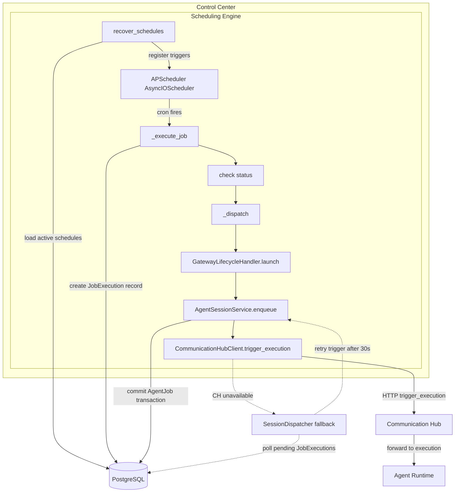

# Scheduling Architecture

## Component Overview

The **SchedulingEngine** is an in-process cron manager that runs inside the **Control Center** process only. It uses APScheduler's `AsyncIOScheduler` to fire scheduled agent jobs on cron triggers. Lifecycle is managed at `backend/app/main.py:303` (`_start_scheduling_engine`) and `backend/app/main.py:319` (`_stop_scheduling_engine`). On startup, `recover_schedules()` loads all active schedules from the database and registers them with APScheduler.

## Integration Points

| Integration | Direction | Protocol | Description |
|---|---|---|---|
| SchedulingEngine → DB | read/write | SQLAlchemy async | Load active schedules, record job executions |
| SchedulingEngine → CommunicationHub | outbound HTTP | REST | Trigger agent execution via trigger_execution() |
| Config → SchedulingEngine | read | Pydantic Settings | scheduler_enabled, scheduler_check_interval_seconds (default 60) |
| SchedulingEngine → AgentSessionService | internal call | Python async | Enqueue AgentJob session via launch path |

## Key Design Decisions

- **Only Control Center connects to DB** — scheduling follows the architecture rule that database access is restricted to the Control Center service.
- **APScheduler is in-process** — no external scheduler service is needed; the `AsyncIOScheduler` runs as a co-routine inside the Control Center event loop.
- **Schedules use async launch path** — dispatch goes through `GatewayLifecycleHandler.launch()` rather than the legacy spawn/request/close flow.
- **Two-phase dispatch with fallback** — the AgentJob is committed to the database first, then `CommunicationHubClient.trigger_execution()` is called to notify Agent Runtime. If Communication Hub is unavailable, `SessionDispatcher` polls for pending executions after a 30-second delay.
- **Target types are agent only** — SOP-based scheduling was removed; all schedules target an agent type for execution.
