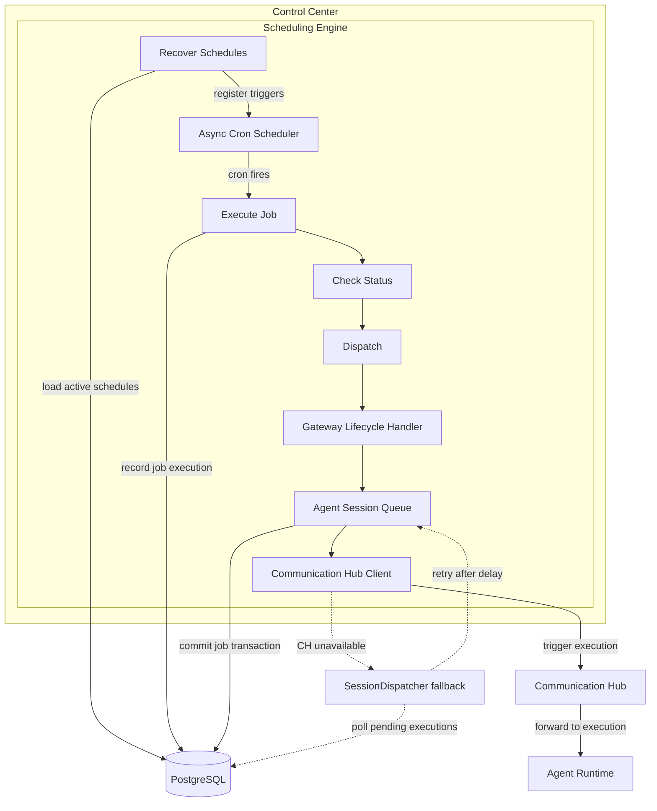

# Scheduling Architecture

## Component Overview

The **SchedulingEngine** is an in-process cron manager that runs inside the **Control Center** process only. It uses an async cron scheduler to fire scheduled agent jobs on configured cron triggers. Lifecycle is managed by the Control Center startup and shutdown hooks. On startup, all active schedules are loaded from the database and registered with the scheduler.

## Integration Points

| Integration | Direction | Protocol | Description |
|---|---|---|---|
| SchedulingEngine → DB | read/write | SQLAlchemy async | Load active schedules, record job executions |
| SchedulingEngine → CommunicationHub | outbound HTTP | REST | Trigger agent execution via the hub |
| Config → SchedulingEngine | read | Application settings | scheduler_enabled, scheduler check interval |
| SchedulingEngine → AgentSessionService | internal call | Python async | Enqueue agent session via launch path |

## Key Design Decisions

- **Only Control Center connects to DB** — scheduling follows the architecture rule that database access is restricted to the Control Center service.
- **In-process scheduler** — the cron scheduler runs as a co-routine inside the Control Center event loop; no external scheduler service is needed.
- **Schedules use async launch path** — dispatch goes through the gateway lifecycle handler rather than a legacy spawn/request/close flow.
- **Two-phase dispatch with fallback** — the agent job is committed to the database first, then the Communication Hub is notified. If Communication Hub is unavailable, a session dispatcher polls for pending executions after a delay.
- **Target types are agent only** — SOP-based scheduling was removed; all schedules target an agent type for execution.
