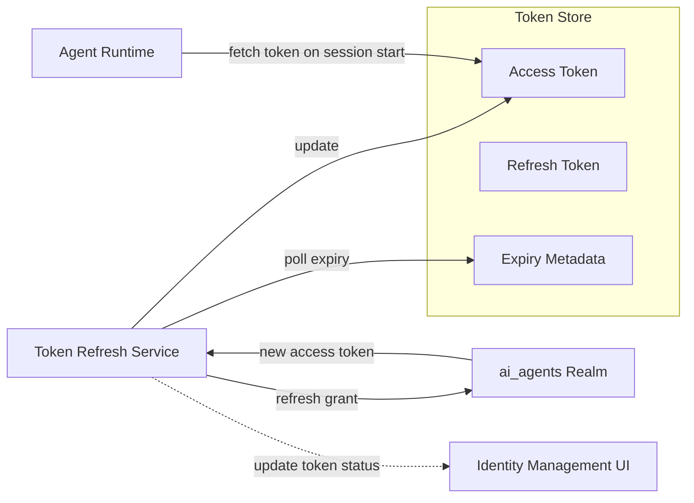

# Token Refresh Service

## Overview

The Token Refresh Service is a background service that keeps agent access tokens valid without requiring administrator intervention. It monitors token expiry in the Token Store and proactively refreshes access tokens against the `ai_agents` realm using stored refresh tokens, before the access token expires. If a refresh token has itself expired, the service marks the identity as requiring re-authentication and surfaces the status in the management UI.

## Component Architecture

## Responsibilities

- **Expiry monitoring** — Polls token expiry metadata at a configured cadence; flags tokens that are expiring soon
- **Proactive refresh** — Issues OAuth 2.0 refresh token grants against the `ai_agents` realm before the access token expires
- **Token Store update** — Writes the new encrypted access token back to the Token Store; the expiry timestamp is updated accordingly
- **Failure handling** — If a refresh grant fails (e.g. the refresh token is expired or revoked), the identity status is updated to `expired`; no further refresh is attempted until an administrator re-authenticates
- **Status surfacing** — Token status (`valid` / `expiring_soon` / `expired`) is surfaced in the Identity Management UI, enabling admins to act before sessions fail

## Token Lifecycle States

| State | Meaning | Action |
|---|---|---|
| **valid** | Access token is current; no action needed | Refresh Service monitors expiry |
| **expiring_soon** | Access token is within the refresh window | Refresh Service issues refresh grant |
| **expired** | Refresh token is expired or revoked | Admin must re-authenticate via OAuth sign-in |

## Re-Authentication

When a refresh token is expired, an administrator re-authenticates by completing an OAuth sign-in to the agent user account in the `ai_agents` realm. The Platform API exchanges the authorization code for a new access and refresh token pair and stores them in the Token Store. The Token Refresh Service resumes normal monitoring once a valid refresh token is available. See [Identity](identity.md) for the dual-realm topology.
