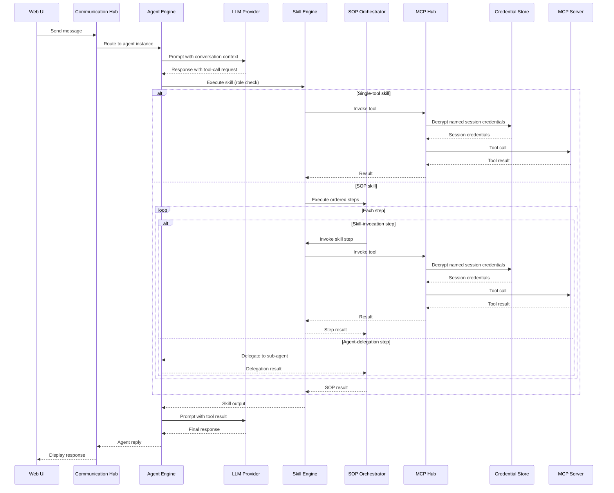

# Tool Execution

## Overview

When an LLM response includes a tool-call request, the Agent Engine delegates execution through a three-layer chain: **Skill Engine → MCP Hub → External MCP Server**. This separation keeps agent logic decoupled from tool implementation and allows tools to be registered, versioned, and secured independently.

## Tool Execution Sequence

## Execution Chain

### Skill Engine

The Skill Engine is the first handler. It resolves the requested skill by name, enforces role-based access (checking the caller's role membership before proceeding), and determines whether the skill maps to a single tool call or a multi-step SOP. Skills bind one or more tools using server-slug-prefixed tool names (e.g. `github/create_issue`), allowing a single skill to span multiple MCP servers.

### SOP Orchestrator

The SOP Orchestrator executes an ordered sequence of steps defined on a SOP skill. Each step carries a type: **skill-invocation** steps route back through the Skill Engine to invoke a named skill (with its own tool bindings); **agent-delegation** steps hand off to the Agent Engine to run a sub-agent. Per-step instruction guidance is applied before each step executes. The Orchestrator collects step results and returns a consolidated output to the Skill Engine.

### MCP Hub

The MCP Hub acts as a proxy and session manager for all registered MCP tool servers. Each server may have multiple named sessions, each with its own credential binding. Credentials are encrypted with AES-256 at registration time and decrypted only at tool-call time — they are never returned in plaintext. The hub also maintains a bidirectional tool-to-skill index, enabling both skill → tools lookup and reverse tool → skills membership queries.

### External MCP Servers

Admin-registered tool servers that implement the Model Context Protocol. Each server exposes one or more tools. The MCP Hub proxies requests to the appropriate server under the correct named session and returns the tool result back up the chain.

## Multi-Turn Tool Use

The sequence above shows a single tool-call round-trip. In practice, the LLM may request multiple tool calls in succession — each one traverses the same Skill Engine → MCP Hub → MCP Server chain before the final response is returned to the user.
