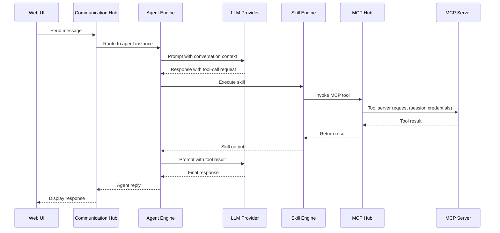

# Tool Execution

## Overview

When an LLM response includes a tool-call request, the Agent Engine delegates execution through a three-layer chain: **Skill Engine → MCP Hub → External MCP Server**. This separation keeps agent logic decoupled from tool implementation and allows tools to be registered, versioned, and secured independently.

## Tool Execution Sequence

## Execution Chain

### Skill Engine

The Skill Engine is the first handler. It resolves the requested skill by name, validates that the agent type is authorised to invoke it, and determines whether the skill maps to a single MCP tool call or a multi-step SOP. For SOPs, the Skill Engine orchestrates the sequence of tool calls and intermediate logic before returning a consolidated result.

### MCP Hub

The MCP Hub acts as a proxy and session manager for all registered MCP tool servers. It maintains identity-bound sessions so that each tool call carries the correct credentials for the target server. The hub handles tool registration, capability syncing, and transport-level concerns, shielding the Skill Engine from server-specific details.

### External MCP Servers

Admin-registered tool servers that implement the Model Context Protocol. Each server exposes one or more tools. The MCP Hub proxies requests to the appropriate server, passing session credentials, and returns the tool result back up the chain.

## Multi-Turn Tool Use

The sequence above shows a single tool-call round-trip. In practice, the LLM may request multiple tool calls in succession — each one traverses the same Skill Engine → MCP Hub → MCP Server chain before the final response is returned to the user.
