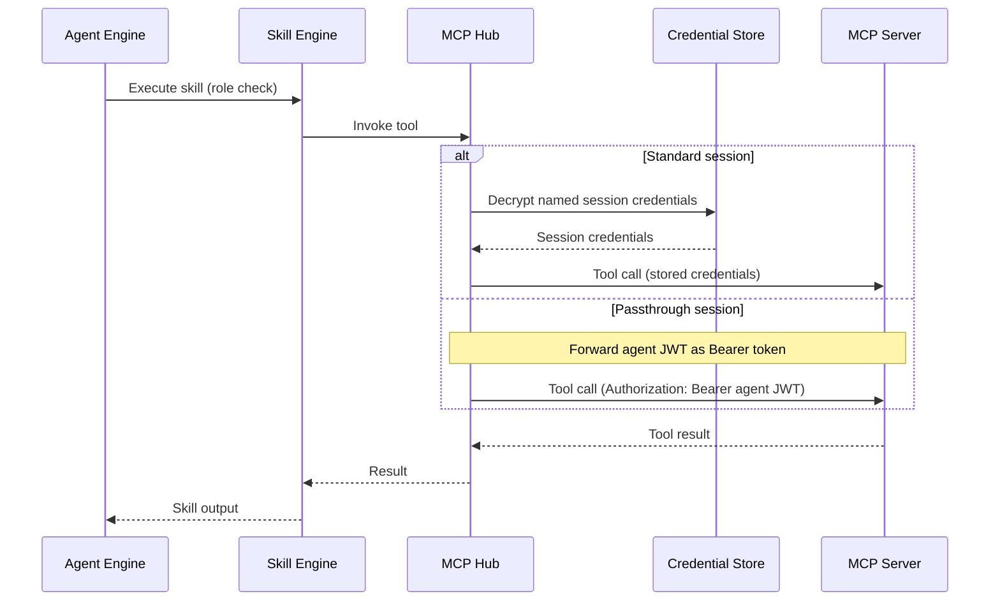
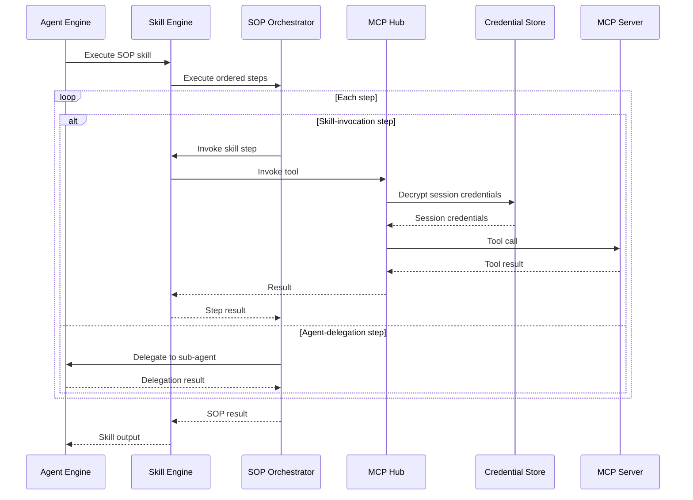

# Tool Execution

## Overview

When an LLM response includes a tool-call request, the Agent Engine delegates execution through a three-layer chain: **Skill Engine → MCP Hub → External MCP Server**. This separation keeps agent logic decoupled from tool implementation and allows tools to be registered, versioned, and secured independently.

For external MCP clients (Copilot, Claude, Cursor, custom agents), the standard `tools/list` and `tools/call` methods reuse this same **Skill Engine → MCP Hub → External MCP Server** chain via the Communication Hub's Tool Registry Bridge — no separate execution path is introduced.

## Single-Tool Execution

```mermaid
sequenceDiagram
    participant AE as Agent Engine
    participant SE as Skill Engine
    participant MCP as MCP Hub
    participant CS as Credential Store
    participant EXT as MCP Server

    AE->>SE: Execute skill (role check)
    SE->>MCP: Invoke tool
    alt Standard session
        MCP->>CS: Decrypt named session credentials
        CS-->>MCP: Session credentials
        MCP->>EXT: Tool call (stored credentials)
    else Passthrough session
        Note over MCP,EXT: Forward agent JWT as Bearer token
        MCP->>EXT: Tool call (Authorization: Bearer agent JWT)
    end
    EXT-->>MCP: Tool result
    MCP-->>SE: Result
    SE-->>AE: Skill output
```

## SOP Orchestration Sequence

```mermaid
sequenceDiagram
    participant AE as Agent Engine
    participant SE as Skill Engine
    participant SOPORCH as SOP Orchestrator
    participant MCP as MCP Hub
    participant CS as Credential Store
    participant EXT as MCP Server

    AE->>SE: Execute SOP skill
    SE->>SOPORCH: Execute ordered steps
    loop Each step
        alt Skill-invocation step
            SOPORCH->>SE: Invoke skill step
            SE->>MCP: Invoke tool
            MCP->>CS: Decrypt session credentials
            CS-->>MCP: Session credentials
            MCP->>EXT: Tool call
            EXT-->>MCP: Tool result
            MCP-->>SE: Result
            SE-->>SOPORCH: Step result
        else Agent-delegation step
            SOPORCH->>AE: Delegate to sub-agent
            AE-->>SOPORCH: Delegation result
        end
    end
    SOPORCH-->>SE: SOP result
    SE-->>AE: Skill output
```

## System Tools — Suspend-on-Call Pattern

Most system tools execute synchronously and return a result to the agent's loop. The `human_intervene` tool follows a different pattern:

1. **Suspend-on-call** — When the agent calls `human_intervene`, execution suspends immediately. No result is returned at call time.
2. **Out-of-band response** — An operator responds through the Web UI. The response is persisted to the `InterveneResponse` table.
3. **Resume with result** — The Agent Runtime restores the suspended execution and injects the operator's response as the tool's return value.

This suspend-on-call vs return-on-response difference is unique to `human_intervene` among system tools. The tool call still flows through the standard Communication Hub routing chain, but the response arrives asynchronously through a separate resume signal rather than inline in the tool execution path.

When a **delegated sub-agent** (depth 1) in a non-conversational execution calls `human_intervene`, the response arrives through the execution log viewer path rather than the conversation WebSocket or dashboard poll path. The CH `InterventionRouter` detects no `conversation_session_id` and falls through to the log stream delivery path, where the Task Delegation Event Router pushes the intervention request as an NDJSON event to the parent agent's log viewer.

For non-conversational SOP executions, the **agent-delegation step** includes an additional depth check via the Delegation Depth Guard before the sub-agent is spawned. If the depth exceeds 1 (i.e., a delegatee at depth 1 attempting to delegate further), the call is blocked and a `delegation_depth_blocked` execution event is emitted.

## Execution Chain

### Skill Engine

The Skill Engine is the first handler. It resolves the requested skill by name, enforces role-based access (checking the caller's role membership before proceeding), and determines whether the skill maps to a single tool call or a multi-step SOP. Skills bind one or more tools using server-slug-prefixed tool names (e.g. `github/create_issue`), allowing a single skill to span multiple MCP servers.

### SOP Orchestrator

The SOP Orchestrator executes an ordered sequence of steps defined on a SOP skill. Each step carries a type: **skill-invocation** steps route back through the Skill Engine to invoke a named skill (with its own tool bindings); **agent-delegation** steps hand off to the Agent Engine to run a sub-agent. Per-step instruction guidance is applied before each step executes. The Orchestrator collects step results and returns a consolidated output to the Skill Engine.

### MCP Hub

The MCP Hub acts as a proxy and session manager for all registered MCP tool servers. It supports two session types:

- **Session-based** — each server has one or more named sessions with credential bindings. Credentials are encrypted with AES-256 at registration time and decrypted only at tool-call time; they are never returned in plaintext.
- **Passthrough** — the executing agent's JWT is extracted from the request context and forwarded as the `Authorization: Bearer` header. The Credential Store is bypassed entirely; the receiving MCP server performs its own identity validation against the Keycloak `ai_agents` realm.

The hub also maintains a bidirectional tool-to-skill index, enabling both skill → tools lookup and reverse tool → skills membership queries.

### External MCP Servers

Admin-registered tool servers that implement the Model Context Protocol. Each server exposes one or more tools. The MCP Hub proxies requests to the appropriate server under the correct named session and returns the tool result back up the chain.

## Multi-Turn Tool Use

The sequence above shows a single tool-call round-trip. In practice, the LLM may request multiple tool calls in succession — each one traverses the same Skill Engine → MCP Hub → MCP Server chain before the final response is returned to the user.
