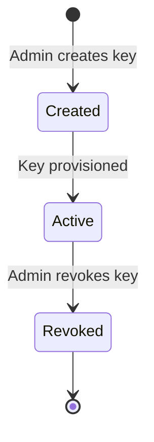
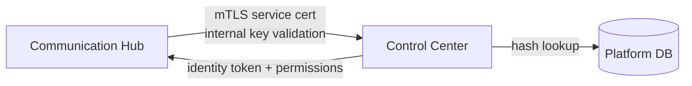

# API Key Security

## Overview

API keys provide an alternative authentication credential for external third-party AI agents (Claude Code, Cursor, custom agents) connecting to the Communication Hub's MCP endpoint. Keys are provisioned by platform administrators in Control Center and validated over existing mTLS service certificates — no new trust model is introduced.

## Key Lifecycle

| State | Description |
|-------|-------------|
| **Created** | Key generated, hash stored, clear-text shown once to admin. Not yet usable. |
| **Active** | Key can authenticate external agents. Validation succeeds, identity token and permission set are returned to CH. |
| **Revoked** | Key permanently invalidated. Any authentication attempt with a revoked key returns 401. |

Keys cannot be re-activated once revoked. The clear-text key is shown exactly once at creation time and is never stored — only the SHA-256 hash persists in the database.

## Hashing Approach

API keys are stored using **SHA-256 one-way hashing** in the `agent_api_keys` table:

- At creation, CC generates a cryptographically random key and computes `SHA-256(key)`
- Only `key_hash` is persisted to the database; the clear-text key is returned once and discarded
- At validation time, CH sends the hashed key (computed from the `Authorization: Bearer` or `?apiKey=` value it received) to CC's internal validation endpoint
- CC performs a hash comparison lookup against `agent_api_keys.key_hash`
- Invalid or revoked keys return 401 with no distinguishing error — preventing key enumeration

No encryption at rest is applied beyond the hash, as the clear-text key is never stored.

## Audit Logging

All API key lifecycle events are recorded in the `ApiKeyUsageLog` table for governance audit:

| Event | Logged Data |
|-------|-------------|
| **Key Created** | Admin identity, bound agent identity + role, timestamp |
| **Key Revoked** | Admin identity, key reference, timestamp |
| **Authentication Attempt** | Key hash (or masked prefix), outcome (success / invalid / revoked), timestamp |
| **Key Used** | Key reference, accessed tool/skill/SOP, timestamp |

Audit logs are immutable and retained per the platform's governance retention policy.

## Transport Security

All communication between Communication Hub and Control Center for API key validation uses the **existing mTLS service certificate infrastructure**. No new certificates or trust relationships are introduced:

The internal validation endpoint is restricted to the Communication Hub caller scope, enforced by mTLS service certificate validation at the edge. External agents cannot call this endpoint directly.

## Permission Model

API keys do not define their own permission scope. They inherit the **full permission set** of the bound identity + role:

`API Key → bound agent identity → bound agent role → policy evaluation → allowed tools/skills/SOPs`

To restrict an external agent's access, administrators assign a narrowly-scoped role when creating the key. The permission resolution chain is identical to that used by internal Agent Runtime agents — the API key simply provides an alternative entry point.
