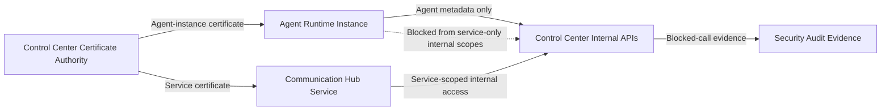
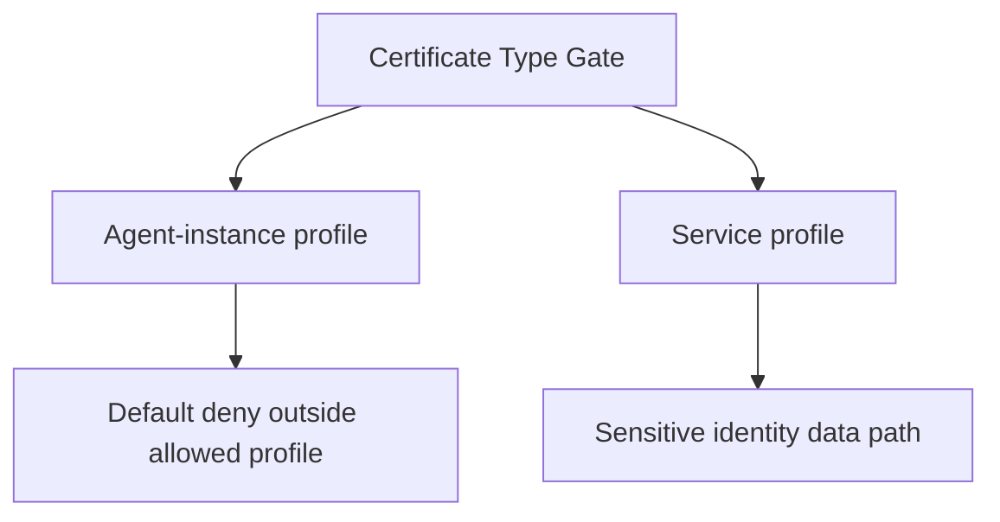

# Certificate Management Architecture

```mermaid
flowchart LR
    CA[Control Center Certificate Authority]
    AR[Agent Runtime Instance]
    CH[Communication Hub Service]
    CC[Control Center Internal APIs]
    AUD[Security Audit Evidence]

    CA -->|Agent-instance certificate| AR
    CA -->|Service certificate| CH
    AR -->|Agent metadata only| CC
    AR -.->|Blocked from service-only internal scopes| CC
    CH -->|Service-scoped internal access| CC
    CC -->|Blocked-call evidence| AUD
```

```mermaid
flowchart TB
    CERT[Certificate Type Gate]
    ARP[Agent-instance profile]
    CHP[Service profile]
    TOK[Sensitive identity data path]
    DENY[Default deny outside allowed profile]

    CERT --> ARP
    CERT --> CHP
    CHP --> TOK
    ARP --> DENY
```
