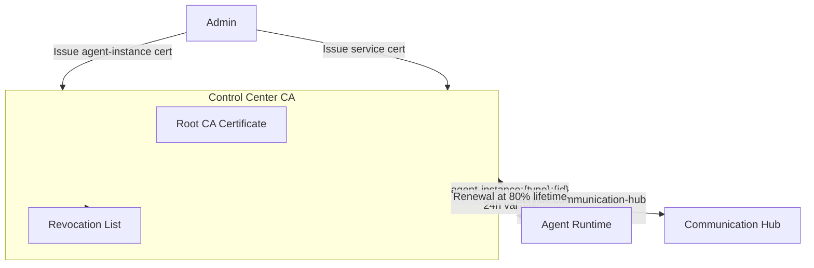

# Certificate Management

The platform uses X.509 mutual TLS (mTLS) certificates to authenticate agent instances and services. The Control Center acts as the root Certificate Authority.

## Certificate Types

| Certificate Type | CN Format | Validity | Issued To | Renewal |
|---|---|---|---|---|
| **Agent-instance** | `agent-instance:{agent_type_id}:{instance_id}` | 24 hours | Agent Runtime instances | Automatic (at 80% lifetime) |
| **Service** | `service:{service_name}` | 30 days | Communication Hub and other trusted services | Manual (operator task) |

## Access Control by Certificate Type

Certificate type is enforced at the endpoint level. The CN prefix determines which endpoints are accessible:

| Endpoint | Agent-instance cert | Service cert |
|---|---|---|
| `GET /agent/metadata` | Allowed | Blocked |
| `POST /tools/{name}` (Communication Hub) | Allowed | — |
| `POST /internal/certificates/validate` | **Blocked (403)** | Allowed |
| `POST /internal/authorize/tool-call` | **Blocked (403)** | Allowed |

This prevents agent instances from directly accessing identity tokens — even a compromised agent cannot bypass the Communication Hub to retrieve them.

## Certificate Lifecycle

**CA Initialization:** On first Control Center startup, the root CA key pair and self-signed certificate are generated and stored with encryption. The CA public certificate is distributed to all Agent Runtime instances and the Communication Hub via `GET /certificates/ca`.

**Issuance:** Certificates are issued by an admin via `POST /certificates/issue` with the agent type ID, instance ID (for agent-instance) or service name (for service). The Control Center signs the CSR and stores agent-instance certificates in the database for audit and revocation tracking. Service certificates are not stored in the database.

**Validation:** On every use, the receiving service validates the certificate signature against the CA public certificate, checks expiration, and checks the revocation list. The certificate type is extracted from the CN and enforced against the endpoint's requirements.

**Renewal:** Agent Runtime automatically renews its certificate at 80% of the 24-hour validity window. If renewal fails, the agent instance shuts down gracefully. Service certificates require manual renewal before the 30-day expiry.

**Revocation:** Administrators revoke certificates via `POST /certificates/revoke` with the certificate serial number. The serial is added to the CRL immediately; subsequent validation attempts return 401.

## Revocation and Boundary Enforcement Notes

- Service-to-service revocation checks use `GET /api/v1/internal/certificates/revoked/{serial_number}`.
- Internal callers default to fail-closed behavior when revocation status cannot be validated.
- Development-only insecure fallback is allowed only with explicit opt-in flags and should not be enabled in production.
- Control Center emits structured deny events for blocked internal calls, including caller identity and deny reason, for security auditability.
