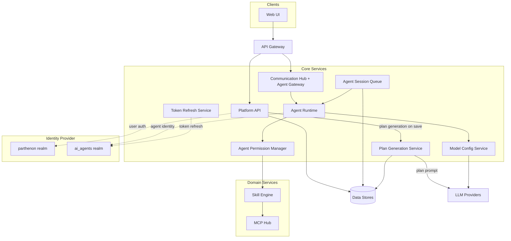

# System Overview — Enterprise AI Harness

## System Architecture

The platform follows a gateway-routed, service-oriented architecture. Inbound traffic from the Web UI flows through a single API Gateway, which routes requests to two core entry points: the Platform API (admin and config) and the Communication Hub (real-time messaging and agent execution). The Communication Hub also serves as the **Agent Gateway**, accepting inbound agent execution requests and managing instance lifecycle. Agent execution is handled asynchronously by the Agent Runtime (powered by the **LangChain deep agent** framework), dispatched through the Agent Session Queue, with permissions evaluated by the Agent Permission Manager and LLM access mediated by the Model Config Service. When an agent type is saved, the Platform API triggers the **Plan Generation Service** synchronously — the service traverses the role → SOP → Skill → Tool graph, invokes the configured LLM to produce a structured implementation plan, and returns the plan alongside a topology payload in the save response. The **Agent Runtime Loader** loads the saved plan from the `agent_plans` table when initialising an agent session and injects it into the agent's system context.

## Component Responsibilities

| Component | Responsibility |
|---|---|
| **Web UI** | Admin management, user-to-agent conversation interface, and Agent Instance Dashboard for monitoring and drilling into individual agent executions |
| **API Gateway** | Reverse proxy routing inbound traffic to core services |
| **Platform API** | Handles admin configuration, auth delegation, agent role and type management, model config CRUD, and session history queries. On agent type save, triggers Plan Generation Service synchronously and returns the generated plan and topology in the response |
| **Plan Generation Service** | Invoked on every agent type save; traverses the role → SOP → Skill → Tool graph via Agent Role Service; constructs an LLM prompt with the agent's instructions, role, SOPs, skills, and tools; calls the configured LLM to produce a structured implementation plan; delegates topology serialisation to the internal **Topology Builder Service**; persists the plan to `agent_plans`. Non-blocking on failure — the agent type is still saved |
| **Communication Hub** | Central message broker for Web UI ↔ Agent and Agent ↔ Agent messaging; also serves as the **Agent Gateway** — accepts inbound agent execution requests, validates OAuth identity tokens, enforces role authorization, and routes results back to callers. See [Communication Hub](modules/communication.md). |
| **Agent Runtime** | Manages agent instance execution using the **LangChain deep agent** framework (observe → reason → act loop); validates agent identity-role assignment; resolves model config via Model Config Service; coordinates LLM inference and skill execution; captures system instruction and user prompt to the execution log before each session's first LLM call. The **Agent Runtime Loader** extension fetches the saved plan from `agent_plans` on session start and injects it into the agent's system context for execution guidance. See [Agent Runtime](modules/agent-runtime/architecture.md). |
| **Agent Permission Manager** | Evaluates an agent role's SOP and Skill assignments; calculates the complete set of allowed MCP tools via role → SOP → Skill → Tool traversal; provides real-time tool preview to the management UI. See [Agent Runtime](modules/agent-runtime/architecture.md). |
| **Agent Session Queue** | Accepts execution requests asynchronously; dispatches sessions to the Agent Runtime; tracks session state (pending → running → complete / failed / cancelled); persists results, conversation history, and execution logs. See [Agent Runtime](modules/agent-runtime/architecture.md). |
| **Token Refresh Service** | Background service that monitors agent token expiry; proactively refreshes access tokens against the `ai_agents` realm using stored refresh tokens; updates the Token Store. See [Token Refresh](modules/token-refresh.md). |
| **Model Config Service** | Manages LLM provider configurations (provider type, API endpoint, encrypted credentials, and `enabled_models` array); resolves the correct provider at runtime by finding the `ModelConfig` whose `enabled_models` contains the agent type's `model_id`. See [Model Configuration](modules/model-config.md). |
| **Skill Engine** | Resolves skills with role-based access enforcement; binds multiple tools per skill using server-slug namespacing; delegates SOP execution to the SOP Orchestrator |
| **SOP Orchestrator** | Executes ordered SOP step sequences; routes skill-invocation steps to Skill Engine and agent-delegation steps to Agent Runtime; supports per-step instruction guidance |
| **MCP Hub** | Registers tool servers, syncs tools with tool-to-skill reverse mapping, manages named sessions per server with AES-256 credential encrypt/decrypt lifecycle, and proxies tool calls |
| **Scheduling Engine** | Triggers prompts and SOPs on configured cron schedules |
| **Notification Engine** | Sends outbound notifications via configured channels; exposed as invocable tools |
| **Data Stores** | Relational store (config, conversations, results, job state, and execution logs) and cache/pubsub layer |
| **Identity Provider** | Issues identity tokens for human users (`parthenon` realm) and agent identities (`ai_agents` realm); both realms are provisioned on first run. Defaults to a bundled Keycloak instance; can be replaced with any external OIDC-compliant provider. See [Identity](modules/identity.md). |
| **LLM Providers** | External model services accessed via the Model Config Service; supports direct provider APIs and LiteLLM proxy |
| **MCP Servers** | Admin-registered external tool servers |

## Identity (Cross-Cutting)

Identity is a foundational concern that gates all authenticated traffic. The identity provider manages two realms: the `parthenon` realm for human users and the `ai_agents` realm for agent identities. Both are provisioned automatically on first run via a Setup Wizard or CLI command; operators may substitute any external OIDC-compliant provider. See [Identity](modules/identity.md) for the provisioning and runtime flows.

## User Permission Management (Cross-Cutting)

User Permission Management controls human user access to Parthenon features and resources through a tag-based policy model. On every authenticated request, Resource APIs delegate to a centralised Permission Engine that evaluates tag-based policy conditions and returns an allow or deny decision. User registration, group assignment, and role seeding happen automatically at login and startup so that access control is always consistent with the identity state. See [User Permission Management](modules/identity/architecture.md) for the component and flow detail.

## Observability (Cross-Cutting)

Observability is a cross-cutting concern embedded in every component. All services emit traces, metrics, and logs via the OpenTelemetry SDK, forwarded over OTLP to a central OTEL Collector that fans out to Prometheus (metrics), Jaeger (traces), and Loki (logs). See [Observability](modules/observability.md) for the telemetry pipeline diagram.

## Integration Points

| Integration | Protocol / Standard | Purpose |
|---|---|---|
| **OIDC Provider (parthenon realm)** | OpenID Connect | Human user authentication and authorization |
| **OIDC Provider (ai_agents realm)** | OpenID Connect / OAuth 2.0 | Agent identity provisioning, token issuance, token validation, and background refresh |
| **Permission Engine** | Internal (tag-based policy) | Centralised authorization for all human user access to protected resources |
| **Platform API → Plan Generation Service** | Internal | Agent type save triggers synchronous plan generation; result returned in the save response |
| **Plan Generation Service → LLM Providers** | LLM API (vendor-specific) | Prompt constructed from agent context; response parsed into structured plan steps |
| **Communication Hub → Agent Runtime** | Internal | Routes agent execution requests; delivers results back to callers; maintains bidirectional chat for conversational agents |
| **Agent Runtime → Model Config Service** | Internal | Passes `model_id`; service resolves matched provider endpoint and encrypted credentials via `enabled_models` lookup |
| **Agent Runtime → Agent Permission Manager** | Internal | Per-session permission evaluation before any skill or tool call |
| **Token Refresh Service → ai_agents Realm** | OAuth 2.0 refresh grant | Background refresh of agent access tokens using stored refresh tokens |
| **MCP Servers** | Model Context Protocol | Tool registration, session management, and tool call proxying |
| **LLM Providers** | LLM API (vendor-specific) | Model inference via resolved provider endpoint and credentials |
| **Notification Channels** | Channel-specific (email, webhook, etc.) | Outbound notifications triggered by skills |
| **OTEL Collector** | OTLP (gRPC / HTTP) | Telemetry export from all services |
