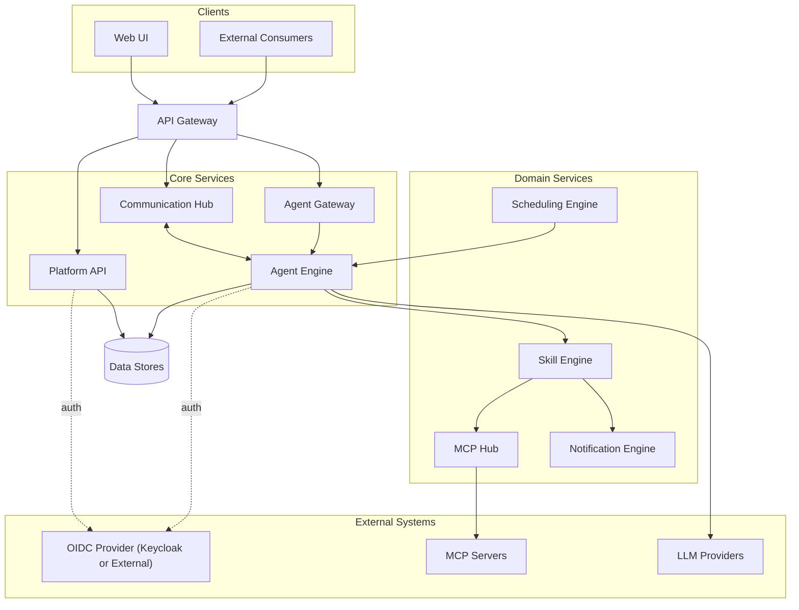

# System Overview — Enterprise AI Harness

## System Architecture

The platform follows a gateway-routed, service-oriented architecture. Inbound traffic from the Web UI and external consumers flows through a single API Gateway, which routes requests to three core entry points: the Platform API (admin and config), the Communication Hub (real-time messaging), and the Agent Gateway (external agent interaction). The Agent Engine is the central orchestrator — it manages agent instances, delegates skill execution to domain services, and calls out to LLM providers.

## Component Responsibilities

| Component | Responsibility |
|---|---|
| **Web UI** | Admin management and user-to-agent conversation interface |
| **External Consumers** | Third-party systems that interact with agents via the Agent Gateway |
| **API Gateway** | Reverse proxy routing inbound traffic to core services |
| **Platform API** | Handles admin configuration, auth delegation, and orchestration of domain services |
| **Communication Hub** | Central message broker for Web UI ↔ Agent and Agent ↔ Agent messaging |
| **Agent Gateway** | Exposes agent types externally via a standard interaction lifecycle protocol |
| **Agent Engine** | Manages agent type registry, instance lifecycle, model binding, and skill/SOP execution |
| **Skill Engine** | Resolves skills with role-based access enforcement; binds multiple tools per skill using server-slug namespacing; delegates SOP execution to the SOP Orchestrator |
| **SOP Orchestrator** | Executes ordered SOP step sequences; routes skill-invocation steps to Skill Engine and agent-delegation steps to Agent Engine; supports per-step instruction guidance |
| **MCP Hub** | Registers tool servers, syncs tools with tool-to-skill reverse mapping, manages named sessions per server with AES-256 credential encrypt/decrypt lifecycle, and proxies tool calls |
| **Scheduling Engine** | Triggers prompts and SOPs on configured cron schedules |
| **Notification Engine** | Sends outbound notifications via configured channels; exposed as invocable tools |
| **Data Stores** | Relational store (config, conversations, results, job state) and cache/pubsub layer |
| **OIDC Provider** | Issues identity tokens for users; provisions identities for agent types. Defaults to a bundled Keycloak instance; can be replaced with any external OIDC-compliant provider. See [Identity](modules/identity.md). |
| **MCP Servers** | Admin-registered external tool servers |
| **LLM Providers** | External model services bound to agent types |

## Identity (Cross-Cutting)

Identity is a foundational concern that gates all authenticated traffic. The platform ships with a bundled Keycloak instance that is provisioned automatically on first run via a Setup Wizard or CLI command; operators may substitute any external OIDC-compliant provider. See [Identity](modules/identity.md) for the provisioning and runtime flows.

## User Permission Management (Cross-Cutting)

User Permission Management controls human user access to Parthenon features and resources through a tag-based policy model. On every authenticated request, Resource APIs delegate to a centralised Permission Engine that evaluates tag-based policy conditions and returns an allow or deny decision. User registration, group assignment, and role seeding happen automatically at login and startup so that access control is always consistent with the identity state. See [User Permission Management](modules/identity/architecture.md) for the component and flow detail.

## Observability (Cross-Cutting)

Observability is a cross-cutting concern embedded in every component. All services emit traces, metrics, and logs via the OpenTelemetry SDK, forwarded over OTLP to a central OTEL Collector that fans out to Prometheus (metrics), Jaeger (traces), and Loki (logs). See [Observability](modules/observability.md) for the telemetry pipeline diagram.

## Integration Points

| Integration | Protocol / Standard | Purpose |
|---|---|---|
| **OIDC Provider** | OpenID Connect | User authentication and agent-type identity provisioning |
| **Permission Engine** | Internal (tag-based policy) | Centralised authorization for all human user access to protected resources |
| **MCP Servers** | Model Context Protocol | Tool registration, session management, and tool call proxying |
| **LLM Providers** | LLM API (vendor-specific) | Model inference bound to agent types |
| **Notification Channels** | Channel-specific (email, webhook, etc.) | Outbound notifications triggered by skills |
| **OTEL Collector** | OTLP (gRPC / HTTP) | Telemetry export from all services |
