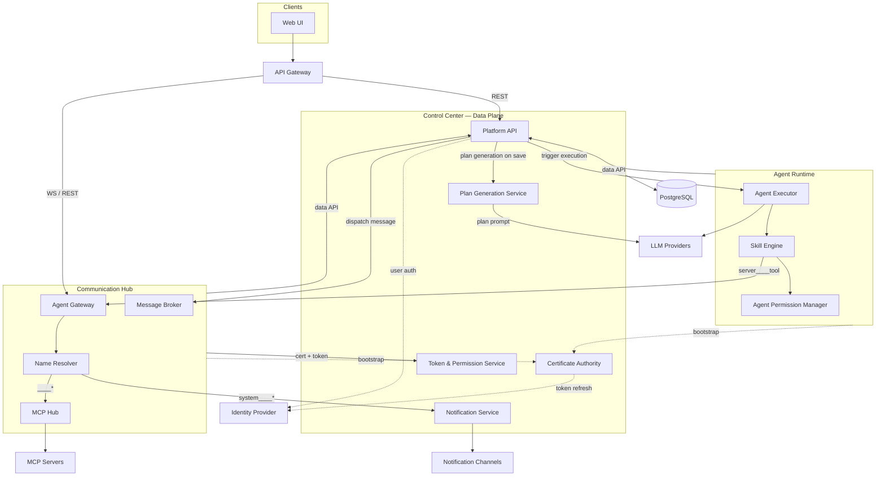
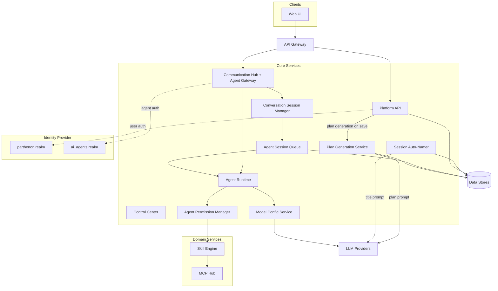
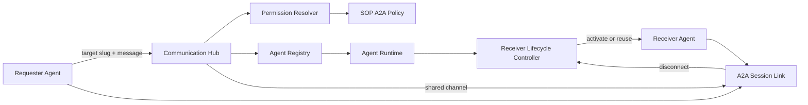

# System Overview — Enterprise AI Harness

## System Architecture

The platform is composed of three independently deployable services — **Control Center**, **Agent Runtime**, and **Communication Hub** — behind a single API Gateway. Only Control Center has direct database access; Agent Runtime and Communication Hub access all data through authenticated Control Center internal APIs over mutual TLS (mTLS).

**Control Center** is the platform's data plane: it owns the PostgreSQL database, acts as the Certificate Authority (CA), manages identity tokens, serves the Platform API for the Web UI, and triggers execution and messaging on the other services.

**Agent Runtime** is a stateless LangChain executor. It receives execution triggers from Control Center, fetches all agent context (plan, skills, model config) from Control Center data APIs using its service certificate, executes the observe-reason-act loop, and posts results back to Control Center. It never accesses the database directly.

**Communication Hub** is the message broker and agent gateway. It accepts Web UI WebSocket connections, receives message dispatch commands from Control Center, validates agent certificates and resolves identity per tool call, and routes all agent tool calls to the correct handler using the unified tool naming convention. It never accesses the database directly.

**Security:** All service-to-service communication uses certificate-based mutual TLS. Control Center issues X.509 certificates to both peer services via a bootstrap flow (using per-service bootstrap keys). Agent Runtime and Communication Hub renew their certificates automatically before expiry. Agent-instance certificates (short-lived, per execution) are issued separately and are blocked from accessing internal Control Center endpoints.

```mermaid
flowchart TB
    subgraph Clients
        WebUI[Web UI]
    end

    GW[API Gateway]

    subgraph ControlCenter["Control Center — Data Plane"]
        PlatformAPI[Platform API]
        PGS[Plan Generation Service]
        CertAuth[Certificate Authority]
        TokenSvc[Token & Permission Service]
        NotifSvc[Notification Service]
    end

    subgraph AgentRuntime["Agent Runtime"]
        Executor[Agent Executor]
        SkillEng[Skill Engine]
        APM[Agent Permission Manager]
    end

    subgraph CommHub["Communication Hub"]
        AgentGW[Agent Gateway]
        Broker[Message Broker]
        NameResolver[Name Resolver]
        MCPHub[MCP Hub]
    end

    DB[(PostgreSQL)]
    LLM[LLM Providers]
    IdP[Identity Provider]
    MCPServers[MCP Servers]
    ExtChannels[Notification Channels]

    WebUI --> GW
    GW -->|REST| PlatformAPI
    GW -->|WS / REST| AgentGW
    PlatformAPI -->|plan generation on save| PGS
    PGS -->|plan prompt| LLM
    ControlCenter --> DB
    AgentRuntime -.->|bootstrap| CertAuth
    CommHub -.->|bootstrap| CertAuth
    AgentRuntime -->|data API| PlatformAPI
    CommHub -->|data API| PlatformAPI
    CommHub -->|cert + token| TokenSvc
    PlatformAPI -->|trigger execution| Executor
    PlatformAPI -->|dispatch message| Broker
    Executor --> SkillEng
    SkillEng --> APM
    SkillEng -->|"server____tool"| AgentGW
    AgentGW --> NameResolver
    NameResolver -->|"system____*"| NotifSvc
    NameResolver -->|"<server>____*"| MCPHub
    MCPHub --> MCPServers
    NotifSvc --> ExtChannels
    Executor --> LLM
    PlatformAPI -.->|user auth| IdP
    CertAuth -.->|token refresh| IdP
```

## Service Boundaries

| Service | Database Access | Inbound from | Outbound to |
|---|---|---|---|
| **Control Center** | Direct (sole owner) | Web UI, Agent Runtime, Communication Hub | Agent Runtime (trigger), Communication Hub (dispatch), LLM, IdP |
| **Agent Runtime** | None (all via CC data APIs) | Control Center (trigger) | Control Center (data APIs, result submit), Communication Hub (tool calls) |
| **Communication Hub** | None (all via CC data APIs) | Web UI (WebSocket), Control Center (dispatch), Agent Runtime (tool calls) | Control Center (data APIs, token resolution), MCP Servers, Notification Channels |

## Control Center Internal API Policy (Service Segregation)

Control Center enforces caller-scoped internal API allowlists with deny-by-default behavior:

- Agent Runtime caller type: `agent_runtime`
- Communication Hub caller type: `communication_hub`
- Unknown caller identity or non-allowlisted endpoint: denied before handler execution and logged as a structured deny event

| Caller | Internal API Scope |
|---|---|
| Agent Runtime | Runtime data/session endpoints only (agent context, model config, session state, result/log writes, MCP session lookup) |
| Communication Hub | Authorization/certificate validation, conversation and A2A data endpoints, system-tools endpoints, MCP proxy |

This policy preserves top-priority segregation rules: only Control Center holds direct database access, and execution remains in Agent Runtime.

## Component Responsibilities

| Component | Responsibility |
|---|---|
| **Web UI** | Admin management, user-to-agent conversation interface, and Agent Instance Dashboard for monitoring and drilling into individual agent executions |
| **API Gateway** | Reverse proxy routing inbound traffic to Control Center and Communication Hub |
| **Platform API** | Handles admin configuration, auth delegation, agent role and type management, model config CRUD, session history queries, notification channel/group management, and delivery log. On agent type save, triggers Plan Generation Service synchronously and returns the generated plan and topology in the response |
| **Plan Generation Service** | Invoked on every agent type save; traverses the role → SOP → Skill → Tool graph; calls the configured LLM to produce a structured implementation plan; persists the plan. Non-blocking on failure — the agent type is still saved |
| **Certificate Authority** | Issues and revokes X.509 certificates for agent instances (short-lived) and peer services (longer-lived). All certificates are managed within Control Center. |
| **Token & Permission Service** | Resolves agent certificates to identity tokens and permissions for Communication Hub; manages token storage and refresh via the IdP `ai_agents` realm |
| **Notification Service** | Orchestrates outbound notifications: resolves recipient groups by slug, retrieves encrypted channel credentials, dispatches to channel providers (SMTP, Email API, Webhook, Messenger), records delivery outcomes to `NotificationLog`, and emits delivery metrics. Registered as the `system____send_notification` tool handler. |
| **Communication Hub** | Central message broker for Web UI ↔ Agent and Agent ↔ Agent messaging; also serves as the **Agent Gateway** — accepts inbound agent execution requests, validates agent-instance X.509 certificates, requests identity tokens and permissions from Control Center on every tool call. Contains the **Name Resolver** which routes all tool calls: `system____*` calls to internal system handlers, `<server>____*` calls to the MCP Hub. Identity tokens are used within the hub and never forwarded to Agent Runtime. |
| **Name Resolver** | Central tool routing component within Communication Hub. Parses the unified `server____tool` name, determines handler (system handler or MCP server), and dispatches accordingly. No tool routing logic exists in Agent Runtime. |
| **Conversation Session Manager** | Manages lifecycle transitions for conversation agent sessions (create, resume, end, archive); validates session ownership; enforces session state machine; triggers Session Auto-Namer after first user message. |
| **Session Auto-Namer** | Background task triggered after the first user turn; generates a session title via LLM prompt; pushes `title_update` WebSocket event to the active client; falls back to truncated first message on LLM failure. |
| **Agent Runtime** | Manages agent instance execution using the **LangChain deep agent** framework (observe → reason → act loop). Fetches all context (plan, skills, model config) from Control Center data APIs. Forwards all tool calls to Communication Hub using the unified `server____tool` naming convention — no system/MCP distinction in executor code. Authenticates using X.509 agent-instance certificates (mTLS). Never stores or receives identity tokens. |
| **Agent Permission Manager** | Evaluates an agent role's SOP and Skill assignments; calculates the complete set of allowed tools via role → SOP → Skill → Tool traversal; provides real-time tool preview to the management UI. |
| **Skill Engine** | Resolves skills with role-based access enforcement; binds multiple tools per skill; delegates SOP execution to the SOP Orchestrator |
| **SOP Orchestrator** | Executes ordered SOP step sequences; routes skill-invocation steps to Skill Engine and agent-delegation steps to Agent Runtime; supports per-step instruction guidance |
| **MCP Hub** | Registers tool servers, syncs tools, manages named sessions per server with AES-256 credential encrypt/decrypt lifecycle, and proxies tool calls. Supports **session-based** (stored credentials) and **passthrough** (forwards agent JWT) session types. |
| **Scheduling Engine** | Triggers prompts and SOPs on configured cron schedules |
| **Data Stores** | PostgreSQL (config, conversations, results, job state, execution logs, notification logs) and Redis (cache/pubsub) — accessed only by Control Center |
| **Identity Provider** | Issues tokens for human users (`parthenon` realm) and agent identities (`ai_agents` realm); both realms provisioned on first run. Defaults to bundled Keycloak; substitutable with any OIDC provider. |
| **LLM Providers** | External model services; accessed via Model Config Service credential resolution |
| **MCP Servers** | Admin-registered external tool servers |
| **Notification Channels** | External outbound destinations: SMTP relay, Email API, Webhook endpoints, Instant Messenger connectors (Teams, Slack) |
| **MCP Demo App** | Example external MCP server; authenticates with the `ai_agents` realm; validates forwarded agent JWTs per tool call |

## Tool Naming Convention (Cross-Cutting)

All tools available to agents follow the `server____tool_name` convention (four underscores). The `system` server name is reserved for built-in platform tools (e.g., `system____save_result`, `system____send_notification`, `system____get_recipient_group`). MCP server names must not contain `____`. This convention is enforced platform-wide and is the basis for all routing decisions in the Communication Hub Name Resolver.

## Identity (Cross-Cutting)

Identity is a foundational concern that gates all authenticated traffic. The identity provider manages two realms: the `parthenon` realm for human users and the `ai_agents` realm for agent identities. Both are provisioned automatically on first run via a Setup Wizard or CLI command; operators may substitute any external OIDC-compliant provider. See [Identity](modules/identity.md) for the provisioning and runtime flows.

```mermaid
flowchart TB
    subgraph Clients
        WebUI[Web UI]
    end

    Nginx[API Gateway]

    subgraph Core[Core Services]
        API[Platform API]
        PGS[Plan Generation Service]
        CC[Control Center]
        CH[Communication Hub + Agent Gateway]
        CSM[Conversation Session Manager]
        SAN[Session Auto-Namer]
        AR[Agent Runtime]
        APM[Agent Permission Manager]
        AJQ[Agent Session Queue]
        MCS[Model Config Service]
    end

    subgraph Domain[Domain Services]
        SE[Skill Engine]
        MCP[MCP Hub]
    end

    DS[(Data Stores)]

    subgraph IdP[Identity Provider]
        UserRealm[parthenon realm]
        AgentRealm[ai_agents realm]
    end

    LLM[LLM Providers]

    WebUI --> Nginx
    Nginx --> API
    Nginx --> CH
    API -->|plan generation on save| PGS
    PGS -->|plan prompt| LLM
    CH --> CSM
    CH --> AR
    CSM --> AJQ
    SAN -->|title prompt| LLM
    SAN --> DS
    AJQ --> AR
    AR --> APM
    AR --> MCS
    MCS --> LLM
    APM --> SE
    SE --> MCP
    API --> DS
    AJQ --> DS
    PGS --> DS
    API -.->|user auth| UserRealm
    CH -.->|agent auth| AgentRealm
```

## A2A Routing and Dynamic Receiver Lifecycle (Cross-Cutting)

```mermaid
flowchart LR
    Req[Requester Agent]
    Hub[Communication Hub]
    Perm[Permission Resolver]
    SOP[SOP A2A Policy]
    Registry[Agent Registry]
    Runtime[Agent Runtime]
    Lifecycle[Receiver Lifecycle Controller]
    Rec[Receiver Agent]
    Link[A2A Session Link]

    Req -->|target slug + message| Hub
    Hub --> Perm
    Perm --> SOP
    Hub --> Registry
    Registry --> Runtime
    Runtime --> Lifecycle
    Lifecycle -->|activate or reuse| Rec
    Hub -->|shared channel| Link
    Req --> Link
    Rec --> Link
    Link -->|disconnect| Lifecycle
```

## User Permission Management (Cross-Cutting)

User Permission Management controls human user access to Parthenon features and resources through a tag-based policy model. On every authenticated request, Resource APIs delegate to a centralised Permission Engine that evaluates tag-based policy conditions and returns an allow or deny decision. User registration, group assignment, and role seeding happen automatically at login and startup so that access control is always consistent with the identity state. See [User Permission Management](modules/identity/architecture.md) for the component and flow detail.

## Observability (Cross-Cutting)

Observability is a cross-cutting concern embedded in every component. All services emit traces, metrics, and logs via the OpenTelemetry SDK, forwarded over OTLP to a central OTEL Collector that fans out to Prometheus (metrics), Jaeger (traces), and Loki (logs). See [Observability](modules/observability.md) for the telemetry pipeline diagram.

## Integration Points

| Integration | Protocol / Standard | Purpose |
|---|---|---|
| **OIDC Provider (parthenon realm)** | OpenID Connect | Human user authentication and authorization |
| **OIDC Provider (ai_agents realm)** | OpenID Connect / OAuth 2.0 | Agent identity provisioning, token issuance, token validation, and background refresh |
| **Permission Engine** | Internal (tag-based policy) | Centralised authorization for all human user access to protected resources |
| **Platform API → Plan Generation Service** | Internal | Agent type save triggers synchronous plan generation; result returned in the save response |
| **Plan Generation Service → LLM Providers** | LLM API (vendor-specific) | Prompt constructed from agent context; response parsed into structured plan steps |
| **Communication Hub → Agent Runtime** | Internal | Routes agent execution requests; delivers results back to callers; maintains bidirectional chat for conversational agents |
| **Communication Hub → Conversation Session Manager** | Internal (REST) | Handles session create, list, resume, end, and archive requests; associates WebSocket connections with session IDs for context propagation |
| **Conversation Session Manager → Session Auto-Namer** | Internal (async trigger) | After first user turn is persisted, triggers background task to generate and set session title |
| **Session Auto-Namer → Web UI** | WebSocket (`title_update` push) | Pushes generated session title to connected client after background generation completes |
| **Agent Runtime → Model Config Service** | Internal | Passes `model_id`; service resolves matched provider endpoint and encrypted credentials via `enabled_models` lookup |
| **Agent Runtime → Agent Permission Manager** | Internal | Per-session permission evaluation before any skill or tool call |
| **Token Refresh Service → ai_agents Realm** | OAuth 2.0 refresh grant | Background refresh of agent access tokens using stored refresh tokens |
| **MCP Servers** | Model Context Protocol | Tool registration, session management, and tool call proxying |
| **LLM Providers** | LLM API (vendor-specific) | Model inference via resolved provider endpoint and credentials |
| **Notification Channels** | Channel-specific (email, webhook, etc.) | Outbound notifications triggered by skills |
| **OTEL Collector** | OTLP (gRPC / HTTP) | Telemetry export from all services |
