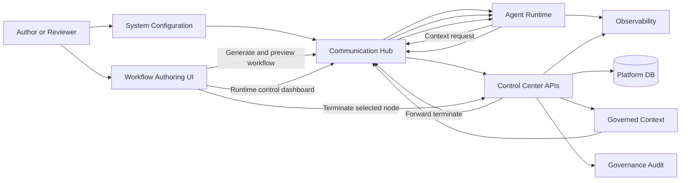
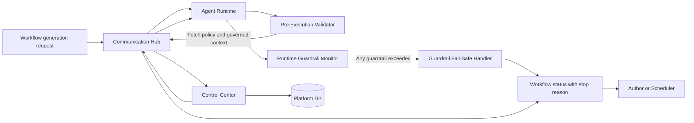

# System Overview

```mermaid
flowchart LR
    AU[Author or Reviewer]
    UI[Workflow Authoring UI]
    CFG[System Configuration]
    CH[Communication Hub]
    AR[Agent Runtime]
    CCA[Control Center APIs]
    CCTX[Governed Context]
    DB[(Platform DB)]
    OBS[Observability]
    AUD[Governance Audit]

    AU --> UI
    AU --> CFG
    CFG --> CH
    UI -->|Generate and preview workflow| CH
    UI -->|Runtime control dashboard| CH
    CH --> AR
    AR -->|Context request| CH
    CH --> CCA
    CCA --> DB
    CCA --> CCTX
    CCTX --> CH
    CH --> AR
    AR --> CH
    AR --> OBS
    CCA --> OBS
    CCA --> AUD
    UI -->|Terminate selected node| CCA
    CCA -->|Forward terminate| CH
    CH --> AR
```

```mermaid
flowchart LR
    RQ[Workflow generation request]
    CH[Communication Hub]
    AR[Agent Runtime]
    PV[Pre-Execution Validator]
    RM[Runtime Guardrail Monitor]
    FS[Guardrail Fail-Safe Handler]
    CC[Control Center]
    DB[(Platform DB)]
    ST[Workflow status with stop reason]
    CL[Author or Scheduler]

    RQ --> CH
    CH --> AR
    AR --> PV
    PV -->|Fetch policy and governed context| CH
    CH --> CC
    CC --> DB
    CC --> CH
    CH --> AR
    AR --> RM
    RM -->|Any guardrail exceeded| FS
    FS --> ST
    CH --> ST
    ST --> CL
```

## Key Responsibilities

- **Communication Hub** — Message broker, agent execution routing, conversation session management, **conversation intervention routing** (detects intervention requests from delegated sub-agents and routes to parent conversation WebSocket clients), and A2A messaging.
- **Agent Runtime** — Deep agent execution engine (observe-reason-act loop), tool call orchestration, delegation, and HITL suspend/resume.
- **Control Center** — Policy resolution, governed context assembly, generation model resolution, SOP resolution, **conversation intervention persistence** (new `intervene_request` and `intervene_response` turn types with delegation chain metadata), governance audit, termination orchestration.
- **Governed Context** — Accumulated context package assembled per agent execution (policies, permissions, previous session context).
- **Governance Audit** — Records all intervention request and response turns in the conversation audit trail with full delegation chain traceability.
