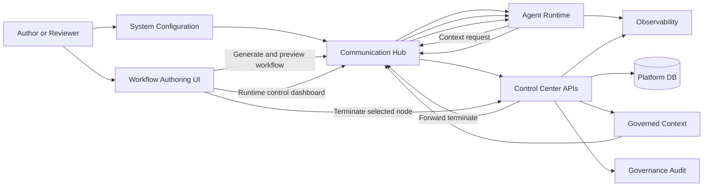
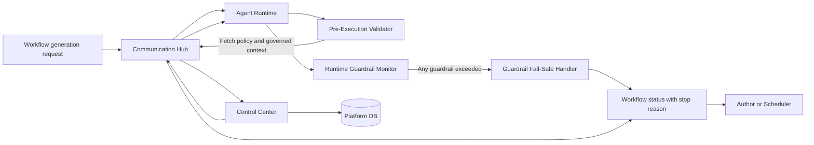

# System Overview

```mermaid
flowchart LR
    AU[Author or Reviewer]
    UI[Workflow Authoring UI]
    CFG[System Configuration]
    CH[Communication Hub]
    AR[Agent Runtime]
    CCA[Control Center APIs]
    CCTX[Governed Context]
    DB[(Platform DB)]
    OBS[Observability]
    AUD[Governance Audit]

    AU --> UI
    AU --> CFG
    CFG --> CH
    UI -->|Generate and preview workflow| CH
    UI -->|Runtime control dashboard| CH
    CH --> AR
    AR -->|Context request| CH
    CH --> CCA
    CCA --> DB
    CCA --> CCTX
    CCTX --> CH
    CH --> AR
    AR --> CH
    AR --> OBS
    CCA --> OBS
    CCA --> AUD
    UI -->|Terminate selected node| CCA
    CCA -->|Forward terminate| CH
    CH --> AR
```

```mermaid
flowchart LR
    RQ[Workflow generation request]
    CH[Communication Hub]
    AR[Agent Runtime]
    PV[Pre-Execution Validator]
    RM[Runtime Guardrail Monitor]
    FS[Guardrail Fail-Safe Handler]
    CC[Control Center]
    DB[(Platform DB)]
    ST[Workflow status with stop reason]
    CL[Author or Scheduler]

    RQ --> CH
    CH --> AR
    AR --> PV
    PV -->|Fetch policy and governed context| CH
    CH --> CC
    CC --> DB
    CC --> CH
    CH --> AR
    AR --> RM
    RM -->|Any guardrail exceeded| FS
    FS --> ST
    CH --> ST
    ST --> CL
```

## Key Responsibilities

- **Communication Hub** — Message broker, agent execution routing, conversation session management, **conversation intervention routing** (detects intervention requests from delegated sub-agents and routes to parent conversation WebSocket clients), **task delegation event routing** (routes non-conversational delegation status events and intervention requests to execution log viewers), A2A messaging, and **system tool call routing** (routes `save_data`, `get_data`, `get_output`, and `query_result` calls through its endpoint map to Control Center).
- **Agent Runtime** — Deep agent execution engine via LangChain `create_agent` / LangGraph `AgentExecutor`, tool call orchestration via `CommHubToolClient`, delegation, **delegation depth enforcement** (1-level limit for non-conversational agents), HITL suspend/resume, delegation status event emission for non-conversational executions, **typed output validation** (calls Control Center schema validation endpoint at execution completion), and **system tool binding** (LangChain `BaseTool` subclasses for `save_data`, `get_data`, `get_output`, and `query_result` that route tool calls through Communication Hub).
- **Control Center** — Policy resolution, governed context assembly, generation model resolution, SOP resolution, **conversation intervention persistence** (new `intervene_request` and `intervene_response` turn types with delegation chain metadata), governance audit, termination orchestration, **Agent Data Type Registry** (centralized reusable typed schemas for agent outputs), **Output Store** (typed output persistence with schema validation), **Schema Validation Service** (payload validation against data type schemas), and **system tool endpoints** (`save_data` persistence, `get_data`/`get_output`/`query_result` query endpoints — all mTLS-protected, exclusively called by Communication Hub).
- **Governed Context** — Accumulated context package assembled per agent execution (policies, permissions, previous session context).
- **Governance Audit** — Records all intervention request and response turns in the conversation audit trail with full delegation chain traceability.
