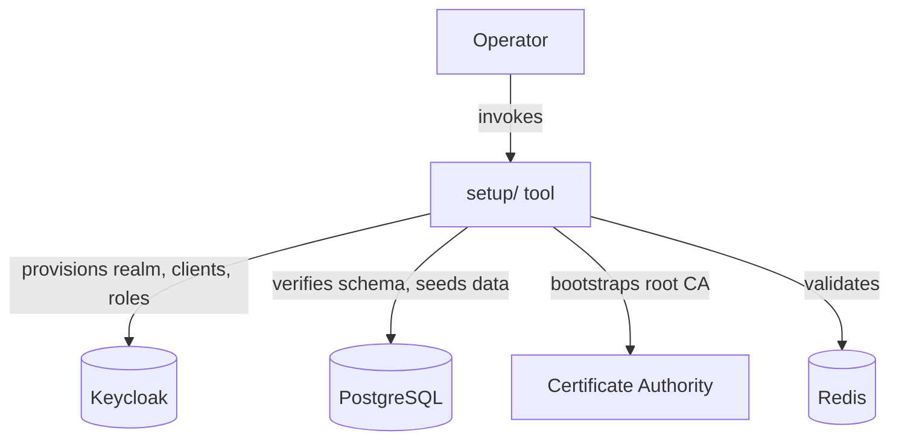
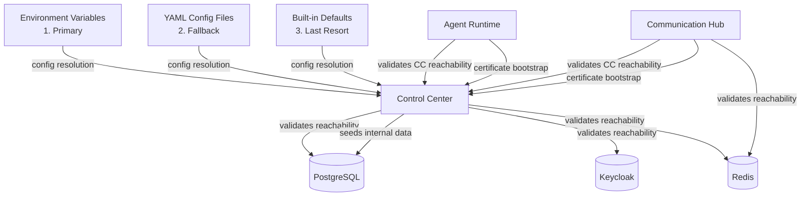
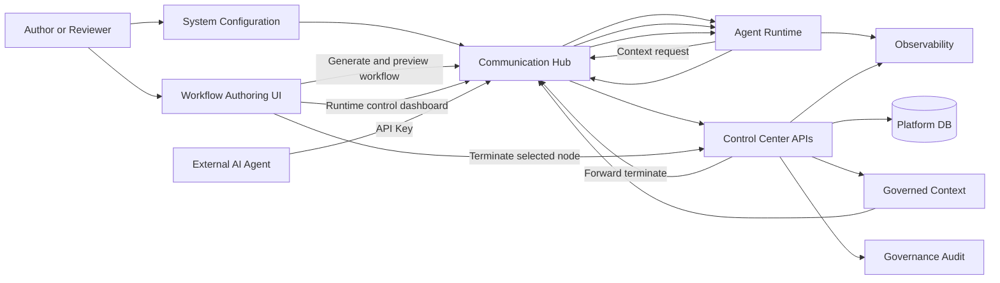
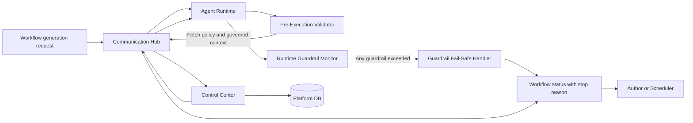

# System Overview

## Infrastructure & Configuration

The setup tool is an operator-invoked component that provisions external infrastructure before the runtime services start. It is not part of the running system — it runs once during environment initialization and is safe to re-run (all operations are idempotent).

```mermaid
flowchart TB
    OP[Operator]
    SETUP[setup/ tool]
    KC[(Keycloak)]
    DB[(PostgreSQL)]
    RD[(Redis)]
    CA[Certificate Authority]

    OP -->|invokes| SETUP
    SETUP -->|provisions realm, clients, roles| KC
    SETUP -->|verifies schema, seeds data| DB
    SETUP -->|bootstraps root CA| CA
    SETUP -->|validates| RD
```

### Runtime Startup Validation & Configuration Resolution

At startup, each service validates that external infrastructure is reachable. Configuration is resolved in priority order: environment variables (primary), YAML config files (fallback), and built-in defaults (last resort). On startup, every service logs which source was used for each infrastructure connection.

```mermaid
flowchart TB
    ENV[Environment Variables<br/>1. Primary]
    YAML[YAML Config Files<br/>2. Fallback]
    DEF[Built-in Defaults<br/>3. Last Resort]
    CC[Control Center]
    AR[Agent Runtime]
    CH[Communication Hub]
    KC[(Keycloak)]
    DB[(PostgreSQL)]
    RD[(Redis)]

    ENV -->|config resolution| CC
    YAML -->|config resolution| CC
    DEF -->|config resolution| CC

    CC -->|validates reachability| DB
    CC -->|validates reachability| KC
    CC -->|validates reachability| RD
    CC -->|seeds internal data| DB

    AR -->|validates CC reachability| CC
    AR -->|certificate bootstrap| CC

    CH -->|validates CC reachability| CC
    CH -->|validates reachability| RD
    CH -->|certificate bootstrap| CC
```

## Workflow Execution

```mermaid
flowchart LR
    AU[Author or Reviewer]
    UI[Workflow Authoring UI]
    CFG[System Configuration]
    CH[Communication Hub]
    AR[Agent Runtime]
    EA[External AI Agent]
    CCA[Control Center APIs]
    CCTX[Governed Context]
    DB[(Platform DB)]
    OBS[Observability]
    AUD[Governance Audit]

    AU --> UI
    AU --> CFG
    CFG --> CH
    UI -->|Generate and preview workflow| CH
    UI -->|Runtime control dashboard| CH
    CH --> AR
    AR -->|Context request| CH
    CH --> CCA
    CCA --> DB
    CCA --> CCTX
    CCTX --> CH
    CH --> AR
    AR --> CH
    AR --> OBS
    CCA --> OBS
    CCA --> AUD
    UI -->|Terminate selected node| CCA
    CCA -->|Forward terminate| CH
    CH --> AR
    EA -->|API Key| CH
```

```mermaid
flowchart LR
    RQ[Workflow generation request]
    CH[Communication Hub]
    AR[Agent Runtime]
    PV[Pre-Execution Validator]
    RM[Runtime Guardrail Monitor]
    FS[Guardrail Fail-Safe Handler]
    CC[Control Center]
    DB[(Platform DB)]
    ST[Workflow status with stop reason]
    CL[Author or Scheduler]

    RQ --> CH
    CH --> AR
    AR --> PV
    PV -->|Fetch policy and governed context| CH
    CH --> CC
    CC --> DB
    CC --> CH
    CH --> AR
    AR --> RM
    RM -->|Any guardrail exceeded| FS
    FS --> ST
    CH --> ST
    ST --> CL
```

## Authentication Paths

The Communication Hub serves as an MCP endpoint for both internal and external agents. Internal Agent Runtime instances authenticate via mTLS certificates; external third-party AI agents use API keys. In both cases, identity tokens are held exclusively by the Communication Hub — agents never receive them directly. For full dual-auth architecture, see [Communication Hub Architecture](modules/communication-hub/architecture.md).

## Permission Authorization

Parthenon uses a **deny-by-default** authorization model with **policy-based allow**. The Permission Engine resolves effective permissions through a role → policy → resource type chain using the `module::submodule` naming convention. For the full authorization flow, wildcard evaluation rules, and policy management architecture, see [IAM Module Architecture](modules/iam.md).

## Authentication Pipeline

The Control Center uses a three-tier authentication pipeline — super admin local auth (top tier), per-provider OIDC JWT validation (middle tier), and public path fallback (bottom tier). For the full pipeline architecture, component responsibilities, and OIDC provider modes, see [Control Center Architecture](modules/control-center/architecture.md).

## Key Responsibilities

- **Control Center** — Central authority for configuration, authentication, OIDC provider registry, permission resolution, certificate authority, API key management, agent data type registry, agent outputs, and scheduling. Validates infrastructure dependencies at startup and fails fast.
- **Agent Runtime** — Deep agent execution via LangChain with tool call orchestration through Communication Hub. Enforces delegation depth limits, performs typed output validation, and emits delegation status events. Agents never hold identity tokens.
- **Communication Hub** — Message broker and agent gateway supporting dual authentication (mTLS cert + API key). Routes tool calls to Control Center, handles conversation intervention routing, A2A messaging, and WebSocket connections for real-time chat.
- **Setup Tool** — Operator-invoked CLI (outside running system) for Keycloak provisioning, certificate authority bootstrap, and database seeding. All operations are idempotent.
