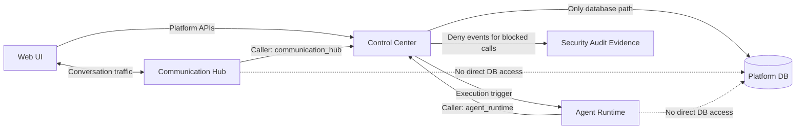
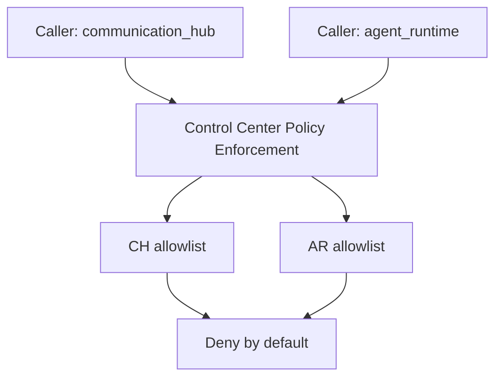

# System Overview

```mermaid
flowchart LR
    UI[Web UI]
    CH[Communication Hub]
    AR[Agent Runtime]
    CC[Control Center]
    DB[(Platform DB)]
    AUD[Security Audit Evidence]

    UI -->|Platform APIs| CC
    UI <-->|Conversation traffic| CH
    CC -->|Execution trigger| AR
    CH -->|Caller: communication_hub| CC
    AR -->|Caller: agent_runtime| CC
    CC -->|Only database path| DB
    CH -.->|No direct DB access| DB
    AR -.->|No direct DB access| DB
    CC -->|Deny events for blocked calls| AUD
```

```mermaid
flowchart TB
    PEP[Control Center Policy Enforcement]
    CHC[Caller: communication_hub]
    ARC[Caller: agent_runtime]
    CHA[CH allowlist]
    ARA[AR allowlist]
    DENY[Deny by default]

    CHC --> PEP
    ARC --> PEP
    PEP --> CHA
    PEP --> ARA
    CHA --> DENY
    ARA --> DENY
```
