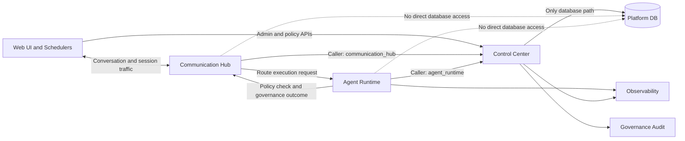
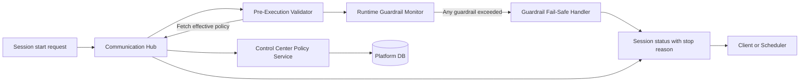

# System Overview

```mermaid
flowchart LR
    UI[Web UI and Schedulers]
    CH[Communication Hub]
    AR[Agent Runtime]
    CC[Control Center]
    DB[(Platform DB)]
    OBS[Observability]
    AUD[Governance Audit]

    UI <-->|Conversation and session traffic| CH
    CH -->|Route execution request| AR
    UI -->|Admin and policy APIs| CC
    AR -->|Policy check and governance outcome| CH
    CH -->|Caller: communication_hub| CC
    AR -->|Caller: agent_runtime| CC
    CC -->|Only database path| DB
    CH -.->|No direct database access| DB
    AR -.->|No direct database access| DB
    AR --> OBS
    CC --> OBS
    CC --> AUD
```

```mermaid
flowchart LR
    RQ[Session start request]
    CH[Communication Hub]
    PV[Pre-Execution Validator]
    RM[Runtime Guardrail Monitor]
    FS[Guardrail Fail-Safe Handler]
    CC[Control Center Policy Service]
    DB[(Platform DB)]
    ST[Session status with stop reason]
    CL[Client or Scheduler]

    RQ --> CH
    CH --> PV
    PV -->|Fetch effective policy| CH
    CH --> CC
    CC --> DB
    PV --> RM
    RM -->|Any guardrail exceeded| FS
    FS --> ST
    CH --> ST
    ST --> CL
```
