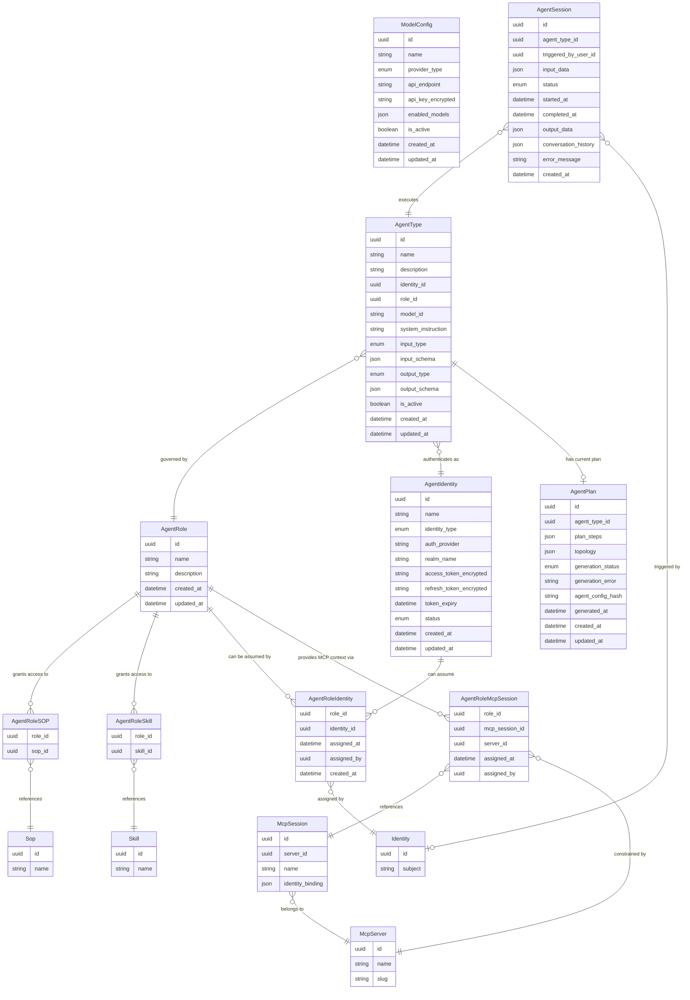

# Agent Management — Entities

**Source**: `backend/app/db/models/agents.py`

| Entity | Description |
|--------|-------------|
| **ModelConfig** | A named, reusable LLM provider backend configuration. Stores provider type, API endpoint, encrypted credentials, and the explicit list of enabled model IDs. The runtime resolves which config to use by matching a model ID against `enabled_models` on active configs. |
| **AgentRole** | A named permission set granting an agent access to specific SOPs and/or Skills. Controls which MCP tools are available at runtime and which identities may assume the role. |
| **AgentRoleIdentity** | Many-to-many join table explicitly assigning an AgentIdentity to an AgentRole. An identity can only be used for a role if a record exists here. Tracks when and by whom the assignment was made. |
| **AgentRoleSOP** | Join table linking an AgentRole to a Sop. Granting an SOP implicitly includes all Skills it depends on and all MCP tools those Skills require. |
| **AgentRoleSkill** | Join table linking an AgentRole to a Skill directly (outside of any SOP). Contributes the Skill's required MCP tools to the role's allowed tool set. |
| **AgentRoleMcpSession** | Join table associating an MCP Session with an AgentRole, providing credential and resource context for MCP tool calls. At most one session per MCP server per role (unique constraint on `role_id + server_id`). |
| **AgentIdentity** | Represents an agent's user account in a dedicated identity provider realm (e.g., `ai_agents`). Stores encrypted OAuth tokens used at runtime; tokens are refreshed automatically as needed. |
| **AgentType** | The definition of an agent class: its identity, permission role, model selection, system instruction, and input/output schema. The `model_id` is resolved at runtime against active `ModelConfig.enabled_models`; there is no direct FK to ModelConfig. |
| **AgentSession** | A single agent execution instance from submission through completion. Serves as the agent instance record for the dashboard. Stores input, output, status, timing, and (for conversational agents) the full `conversation_history`. |
| **AgentPlan** | Stores the most recent LLM-generated implementation plan for an agent type. One record per `AgentType` (unique on `agent_type_id`). `plan_steps` is a structured, ordered plan payload that is both human-readable (for UI preview) and machine-parseable (for runtime execution guidance). `topology` is an opaque node-edge JSON payload produced by the Topology Builder service for frontend rendering. `generation_status` tracks `pending` \| `success` \| `failed` state; `generation_error` captures the failure reason without discarding the last successful plan. `agent_config_hash` is a hash of the inputs at generation time (role, SOPs, skills, system instruction) used to detect plan staleness. The Agent Runtime loads the saved plan during session initialization to guide execution. |
