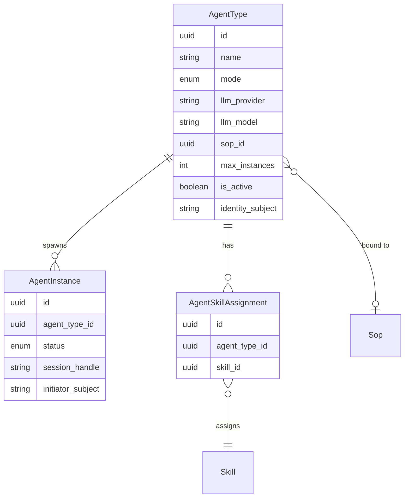

# Agent Management — Entities

**Source**: `backend/app/db/models/agents.py`

| Entity | Description |
|--------|-------------|
| **AgentType** | The definition of an agent class, including its operating mode (sop-agent or skillful-agent), OIDC identity, model binding, and maximum concurrent instance count. |
| **AgentInstance** | A single active runtime execution of an AgentType, carrying its own lifecycle status (created → active → closed). |
| **AgentSkillAssignment** | Links a Skill to a skillful-agent AgentType, making that skill available during the agent's reasoning loop. |
