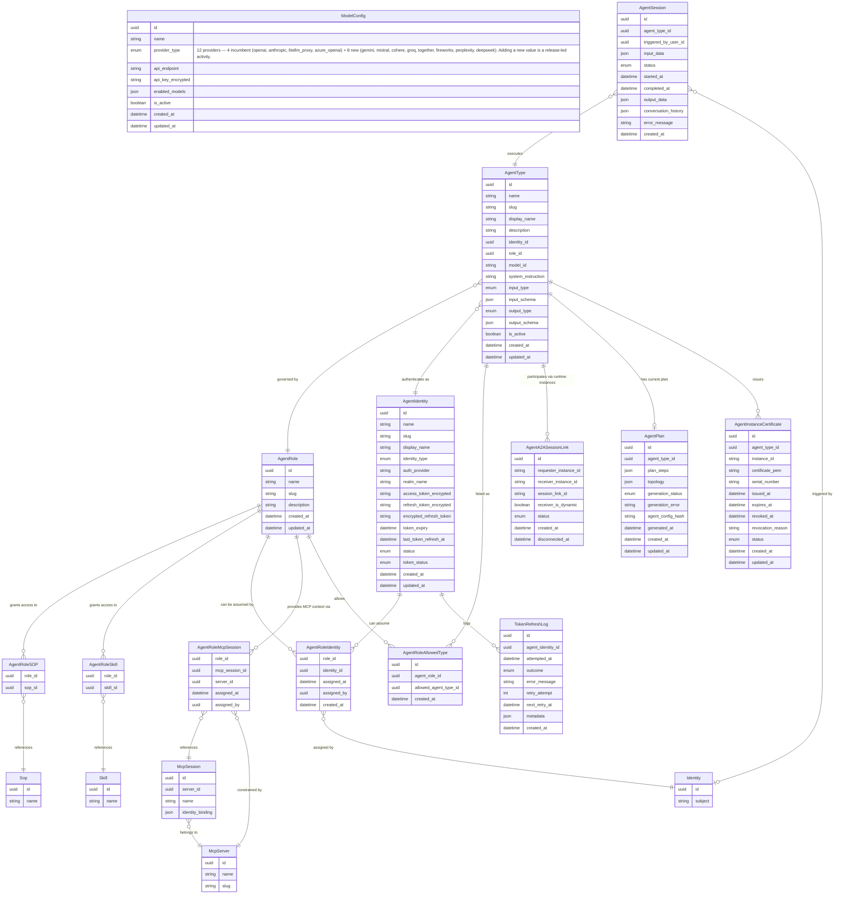
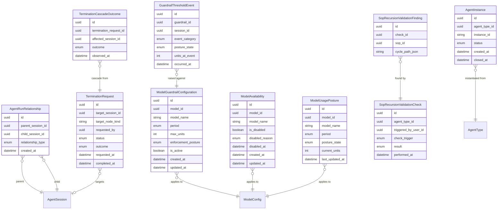

# Agent Management — Entities

```mermaid
erDiagram
    ModelConfig {
        uuid id
        string name
        enum provider_type "12 providers — 4 incumbent (openai, anthropic, litellm_proxy, azure_openai) + 8 new (gemini, mistral, cohere, groq, together, fireworks, perplexity, deepseek). Adding a new value is a release-led activity."
        string api_endpoint
        string api_key_encrypted
        json enabled_models
        boolean is_active
        datetime created_at
        datetime updated_at
    }
    AgentRole {
        uuid id
        string name
        string slug
        string description
        datetime created_at
        datetime updated_at
    }
    AgentRoleAllowedType {
        uuid id
        uuid agent_role_id
        uuid allowed_agent_type_id
        datetime created_at
    }
    AgentRoleIdentity {
        uuid role_id
        uuid identity_id
        datetime assigned_at
        uuid assigned_by
        datetime created_at
    }
    AgentRoleSOP {
        uuid role_id
        uuid sop_id
    }
    AgentRoleSkill {
        uuid role_id
        uuid skill_id
    }
    AgentRoleMcpSession {
        uuid role_id
        uuid mcp_session_id
        uuid server_id
        datetime assigned_at
        uuid assigned_by
    }
    AgentIdentity {
        uuid id
        string name
        string slug
        string display_name
        enum identity_type
        string auth_provider
        string realm_name
        string access_token_encrypted
        string refresh_token_encrypted
        string encrypted_refresh_token
        datetime token_expiry
        datetime last_token_refresh_at
        enum status
        enum token_status
        datetime created_at
        datetime updated_at
    }
    AgentType {
        uuid id
        string name
        string slug
        string display_name
        string description
        uuid identity_id
        uuid role_id
        string model_id
        string system_instruction
        enum input_type
        json input_schema
        enum output_type
        json output_schema
        boolean is_active
        datetime created_at
        datetime updated_at
    }
    AgentSession {
        uuid id
        uuid agent_type_id
        uuid triggered_by_user_id
        json input_data
        enum status
        datetime started_at
        datetime completed_at
        json output_data
        json conversation_history
        string error_message
        datetime created_at
    }
    AgentA2ASessionLink {
        uuid id
        string requester_instance_id
        string receiver_instance_id
        string session_link_id
        boolean receiver_is_dynamic
        enum status
        datetime created_at
        datetime disconnected_at
    }
    McpServer {
        uuid id
        string name
        string slug
    }
    McpSession {
        uuid id
        uuid server_id
        string name
        json identity_binding
    }
    Sop {
        uuid id
        string name
    }
    Skill {
        uuid id
        string name
    }
    Identity {
        uuid id
        string subject
    }

    AgentRole ||--o{ AgentRoleSOP : "grants access to"
    AgentRole ||--o{ AgentRoleSkill : "grants access to"
    AgentRole ||--o{ AgentRoleIdentity : "can be assumed by"
    AgentRole ||--o{ AgentRoleMcpSession : "provides MCP context via"
    AgentRole ||--o{ AgentRoleAllowedType : "allows"
    AgentIdentity ||--o{ AgentRoleIdentity : "can assume"
    AgentRoleIdentity }o--|| Identity : "assigned by"
    AgentRoleSOP }o--|| Sop : "references"
    AgentRoleSkill }o--|| Skill : "references"
    AgentRoleMcpSession }o--|| McpSession : "references"
    AgentRoleMcpSession }o--|| McpServer : "constrained by"
    McpSession }o--|| McpServer : "belongs to"
    AgentPlan {
        uuid id
        uuid agent_type_id
        json plan_steps
        json topology
        enum generation_status
        string generation_error
        string agent_config_hash
        datetime generated_at
        datetime created_at
        datetime updated_at
    }

    AgentInstanceCertificate {
        uuid id
        uuid agent_type_id
        string instance_id
        string certificate_pem
        string serial_number
        datetime issued_at
        datetime expires_at
        datetime revoked_at
        string revocation_reason
        enum status
        datetime created_at
        datetime updated_at
    }
    TokenRefreshLog {
        uuid id
        uuid agent_identity_id
        datetime attempted_at
        enum outcome
        string error_message
        int retry_attempt
        datetime next_retry_at
        json metadata
        datetime created_at
    }

    AgentType }o--|| AgentRole : "governed by"
    AgentType }o--|| AgentIdentity : "authenticates as"
    AgentSession }o--|| AgentType : "executes"
    AgentType ||--o{ AgentRoleAllowedType : "listed as"
    AgentType ||--o{ AgentA2ASessionLink : "participates via runtime instances"
    AgentSession }o--o| Identity : "triggered by"
    AgentType ||--o| AgentPlan : "has current plan"
    AgentType ||--o{ AgentInstanceCertificate : "issues"
    AgentIdentity ||--o{ TokenRefreshLog : "logs"
```

**Source**: `backend/app/db/models/agents.py`, `backend/app/db/models/agent_instance_certificate.py`, `backend/app/db/models/token_refresh_log.py`

| Entity | Description |
|--------|-------------|
| **ModelConfig** | A named, reusable LLM provider backend configuration. Stores provider type, API endpoint, encrypted credentials, and the explicit list of enabled model IDs. The runtime resolves which config to use by matching a model ID against `enabled_models` on active configs. |
| **AgentRole** | A named permission set granting an agent access to specific SOPs and/or Skills. Controls which MCP tools are available at runtime and which identities may assume the role. |
| **AgentRoleAllowedType** | Explicit allow-list mapping between an agent role and target agent types permitted for delegation. Used for A2A policy preview and enforcement checks. |
| **AgentRoleIdentity** | Many-to-many join table explicitly assigning an AgentIdentity to an AgentRole. An identity can only be used for a role if a record exists here. Tracks when and by whom the assignment was made. |
| **AgentRoleSOP** | Join table linking an AgentRole to a Sop. Granting an SOP implicitly includes all Skills it depends on and all MCP tools those Skills require. |
| **AgentRoleSkill** | Join table linking an AgentRole to a Skill directly (outside of any SOP). Contributes the Skill's required MCP tools to the role's allowed tool set. |
| **AgentRoleMcpSession** | Join table associating an MCP Session with an AgentRole, providing credential and resource context for MCP tool calls. At most one session per MCP server per role (unique constraint on `role_id + server_id`). |
| **AgentIdentity** | Represents an agent's user account in a dedicated identity provider realm (e.g., `ai_agents`). Stores encrypted OAuth tokens used at runtime; refresh tokens are stored encrypted and refreshed automatically. `token_status` tracks the current refresh state (`active`, `expired`, `refresh_failed`); `last_token_refresh_at` records the most recent successful refresh. If `token_status` becomes `refresh_failed`, agent execution is blocked until operator intervention. Identity slug/name is treated as a slug-safe runtime identifier, while display labels remain user-friendly. |
| **AgentType** | The definition of an agent class: its identity, permission role, model selection, system instruction, and input/output schema. The `model_id` is resolved at runtime against active `ModelConfig.enabled_models`; there is no direct FK to ModelConfig. Agent type slug is the canonical routing key for delegation and protocol metadata. |
| **AgentSession** | A single agent execution instance from submission through completion. Serves as the agent instance record for the dashboard. Stores input, output, status, timing, and (for conversational agents) the full `conversation_history`. |
| **AgentA2ASessionLink** | Tracks A2A requester/receiver linkage for delegated runs. Supports shared-session lifecycle tracking, receiver cleanup decisions, and delegated execution status visibility. |
| **AgentPlan** | Stores the most recent LLM-generated implementation plan for an agent type. One record per `AgentType` (unique on `agent_type_id`). `plan_steps` is a structured, ordered plan payload that is both human-readable (for UI preview) and machine-parseable (for runtime execution guidance). `topology` is an opaque node-edge JSON payload produced by the Topology Builder service for frontend rendering. `generation_status` tracks `pending` \| `success` \| `failed` state; `generation_error` captures the failure reason without discarding the last successful plan. `agent_config_hash` is a hash of the inputs at generation time (role, SOPs, skills, system instruction) used to detect plan staleness. The Agent Runtime loads the saved plan during session initialization to guide execution. |
| **AgentInstanceCertificate** | X.509 certificate issued to a specific agent runtime instance by the Control Center CA. Tracks the full certificate lifecycle: issuance, expiration (24-hour validity), and revocation. The `instance_id` combined with `agent_type_id` uniquely identifies the runtime instance. `status` is computed: `revoked` if `revoked_at` is set, `expired` if past `expires_at`, otherwise `active`. |
| **TokenRefreshLog** | Audit trail for every automatic OAuth token refresh attempt on an agent identity. Records the outcome (`success`, `failure`, `rate_limited`), retry attempt number, and any error message. Supports compliance review and debugging of refresh failures. Old entries (> 90 days) may be archived. |

**Business rules:**
- `AgentType.slug` is the canonical agent routing identifier and must be unique and normalized.
- Agent identity runtime identifier (name/slug) must be slug-safe for protocol metadata and routing.
- Role-to-agent-type allow-list mappings are used to preview and enforce delegation boundaries.

## Model Guardrail and Runtime Control Entities

The following entities support the **vendor → model → guardrail hierarchy** for model-usage guardrails and the **Runtime Control Dashboard** for live execution visibility and operator-controlled termination.

```mermaid
erDiagram
    ModelGuardrailConfiguration {
        uuid id
        uuid model_id
        string model_name
        enum period
        int max_units
        enum enforcement_posture
        boolean is_active
        datetime created_at
        datetime updated_at
    }
    ModelAvailability {
        uuid id
        uuid model_id
        string model_name
        boolean is_disabled
        enum disabled_reason
        datetime disabled_at
        datetime created_at
        datetime updated_at
    }
    ModelUsagePosture {
        uuid id
        uuid model_id
        string model_name
        enum period
        enum posture_state
        int current_units
        datetime last_updated_at
    }
    AgentInstance {
        uuid id
        uuid agent_type_id
        string instance_id
        enum status
        datetime created_at
        datetime closed_at
    }
    AgentRunRelationship {
        uuid id
        uuid parent_session_id
        uuid child_session_id
        enum relationship_type
        datetime created_at
    }
    TerminationRequest {
        uuid id
        uuid target_session_id
        string target_node_kind
        uuid requested_by
        enum status
        enum outcome
        datetime requested_at
        datetime completed_at
    }
    TerminationCascadeOutcome {
        uuid id
        uuid termination_request_id
        uuid affected_session_id
        enum outcome
        datetime observed_at
    }
    GuardrailThresholdEvent {
        uuid id
        uuid guardrail_id
        uuid session_id
        enum event_category
        enum posture_state
        int units_at_event
        datetime occurred_at
    }
    SopRecursionValidationCheck {
        uuid id
        uuid agent_type_id
        uuid triggered_by_user_id
        enum check_trigger
        enum result
        datetime performed_at
    }
    SopRecursionValidationFinding {
        uuid id
        uuid check_id
        uuid sop_id
        string cycle_path_json
    }

    ModelGuardrailConfiguration }o--|| ModelConfig : "applies to"
    ModelAvailability }o--|| ModelConfig : "applies to"
    ModelUsagePosture }o--|| ModelConfig : "applies to"
    AgentInstance }o--|| AgentType : "instantiated from"
    AgentRunRelationship }o--|| AgentSession : "parent"
    AgentRunRelationship }o--|| AgentSession : "child"
    TerminationRequest }o--o| AgentSession : "targets"
    TerminationCascadeOutcome }o--|| TerminationRequest : "cascade from"
    GuardrailThresholdEvent }o--|| ModelGuardrailConfiguration : "raised against"
    SopRecursionValidationFinding }o--|| SopRecursionValidationCheck : "found by"
```

**Sources**: `backend/app/db/models/model_guardrail_configuration.py`, `backend/app/db/models/model_usage_posture.py`, `backend/app/db/models/session_logs.py`, `backend/app/db/models/agent_instance.py`

| Entity | Description |
|--------|-------------|
| **ModelGuardrailConfiguration** | A single guardrail scoped to one period (hour, day, week, or month) for one model. Unique constraint on `(model_id, model_name, period)`. `enforcement_posture` is `terminate` (default) or `observe-only`; `is_active` allows per-guardrail enable/disable independent of the other periods. |
| **ModelAvailability** | Per-model availability state. `is_disabled=True` blocks execution; `disabled_reason` is `vendor_disabled` (cascade from vendor-level disable) or `model_disabled` (manual). |
| **ModelUsagePosture** | Current usage posture against a guardrail limit. `posture_state` is `within_limit`, `approaching_limit`, or `breached`. When `breached` and the guardrail's `enforcement_posture` is `terminate`, the agent execution is blocked. |
| **AgentInstance** | A logical agent instance shown in the Agent Instance Dashboard. `instance_id` is the canonical identifier used for `AgentInstanceCertificate` lookup. `status` is one of `created`, `active`, `closed`, `error`. |
| **AgentRunRelationship** | Parent/child edges between `AgentSession` records for delegated execution. The relationship graph is rendered in the runtime topology diagram and walked during cascade termination. |
| **TerminationRequest** | A recorded operator-initiated termination request against a session. `target_node_kind` is `agent` (live `AgentJob`) or `conversation` (sleep `ConversationSession`). `status` is `pending` / `completed` / `failed`; `outcome` is `cancelled` / `not_found` / `error`. |
| **TerminationCascadeOutcome** | One row per delegated child affected by a parent termination. Captures whether each child was successfully cancelled, not found, or errored. |
| **GuardrailThresholdEvent** | Append-only log of guardrail threshold transitions. `event_category` is one of `model_disabled`, `vendor_disabled`, `guardrail_breached`. `posture_state` is the new state at the time of the event. |
| **SopRecursionValidationCheck** | Records a recursion/dead-loop risk validation at create, update, or run initiation. `check_trigger` is `create` / `update` / `run`; `result` is `pass` / `fail`. |
| **SopRecursionValidationFinding** | The specific cycle path(s) found by a `SopRecursionValidationCheck`. Stores the cycle path as a JSON array of SOP IDs. |

**Business rules:**
- A model can have one to four `ModelGuardrailConfiguration` records, one per period. There is no forced four-period entry.
- `ModelAvailability.disabled_reason = vendor_disabled` indicates a cascade from vendor-level disable; the per-model `ModelGuardrailConfiguration` records remain visible to show the cascade source.
- `AgentJob.status` accepts `terminated` as a distinct value from `failed`. The new value is added in migration `f4a5b6c7d8e9`.
- `ExecutionEventCategory` accepts `model_disabled`, `vendor_disabled`, and `guardrail_breached` as user-visible event categories for execution logs. These are distinct from standard execution failures.
- `SopRecursionValidationCheck` runs at every agent create, update, and run; `result = fail` blocks the action.
