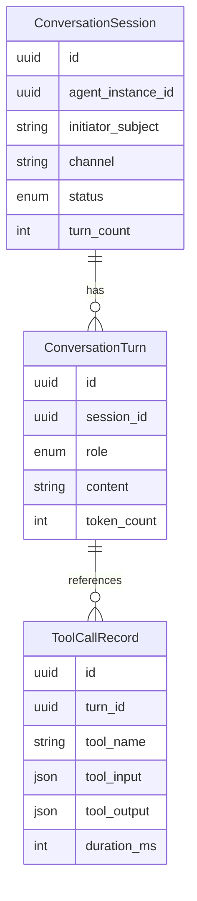

# Communication & Conversations — Entities

**Source**: `backend/app/db/models/conversations.py`

| Entity | Description |
|--------|-------------|
| **ConversationSession** | A bounded interaction context between an initiating party (user or scheduler) and an agent; tracks channel, participants, and status. |
| **ConversationTurn** | A single message within a session; carries a role label (user, agent, tool, or system) and is ordered chronologically. |
| **ToolCallRecord** | A record of a specific tool invocation made during a conversation turn — what was called, with what arguments, and what was returned. |
