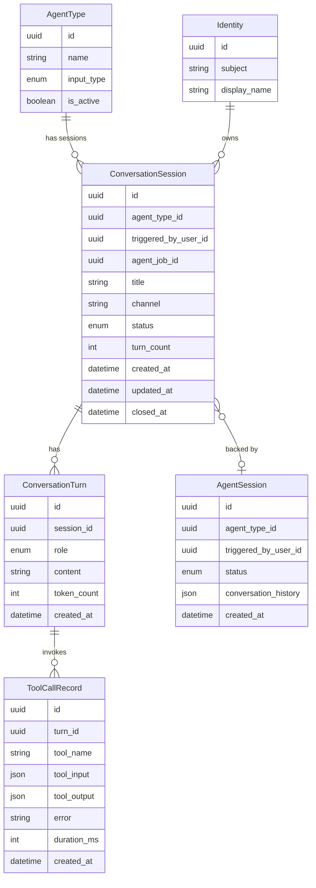

# Communication & Conversations — Entities

```mermaid
erDiagram
    ConversationSession {
        uuid id
        uuid agent_type_id
        uuid triggered_by_user_id
        uuid agent_job_id
        string title
        string channel
        enum status
        int turn_count
        datetime created_at
        datetime updated_at
        datetime closed_at
    }
    ConversationTurn {
        uuid id
        uuid session_id
        enum role
        string content
        int token_count
        datetime created_at
    }
    ToolCallRecord {
        uuid id
        uuid turn_id
        string tool_name
        json tool_input
        json tool_output
        string error
        int duration_ms
        datetime created_at
    }
    AgentType {
        uuid id
        string name
        enum input_type
        boolean is_active
    }
    AgentSession {
        uuid id
        uuid agent_type_id
        uuid triggered_by_user_id
        enum status
        json conversation_history
        datetime created_at
    }
    Identity {
        uuid id
        string subject
        string display_name
    }

    AgentType ||--o{ ConversationSession : "has sessions"
    Identity ||--o{ ConversationSession : "owns"
    ConversationSession }o--o| AgentSession : "backed by"
    ConversationSession ||--o{ ConversationTurn : "has"
    ConversationTurn ||--o{ ToolCallRecord : "invokes"
```

**ConversationStatus enum values:**

| Value | Meaning |
|---|---|
| `active` | Session is open and accepting new messages |
| `closed` | User explicitly ended the session; no longer accepting messages |
| `archived` | Hidden from the active sessions list; retained for audit and history |
| `error` | Session encountered an unrecoverable error |

**Source**: `backend/app/db/models/conversations.py`

| Entity | Description |
|--------|-------------|
| **ConversationSession** | Primary user-facing session entity for conversational agent interactions; tracks session title (auto-generated), user ownership, agent type, and lifecycle status (active / closed / archived / error). Promoted from an internal execution record to a persistent, bounded conversation with full turn history. |
| **ConversationTurn** | A single message within a session; carries a role label (user, agent, tool, or system) and is ordered chronologically. |
| **ToolCallRecord** | A record of a specific tool invocation made during a conversation turn — what was called, with what arguments, what was returned, and any error encountered. |
