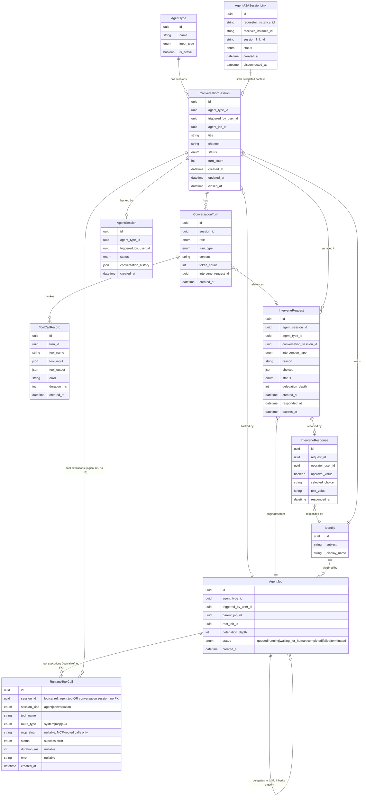

# Communication & Conversations — Entities

```mermaid
erDiagram
    ConversationSession {
        uuid id
        uuid agent_type_id
        uuid triggered_by_user_id
        uuid agent_job_id
        string title
        string channel
        enum status
        int turn_count
        datetime created_at
        datetime updated_at
        datetime closed_at
    }
    ConversationTurn {
        uuid id
        uuid session_id
        enum role
        enum turn_type
        string content
        int token_count
        uuid intervene_request_id
        datetime created_at
    }
    ToolCallRecord {
        uuid id
        uuid turn_id
        string tool_name
        json tool_input
        json tool_output
        string error
        int duration_ms
        datetime created_at
    }
    RuntimeToolCall {
        uuid id
        uuid session_id "logical ref: agent job OR conversation session, no FK"
        enum session_kind "agent|conversation"
        string tool_name
        enum route_type "system|mcp|a2a"
        string mcp_slug "nullable; MCP-routed calls only"
        enum status "success|error"
        int duration_ms "nullable"
        string error "nullable"
        datetime created_at
    }
    InterveneRequest {
        uuid id
        uuid agent_session_id
        uuid agent_type_id
        uuid conversation_session_id
        enum intervention_type
        string reason
        json choices
        enum status
        int delegation_depth
        datetime created_at
        datetime responded_at
        datetime expires_at
    }
    InterveneResponse {
        uuid id
        uuid request_id
        uuid operator_user_id
        boolean approval_value
        string selected_choice
        string text_value
        datetime responded_at
    }
    AgentA2ASessionLink {
        uuid id
        string requester_instance_id
        string receiver_instance_id
        string session_link_id
        enum status
        datetime created_at
        datetime disconnected_at
    }
    AgentType {
        uuid id
        string name
        enum input_type
        boolean is_active
    }
    AgentSession {
        uuid id
        uuid agent_type_id
        uuid triggered_by_user_id
        enum status
        json conversation_history
        datetime created_at
    }
    AgentJob {
        uuid id
        uuid agent_type_id
        uuid triggered_by_user_id
        uuid parent_job_id
        uuid root_job_id
        int delegation_depth
        enum status "queued|running|waiting_for_human|completed|failed|terminated"
        datetime created_at
    }
    Identity {
        uuid id
        string subject
        string display_name
    }

    AgentType ||--o{ ConversationSession : "has sessions"
    Identity ||--o{ ConversationSession : "owns"
    ConversationSession }o--o| AgentSession : "backed by"
    ConversationSession }o--o| AgentJob : "backed by"
    ConversationSession ||--o{ ConversationTurn : "has"
    ConversationTurn ||--o{ ToolCallRecord : "invokes"
    ConversationTurn }o--o| InterveneRequest : "references"
    InterveneRequest }o--|| ConversationSession : "surfaced in"
    InterveneRequest }o--|| AgentJob : "originates from"
    InterveneRequest ||--o| InterveneResponse : "resolved by"
    InterveneResponse }o--|| Identity : "responded by"
    AgentA2ASessionLink ||--o| ConversationSession : "links delegated context"
    Identity ||--o{ AgentJob : "triggered by"
    AgentJob ||--o{ AgentJob : "delegates to (child inherits trigger)"
    AgentJob ||--o{ RuntimeToolCall : "tool executions (logical ref, no FK)"
    ConversationSession ||--o{ RuntimeToolCall : "tool executions (logical ref, no FK)"
```

**ConversationStatus enum values:**

| Value | Meaning |
|---|---|
| `active` | Session is open and accepting new messages |
| `closed` | User explicitly ended the session; no longer accepting messages |
| `archived` | Hidden from the active sessions list; retained for audit and history |
| `error` | Session encountered an unrecoverable error |

**Source**: `backend/app/db/models/conversations.py`, `backend/app/db/models/intervene.py`, `backend/app/db/models/agents.py`, `backend/app/db/models/tool_calls.py`

**Trigger-provenance semantics:** `triggered_by_user_id` is populated per launch path — direct user triggers set it to the triggering user's `Identity`; delegated child jobs inherit it from their parent via `parent_job_id`; schedule-triggered jobs copy it from `ScheduledJob.scheduled_by_user_id` at trigger time (the schedule **name** is shown as the trigger source). The topology projection additionally exposes `trigger_source`, `trigger_source_label`, and `trigger_user_label` — all **derived at read time**, never persisted columns on `AgentJob`.

**RuntimeToolCall notes:** `session_id` is a polymorphic **logical reference with no enforced FK** — it holds an `AgentJob` id when `session_kind=agent` and a `ConversationSession` id when `session_kind=conversation` (conversation turns execute without a backing agent job). `mcp_slug` maps to `McpServer.slug` at render time for MCP-routed calls (no FK). A2A delegation rows (`route_type=a2a`) are recorded permanently in `runtime_tool_calls` but rendered as delegation edges, not in-node tool calls.

| Entity | Description |
|--------|-------------|
| **ConversationSession** | Primary user-facing session entity for conversational agent interactions; tracks session title (auto-generated), user ownership, agent type, and lifecycle status (active / closed / archived / error). Promoted from an internal execution record to a persistent, bounded conversation with full turn history. |
| **ConversationTurn** | A single message within a session; carries a role label (user, agent, tool, or system) and a `turn_type` distinguishing regular `message` turns from `intervene_request` and `intervene_response` intervention events. Ordered chronologically. |
| **ToolCallRecord** | A record of a specific tool invocation made during a conversation turn — what was called, with what arguments, what was returned, and any error encountered. |
| **InterveneRequest** | An agent-initiated request for human intervention surfaced in a conversation session. Links to the originating `AgentJob` and parent `ConversationSession`. Tracks intervention type (approval, choice, text), lifecycle status, and delegation depth. |
| **InterveneResponse** | The operator's response to an `InterveneRequest`. Carries the type-specific response value (approval boolean, selected choice, or free-form text) and the responding operator identity. |
| **AgentJob** | A single provisioned agent execution tracked from submission through completion; carries trigger provenance via `triggered_by_user_id` (direct, delegated, or schedule-inherited) and delegation via `parent_job_id`/`root_job_id`. |
| **RuntimeToolCall** | Append-only runtime log of every tool execution performed by Agent Runtime — system tools, MCP tools, and A2A delegations — keyed to an agent job or conversation session (polymorphic `session_id`, no FK). Powers the per-node tool-call routes and history in the runtime topology. |
| **AgentA2ASessionLink** | Tracks requester/receiver linkage when one agent delegates to another in a shared session context. Supports lifecycle visibility and disconnection handling for delegated conversations. |
