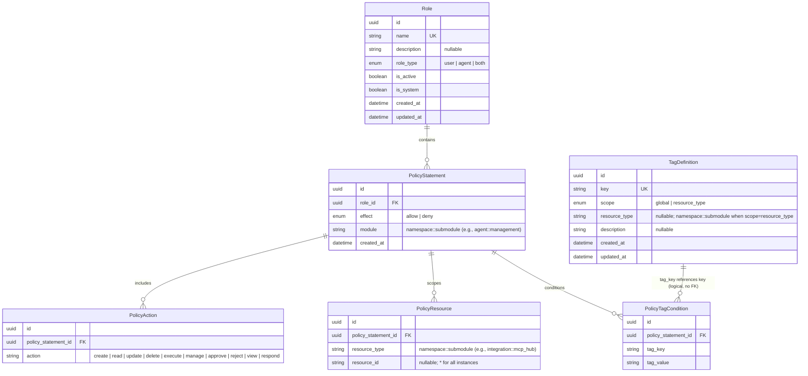

# IAM & Policy Authorization — Entities

**Sources**: `backend/app/db/models/role.py` → `backend/app/db/models/identity.py` (Role), `backend/app/db/models/policy_statement.py`, `backend/app/db/models/policy_action.py`, `backend/app/db/models/policy_resource.py`, `backend/app/db/models/policy_tag_condition.py`, `backend/app/db/models/tag_definition.py`

| Entity | Description |
|--------|-------------|
| **Role** | A named permission role to which policy statements are attached. `role_type` determines what kind of principal (user, agent, or both) the role applies to. `is_system` marks immutable system-managed roles that cannot be deleted. Defined in `backend/app/db/models/identity.py`. |
| **PolicyStatement** | A permission statement belonging to a role. `effect` is `allow` or `deny`. `module` uses the `module::submodule` namespaced format (e.g., `agent::management`, `integration::*`, `*::*`) to scope the statement to platform resource types. Module values are validated at the application layer against `ResourceTypeManifest`; legacy flat values are no longer accepted. |
| **PolicyAction** | A specific action permitted or denied by a policy statement. Actions include `create`, `read`, `update`, `delete`, `execute`, `manage`, `approve`, `reject`, `view`, and `respond`. |
| **PolicyResource** | A resource (by namespaced type identifier and optional id) that a policy statement applies to. `resource_type` uses the `module::submodule` format (e.g., `integration::mcp_hub`) or wildcard patterns. `resource_id = "*"` matches all instances of the given type; wildcards in `resource_type` (e.g., `*::*`, `agent::*`) are orthogonal to wildcards in `resource_id`. |
| **PolicyTagCondition** | A tag-based condition that further constrains when a policy statement applies, matching on `tag_key` and `tag_value`. References `TagDefinition.key` logically — there is no physical foreign-key constraint between the two tables. |
| **TagDefinition** | Defines a tag key with scope (`global` or `resource_type`). When `scope = resource_type`, the `resource_type` column scopes the tag to a particular resource type and accepts namespaced `module::submodule` identifiers. |

---

## Module::Submodule Naming Convention

The `PolicyStatement.module` and `PolicyResource.resource_type` columns use a two-layer namespaced format:

| Format | Example | Scope |
|--------|---------|-------|
| `module::submodule` | `agent::management`, `system::permissions` | A single resource type |
| `module::*` | `agent::*`, `integration::*` | All submodules within a module |
| `*::*` | `*::*` | Every resource type across all modules |

### Three Modules

| Module | Submodules (17 total) |
|--------|-----------------------|
| **agent** | `roles`, `identities`, `management`, `runtime_control`, `skills`, `sops`, `model_configs`, `schedules`, `trails`, `human_intervention`, `data_types`, `outputs` |
| **integration** | `mcp_hub`, `notifications` |
| **system** | `observability`, `permissions`, `system_config` |

Legacy flat values (e.g., `agent`, `role`, `skill`, `mcp_server`, `permissions`) are no longer accepted. Validation is enforced at the application layer via `ResourceTypeManifest` in `backend/app/core/resource_types.py`.

### Consolidated Legacy Values

| Legacy Value(s) | Namespaced Value |
|-----------------|------------------|
| `agent` | `agent::management` |
| `role` | `agent::roles` |
| `skill` | `agent::skills` |
| `scheduling` | `agent::schedules` |
| `conversation`, `result` | `agent::trails` |
| `intervene` | `agent::human_intervention` |
| `data_type` | `agent::data_types` |
| `mcp_server` | `integration::mcp_hub` |
| `notification` | `integration::notifications` |
| `permissions`, `group`, `user`, `tag`, `access_request` | `system::permissions` |
