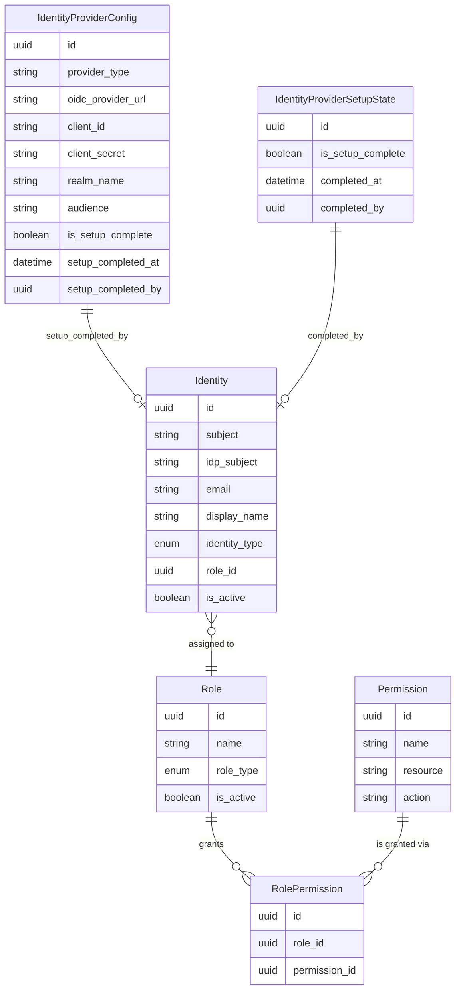
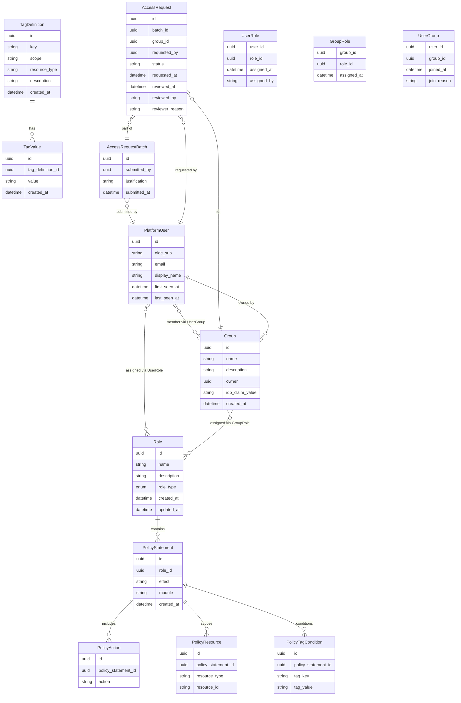

# Identity & Access — Entities

**Sources**: `backend/app/db/models/identity.py`, `backend/app/db/models/identity_provider_config.py`, `backend/app/db/models/identity_provider_setup_state.py`

| Entity | Description |
|--------|-------------|
| **Identity** | An external principal (user or agent) registered in the platform, linked to a Role that defines its access; `idp_subject` stores the subject identifier from the external IdP. |
| **Role** | A named set of permissions representing a class of principal; type is one of: user, agent, or both. |
| **Permission** | A grantable right to perform a specific action on a named resource within the platform. |
| **RolePermission** | The join record that links a Role to a Permission, establishing what that role is allowed to do. |
| **IdentityProviderConfig** | Stores the active identity provider configuration (type, OIDC URL, client credentials, realm); tracks whether initial setup has been completed. |
| **IdentityProviderSetupState** | Records the completion state of the first-run IdP setup wizard, including timestamp and the identity that completed it. |

---

## User Permissions

**Sources**: `backend/app/db/models/tag_definition.py`, `backend/app/db/models/tag_value.py`, `backend/app/db/models/role.py`, `backend/app/db/models/policy_statement.py`, `backend/app/db/models/policy_action.py`, `backend/app/db/models/policy_resource.py`, `backend/app/db/models/policy_tag_condition.py`, `backend/app/db/models/platform_user.py`, `backend/app/db/models/user_role.py`, `backend/app/db/models/group.py`, `backend/app/db/models/group_role.py`, `backend/app/db/models/user_group.py`, `backend/app/db/models/access_request_batch.py`, `backend/app/db/models/access_request.py`

| Entity | Description |
|--------|-------------|
| **TagDefinition** | Defines a tag key with allowed values, scope, and optional resource-type constraint for resource tagging. |
| **TagValue** | An allowed value for a tag definition. |
| **Role** | A named permission role; `role_type` distinguishes system-managed roles (immutable) from user-defined roles. |
| **PolicyStatement** | A permission statement belonging to a role; `effect` is allow/deny, `module` scopes the statement to a platform module. |
| **PolicyAction** | A specific action permitted or denied by a policy statement. |
| **PolicyResource** | A resource (by type and optional id) that a policy statement applies to. |
| **PolicyTagCondition** | A tag-based condition that further constrains when a policy statement applies. |
| **PlatformUser** | A human user cached from OIDC sign-in; `oidc_sub` is the identity provider subject claim. |
| **UserRole** | Direct role assignment to a platform user (junction). |
| **Group** | A named collection of users; `idp_claim_value` enables automatic membership via IdP group claims. |
| **GroupRole** | Roles assigned to a group, inherited by all group members (junction). |
| **UserGroup** | Membership record linking a user to a group (junction). |
| **AccessRequestBatch** | A user's submission requesting access to one or more groups; holds the shared justification. |
| **AccessRequest** | A request for access to a single group within a batch; holds status and reviewer details. |
