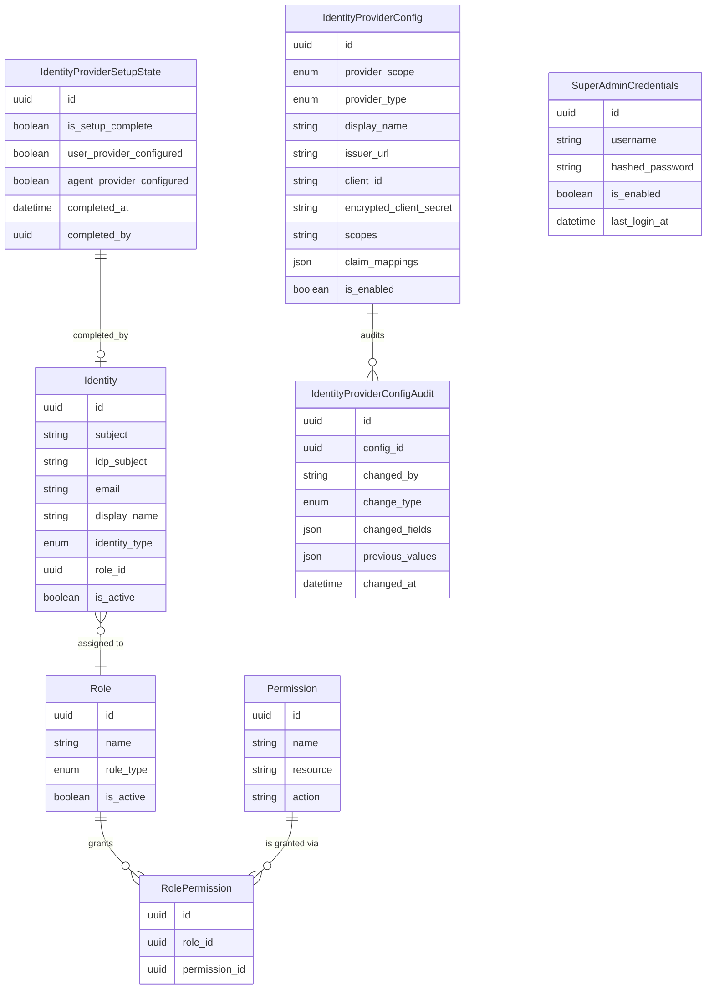
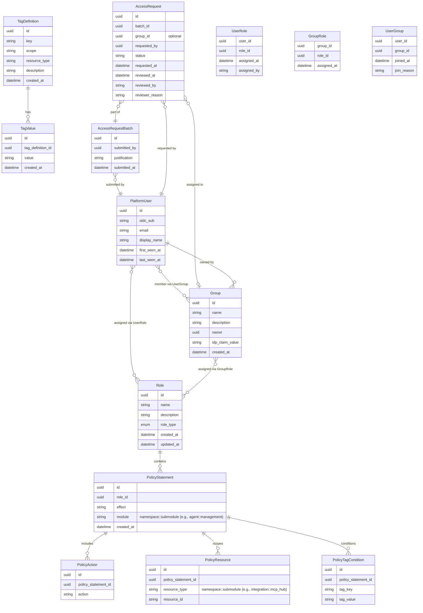

# Identity & Access — Entities

```mermaid
erDiagram
    Identity {
        uuid id
        string subject
        string idp_subject
        string email
        string display_name
        enum identity_type
        uuid role_id
        boolean is_active
    }
    Role {
        uuid id
        string name
        enum role_type
        boolean is_active
    }
    Permission {
        uuid id
        string name
        string resource
        string action
    }
    RolePermission {
        uuid id
        uuid role_id
        uuid permission_id
    }
    IdentityProviderConfig {
        uuid id
        enum provider_scope
        enum provider_type
        string display_name
        string issuer_url
        string client_id
        string encrypted_client_secret
        string scopes
        json claim_mappings
        boolean is_enabled
    }
    IdentityProviderConfigAudit {
        uuid id
        uuid config_id
        string changed_by
        enum change_type
        json changed_fields
        json previous_values
        datetime changed_at
    }
    IdentityProviderSetupState {
        uuid id
        boolean is_setup_complete
        boolean user_provider_configured
        boolean agent_provider_configured
        datetime completed_at
        uuid completed_by
    }
    SuperAdminCredentials {
        uuid id
        string username
        string hashed_password
        boolean is_enabled
        datetime last_login_at
    }

    Identity }o--|| Role : "assigned to"
    Role ||--o{ RolePermission : "grants"
    Permission ||--o{ RolePermission : "is granted via"
    IdentityProviderConfig ||--o{ IdentityProviderConfigAudit : "audits"
    IdentityProviderSetupState ||--o| Identity : "completed_by"
```

**Sources**: `backend/app/db/models/identity.py`, `backend/app/db/models/identity_provider_config.py`, `backend/app/db/models/identity_provider_config_audit.py`, `backend/app/db/models/identity_provider_setup_state.py`, `backend/app/db/models/super_admin_credentials.py`

| Entity | Description |
|--------|-------------|
| **Identity** | An external principal (user or agent) registered in the platform, linked to a Role that defines its access; `idp_subject` stores the subject identifier from the external IdP. |
| **Role** | A named set of permissions representing a class of principal; type is one of: user, agent, or both. |
| **Permission** | A grantable right to perform a specific action on a named resource within the platform. |
| **RolePermission** | The join record that links a Role to a Permission, establishing what that role is allowed to do. |
| **IdentityProviderConfig** | An OIDC identity provider configuration for user or agent authentication. Each scope (`user` / `agent`) has at most one enabled config. Supports any OIDC-compliant provider via `oidc_generic`, plus first-class support for Keycloak and Azure EntraID. Sensitive fields are encrypted at rest. |
| **IdentityProviderConfigAudit** | Immutable audit entry recording every administrative change to an identity provider configuration (create, update, test, delete). Stores a snapshot of previous values for rollback and security review. |
| **IdentityProviderSetupState** | Single-row sentinel tracking whether the initial platform bootstrap is complete, plus per-provider-configured flags for user and agent identity domains. |
| **SuperAdminCredentials** | Stores the built-in super admin bootstrap credentials (single-row). Enables platform access when OIDC is unavailable or misconfigured. Can be disabled once OIDC is operational. Password is always stored hashed; credentials are sourced from environment variables with DB override capability. |

---

## User Permissions

```mermaid
erDiagram
    TagDefinition ||--o{ TagValue : "has"
    Role ||--o{ PolicyStatement : "contains"
    PolicyStatement ||--o{ PolicyAction : "includes"
    PolicyStatement ||--o{ PolicyResource : "scopes"
    PolicyStatement ||--o{ PolicyTagCondition : "conditions"
    PlatformUser }o--o{ Role : "assigned via UserRole"
    PlatformUser }o--o{ Group : "member via UserGroup"
    Group }o--o{ Role : "assigned via GroupRole"
    Group }o--|| PlatformUser : "owned by"
    AccessRequestBatch }o--|| PlatformUser : "submitted by"
    AccessRequest }o--|| AccessRequestBatch : "part of"
    AccessRequest }o--o| Group : "assigned to"
    AccessRequest }o--|| PlatformUser : "requested by"

    TagDefinition {
        uuid id
        string key
        string scope
        string resource_type
        string description
        datetime created_at
    }
    TagValue {
        uuid id
        uuid tag_definition_id
        string value
        datetime created_at
    }
    Role {
        uuid id
        string name
        string description
        enum role_type
        datetime created_at
        datetime updated_at
    }
    PolicyStatement {
        uuid id
        uuid role_id
        string effect
        string module "namespace::submodule (e.g., agent::management)"
        datetime created_at
    }
    PolicyAction {
        uuid id
        uuid policy_statement_id
        string action
    }
    PolicyResource {
        uuid id
        uuid policy_statement_id
        string resource_type "namespace::submodule (e.g., integration::mcp_hub)"
        string resource_id
    }
    PolicyTagCondition {
        uuid id
        uuid policy_statement_id
        string tag_key
        string tag_value
    }
    PlatformUser {
        uuid id
        string oidc_sub
        string email
        string display_name
        datetime first_seen_at
        datetime last_seen_at
    }
    UserRole {
        uuid user_id
        uuid role_id
        datetime assigned_at
        string assigned_by
    }
    Group {
        uuid id
        string name
        string description
        uuid owner
        string idp_claim_value
        datetime created_at
    }
    GroupRole {
        uuid group_id
        uuid role_id
        datetime assigned_at
    }
    UserGroup {
        uuid user_id
        uuid group_id
        datetime joined_at
        string join_reason
    }
    AccessRequestBatch {
        uuid id
        uuid submitted_by
        string justification
        datetime submitted_at
    }
    AccessRequest {
        uuid id
        uuid batch_id
        uuid group_id "optional"
        uuid requested_by
        string status
        datetime requested_at
        datetime reviewed_at
        string reviewed_by
        string reviewer_reason
    }
```

> **Module::submodule naming convention**: `PolicyStatement.module` and `PolicyResource.resource_type` use a two-layer namespaced format (`module::submodule`, e.g. `agent::management`). There are three modules: `agent`, `integration`, and `system`. Wildcards are supported: `*::*` matches all, `module::*` matches all submodules within a module. Legacy flat values are no longer accepted — validation is enforced via `ResourceTypeManifest`.

**Sources**: `backend/app/db/models/tag_definition.py`, `backend/app/db/models/tag_value.py`, `backend/app/db/models/role.py`, `backend/app/db/models/policy_statement.py`, `backend/app/db/models/policy_action.py`, `backend/app/db/models/policy_resource.py`, `backend/app/db/models/policy_tag_condition.py`, `backend/app/db/models/platform_user.py`, `backend/app/db/models/user_role.py`, `backend/app/db/models/group.py`, `backend/app/db/models/group_role.py`, `backend/app/db/models/user_group.py`, `backend/app/db/models/access_request_batch.py`, `backend/app/db/models/access_request.py`

| Entity | Description |
|--------|-------------|
| **TagDefinition** | Defines a tag key with allowed values, scope, and optional resource-type constraint for resource tagging. |
| **TagValue** | An allowed value for a tag definition. |
| **Role** | A named permission role; `role_type` distinguishes system-managed roles (immutable) from user-defined roles. |
| **PolicyStatement** | A permission statement belonging to a role; `effect` is allow/deny, `module` uses the `module::submodule` namespaced format (e.g., `agent::management`, `integration::*`, `*::*`) to scope the statement to platform resource types. Legacy flat values are no longer accepted. |
| **PolicyAction** | A specific action permitted or denied by a policy statement. |
| **PolicyResource** | A resource (by namespaced type identifier and optional id) that a policy statement applies to. `resource_type` uses the `module::submodule` format (e.g., `integration::mcp_hub`) or wildcard patterns; `resource_id = "*"` matches all instances. |
| **PolicyTagCondition** | A tag-based condition that further constrains when a policy statement applies. |
| **PlatformUser** | A human user cached from OIDC sign-in; `oidc_sub` is the identity provider subject claim. |
| **UserRole** | Direct role assignment to a platform user (junction). |
| **Group** | A named collection of users; `idp_claim_value` enables automatic membership via IdP group claims. |
| **GroupRole** | Roles assigned to a group, inherited by all group members (junction). |
| **UserGroup** | Membership record linking a user to a group (junction). |
| **AccessRequestBatch** | A user's submission requesting access to one or more groups; holds the shared justification. |
| **AccessRequest** | A single group-access request within a batch; `group_id` is optional — users without permission to view groups submit requests without a group, and administrators assign the group during approval. |
