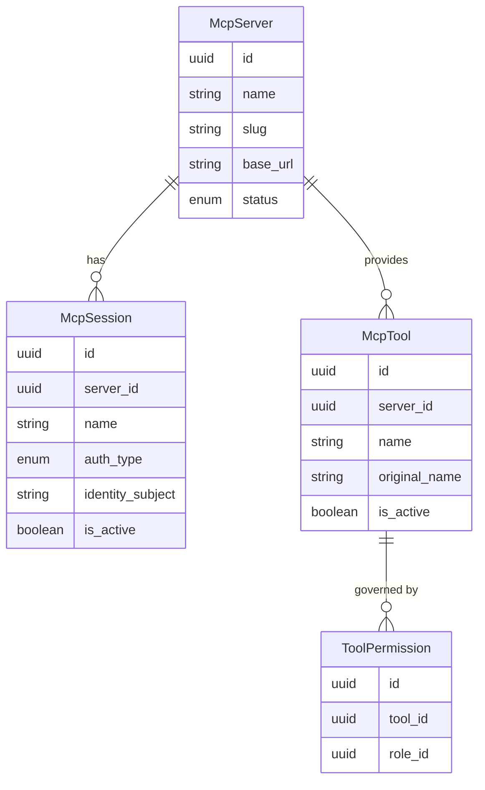

# MCP Hub — Entities

**Source**: `backend/app/db/models/mcp_hub.py`

| Entity | Description |
|--------|-------------|
| **McpServer** | A registered external tool server with a unique slug; its status (active/inactive) is tracked by the platform. |
| **McpSession** | A named connection configuration on a server that carries a specific identity or credential binding for outbound calls. |
| **McpTool** | A capability synced from an external server; namespaced under the server's slug to ensure platform-wide uniqueness. |
| **ToolPermission** | Grants a Role or Identity the right to invoke a specific tool. |
