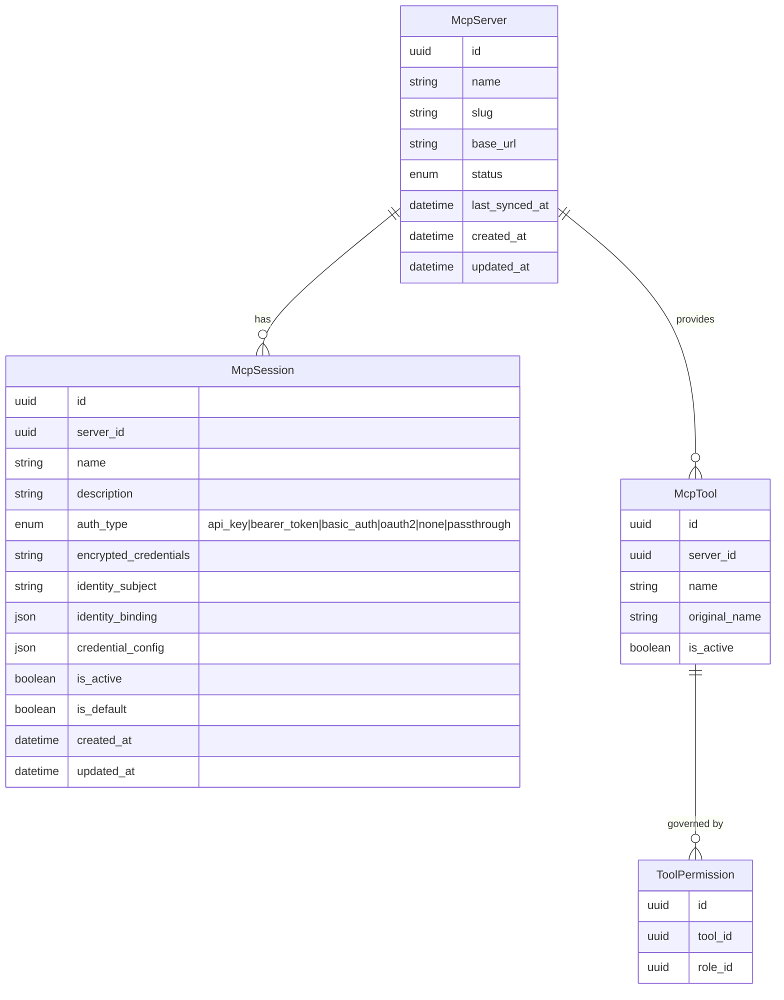

# MCP Hub — Entities

```mermaid
erDiagram
    McpServer {
        uuid id
        string name
        string slug
        string base_url
        enum status
        datetime last_synced_at
        datetime created_at
        datetime updated_at
    }
    McpSession {
        uuid id
        uuid server_id
        string name
        string description
        enum auth_type "api_key|bearer_token|basic_auth|oauth2|none|passthrough"
        string encrypted_credentials
        string identity_subject
        json identity_binding
        json credential_config
        boolean is_active
        boolean is_default
        datetime created_at
        datetime updated_at
    }
    McpTool {
        uuid id
        uuid server_id
        string name
        string original_name
        boolean is_active
    }
    ToolPermission {
        uuid id
        uuid tool_id
        uuid role_id
    }

    McpServer ||--o{ McpSession : "has"
    McpServer ||--o{ McpTool : "provides"
    McpTool ||--o{ ToolPermission : "governed by"
```

**Source**: `backend/app/db/models/mcp_hub.py`

**Business rules:**
- `McpServer.slug` is the canonical namespace for tool routing and must be globally unique.
- Server display labels can change, but slug remains stable for references and namespaced tool IDs.
- At most one `McpSession` per `McpServer` may be marked `is_default = true`; a sole session is automatically treated as default.

| Entity | Description |
|--------|-------------|
| **McpServer** | A registered external tool server with a unique slug; its status (active/inactive) is tracked by the platform. |
| **McpSession** | A named connection configuration on a server that carries a specific identity, credential binding, and session-level config for outbound calls; supports structured identity binding and per-session credential configuration. `auth_type` may be `passthrough`, in which case the executing agent's identity is forwarded at call time and no credentials are stored. `is_default` designates the session used for sync operations and default tool calls when no specific session is requested. |
| **McpTool** | A capability synced from an external server; namespaced under the server's slug to ensure platform-wide uniqueness. |
| **ToolPermission** | Grants a Role or Identity the right to invoke a specific tool. |
