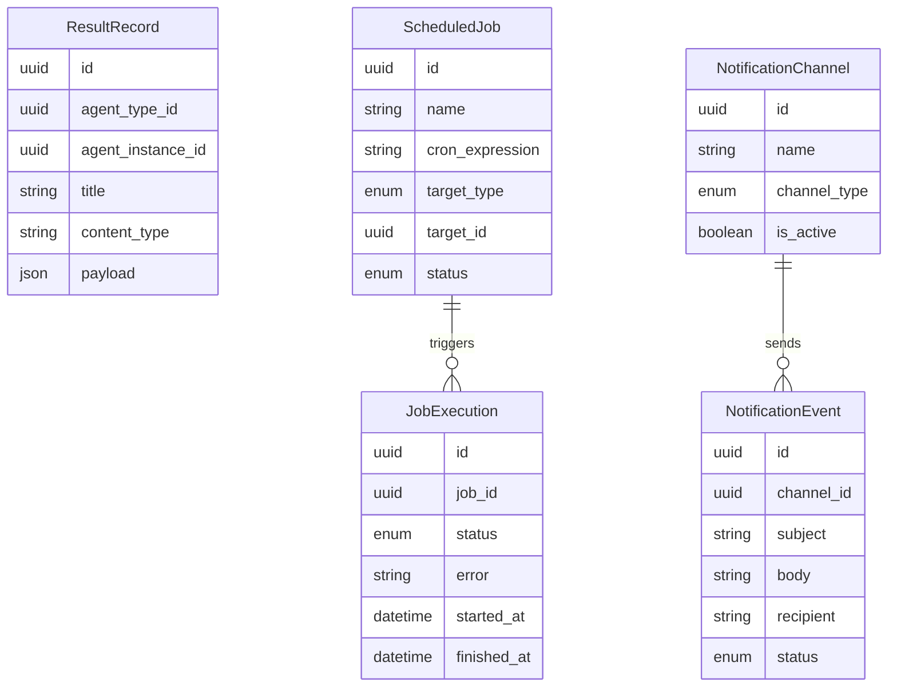

# Results, Scheduling & Notifications — Entities

**Sources**: `backend/app/db/models/results.py`, `backend/app/db/models/scheduling.py`, `backend/app/db/models/notifications.py`

| Entity | Description |
|--------|-------------|
| **ResultRecord** | A structured output saved by an agent or SOP via the `save_result` tool; accessible through the result repository. |
| **ScheduledJob** | A cron-based schedule that triggers a prompt or SOP execution; carries active or paused status. |
| **JobExecution** | A record of a single run of a ScheduledJob, capturing when it fired and whether it succeeded or failed. |
| **NotificationChannel** | A configured outbound destination for notifications; type is one of: email, Slack, Teams, or webhook. |
| **NotificationEvent** | A record of a notification dispatched by an agent or workflow to a NotificationChannel, including delivery outcome. |
