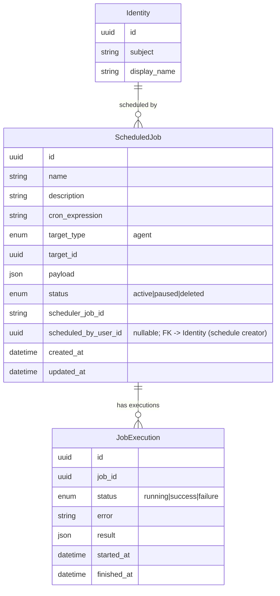
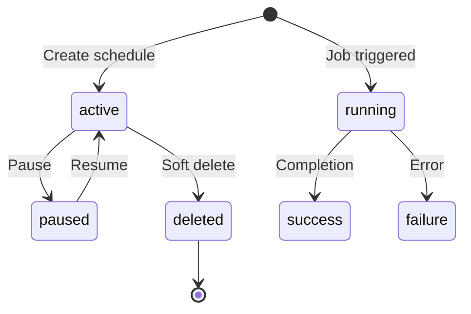

# Scheduling — Entities

**Source**: `backend/app/db/models/scheduling.py`, `backend/app/db/models/identity.py`

## Entity Descriptions

| Entity | Description |
|--------|-------------|
| **ScheduledJob** | A cron-based schedule that triggers an agent at a recurring interval; carries the target identity, input payload, the APScheduler correlation ID for lifecycle management, and the creating user identity (`scheduled_by_user_id`) used as the trigger-provenance anchor for schedule-triggered agents. |
| **JobExecution** | An immutable record of a single scheduled job run; captures start/finish timestamps, status outcome, optional error detail, and execution result. |

## Business Rules

- **Soft-delete**: Scheduled jobs are never hard-deleted. The `deleted` status hides them from active lists while preserving execution history.
- **Immutable execution history**: `JobExecution` records are append-only. Once created, they are never modified — status and results are set at completion and remain stable.
- **UTC only**: All schedule expressions (`cron_expression`) and timestamps are in UTC.
- **target_type is agent only**: The `target_type` currently supports only `agent`. SOP-based scheduling was removed.
- **Trigger provenance**: `scheduled_by_user_id` records who created the schedule. When the schedule fires, the value is copied into the triggered `AgentJob.triggered_by_user_id` at trigger time, so a schedule-triggered agent surfaces the schedule's creator as its trigger source.
- **CASCADE delete**: Deleting a `ScheduledJob` cascades to all its `JobExecution` records.
- **APScheduler correlation**: `scheduler_job_id` links the database record to an APScheduler job for runtime lifecycle operations (pause, resume, remove).

## Status Transitions

