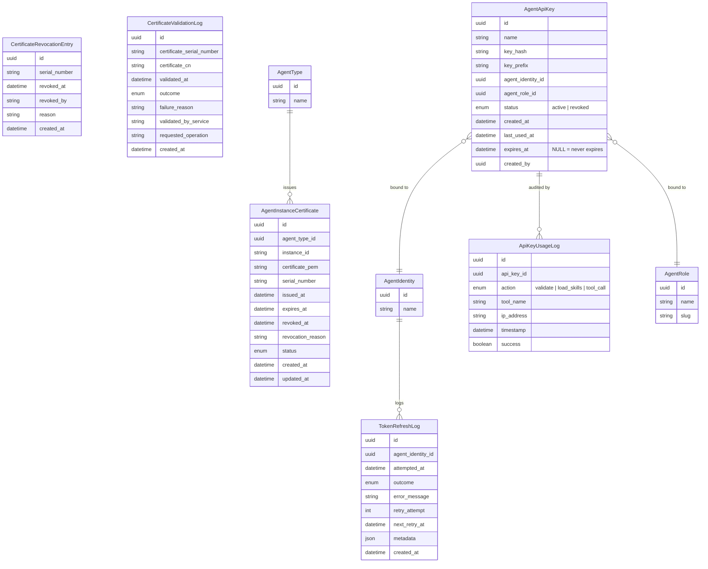

# Agent Runtime Security — Entities

**Sources**: `backend/app/db/models/agent_security.py`, `backend/app/db/models/agent_api_key.py`

| Entity | Description |
|--------|-------------|
| **AgentInstanceCertificate** | X.509 certificate issued to a specific agent runtime instance by the Control Center CA. Tracks the full certificate lifecycle: issuance, expiration (24-hour validity), and revocation. The `instance_id` combined with `agent_type_id` uniquely identifies the runtime instance. `status` is computed: `revoked` if `revoked_at` is set, `expired` if past `expires_at`, otherwise `active`. Revoked records are retained (never deleted) for audit trail. |
| **CertificateRevocationEntry** | Fast-lookup revocation list for certificate validation. Each entry is immutable once created; serial numbers are unique. Control Center checks this table on every certificate validation request. Entries older than 30 days past their certificate's expiration may be archived. |
| **TokenRefreshLog** | Audit trail for every automatic OAuth token refresh attempt on an agent identity. Records the outcome (`success`, `failure`, `rate_limited`), retry attempt number, scheduled next retry, and a JSON metadata field for provider response details. Retries use exponential backoff (1 s, 5 s, 15 s) with a maximum of 3 attempts per refresh operation. Old entries (> 90 days) may be archived for compliance. |
| **CertificateValidationLog** | Audit trail for every certificate validation performed by Control Center and Communication Hub. One entry is written per agent metadata request and per tool call. High-volume table; indexed on `certificate_serial_number` and `validated_at` for audit queries. Old entries (> 90 days) may be archived for compliance. |
| **AgentApiKey** | API key bound to a specific agent identity and agent role for third-party MCP hub access. The key value is SHA-256 hashed at rest (`key_hash`); only the hash and a readable prefix (`key_prefix`, e.g. `phn_sk_`) are persisted. The clear-text key is displayed once at creation and never retrievable afterward. Status is `active` or `revoked`; revoked keys remain for audit. `last_used_at` is updated on each successful authentication. Optional `expires_at` sets a key expiry — `NULL` means the key never expires, and a past value causes the key to be rejected at authentication. One active key per identity-role pair. |
| **ApiKeyUsageLog** | Immutable audit record for each API key operation. Captures the action type (`validate` for authentication, `load_skills` for skill discovery, `tool_call` for individual tool invocations), the tool name when applicable, client IP address, timestamp, and whether the operation succeeded. Append-only; entries are never modified or deleted. Supports security monitoring and usage analytics. |
