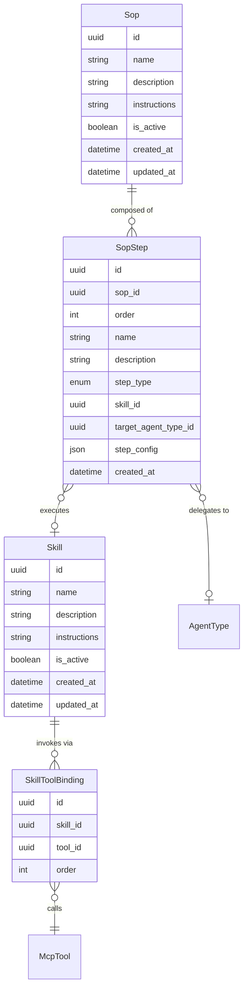

# Skills & SOPs — Entities

**Source**: `backend/app/db/models/skills.py`

| Entity | Description |
|--------|-------------|
| **Skill** | A named, permission-assignable capability that wraps one or more MCP tool invocations into a single executable unit; carries agent-facing instructions for how to use the skill. |
| **SkillToolBinding** | Ordered link between a Skill and an MCP tool it invokes; supports multi-tool skills. |
| **Sop** | A Standard Operating Procedure that composes multiple Skills into an ordered, multi-step workflow; carries human-readable workflow guidance in its instructions field. |
| **SopStep** | An ordered step within a SOP; represents either a skill invocation (`skill_invocation`) or a delegation request to another agent type (`agent_delegation`); carries step-specific runtime config and a typed reference to the target agent type. |
