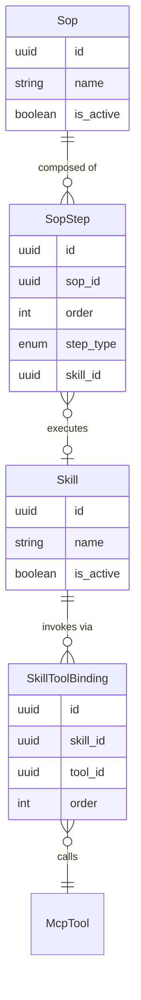

# Skills & SOPs — Entities

**Source**: `backend/app/db/models/skills.py`

| Entity | Description |
|--------|-------------|
| **Skill** | A named, permission-assignable capability that wraps one or more MCP tool invocations into a single executable unit. |
| **SkillToolBinding** | Ordered link between a Skill and an MCP tool it invokes; supports multi-tool skills. |
| **Sop** | A Standard Operating Procedure that composes multiple Skills into an ordered, multi-step workflow. |
| **SopStep** | An ordered step within a SOP; represents either a Skill invocation or a delegation request to another agent type. |
