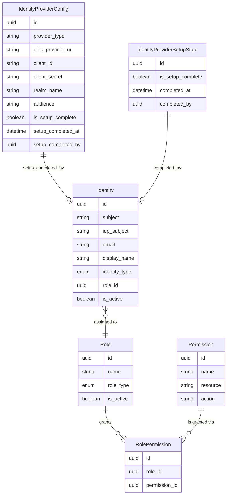
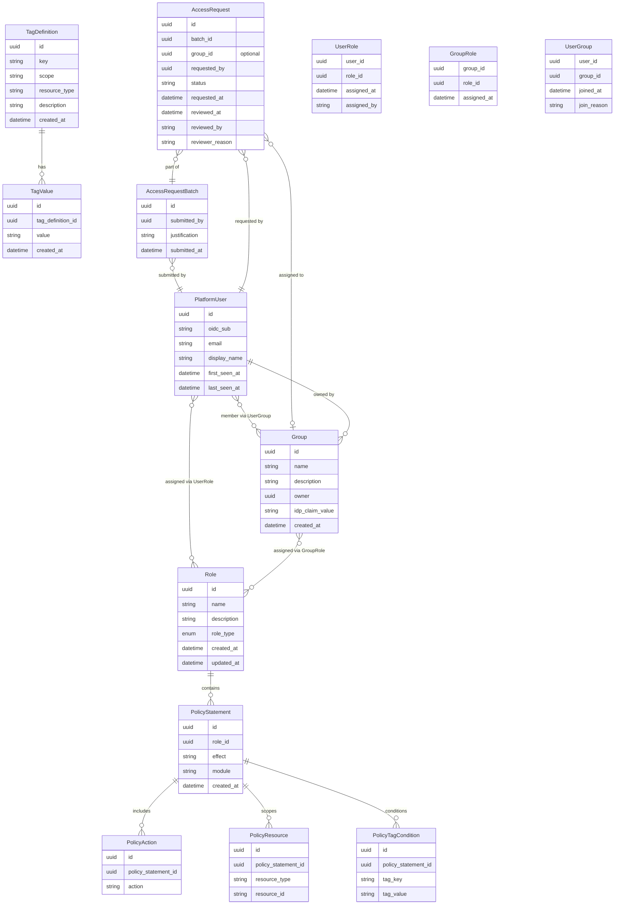
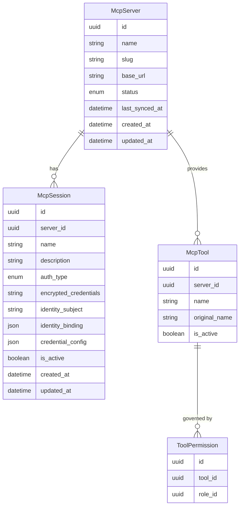
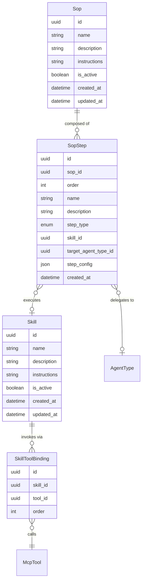
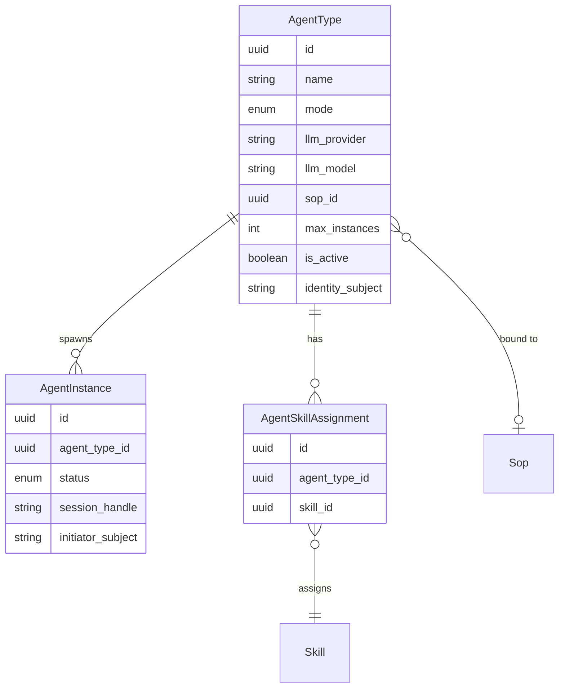
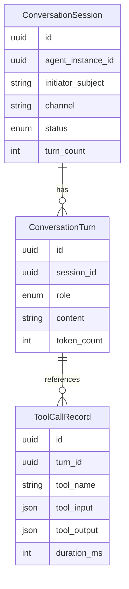
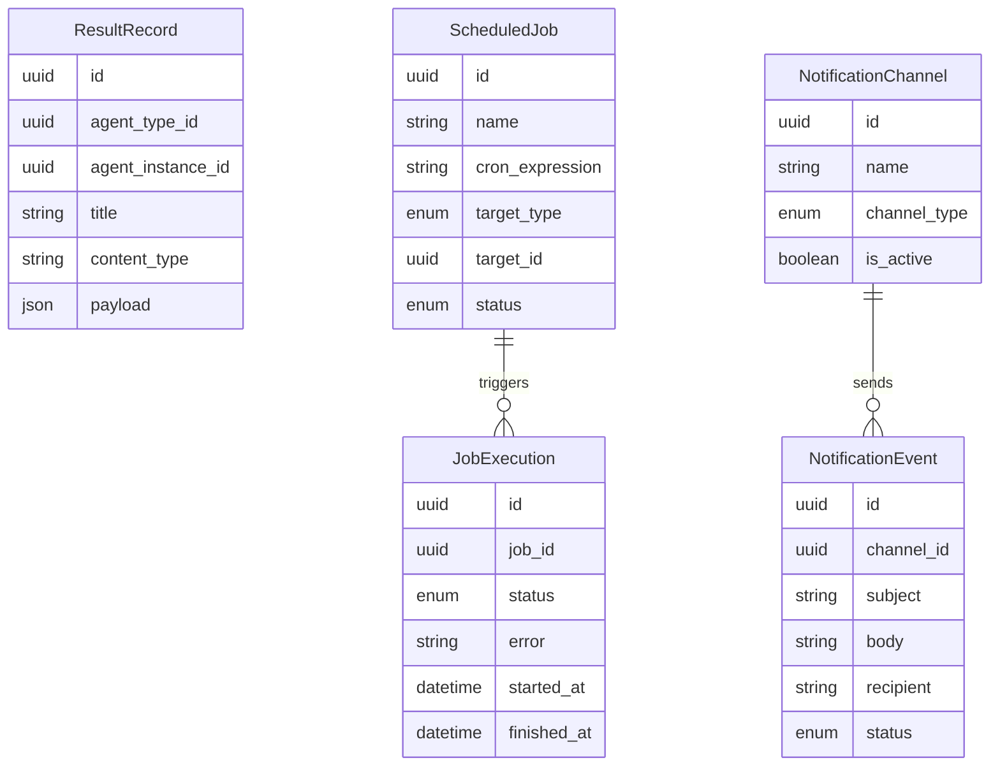
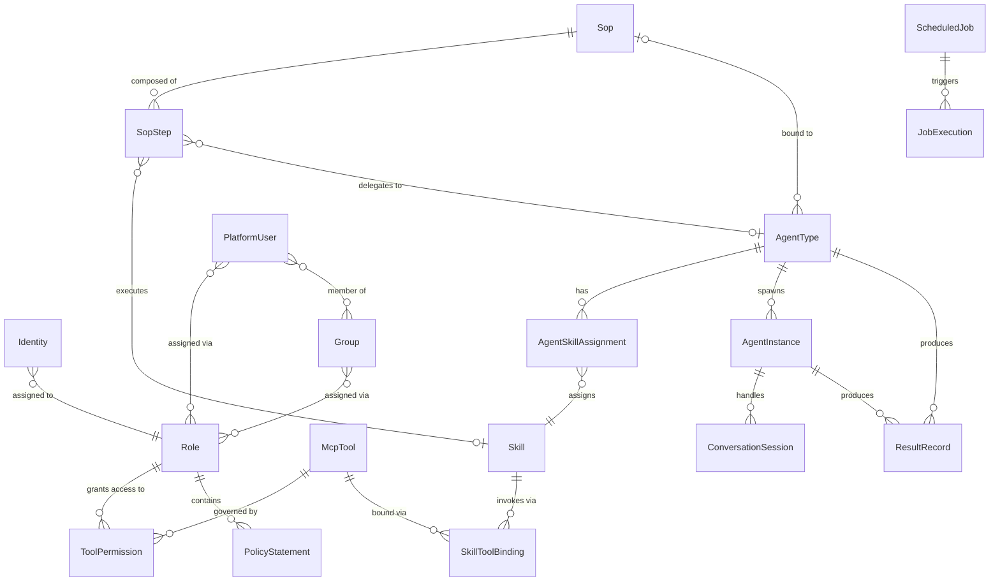

# Data Model Overview

Parthenon's data model is organised into six domains. Each section below contains the entity-relationship diagram for that domain with key business attributes. Cross-domain links are summarised in the last section.

For entity descriptions, see the module docs in `docs/master/data-model/modules/`.
Schema source files live in `backend/app/db/models/`.

---

## Identity & Access

**Sources**: `backend/app/db/models/identity.py`, `backend/app/db/models/identity_provider_config.py`, `backend/app/db/models/identity_provider_setup_state.py`

---

## User Permissions

**Sources**: `backend/app/db/models/tag_definition.py`, `backend/app/db/models/tag_value.py`, `backend/app/db/models/role.py`, `backend/app/db/models/policy_statement.py`, `backend/app/db/models/policy_action.py`, `backend/app/db/models/policy_resource.py`, `backend/app/db/models/policy_tag_condition.py`, `backend/app/db/models/platform_user.py`, `backend/app/db/models/user_role.py`, `backend/app/db/models/group.py`, `backend/app/db/models/group_role.py`, `backend/app/db/models/user_group.py`, `backend/app/db/models/access_request_batch.py`, `backend/app/db/models/access_request.py`

---

## MCP Hub

**Source**: `backend/app/db/models/mcp_hub.py`

---

## Skills & SOPs

**Source**: `backend/app/db/models/skills.py`

---

## Agent Management

**Source**: `backend/app/db/models/agents.py`

---

## Communication & Conversations

**Source**: `backend/app/db/models/conversations.py`

---

## Results, Scheduling & Notifications

**Sources**: `backend/app/db/models/results.py`, `backend/app/db/models/scheduling.py`, `backend/app/db/models/notifications.py`

---

## Cross-Domain Relationship Map

