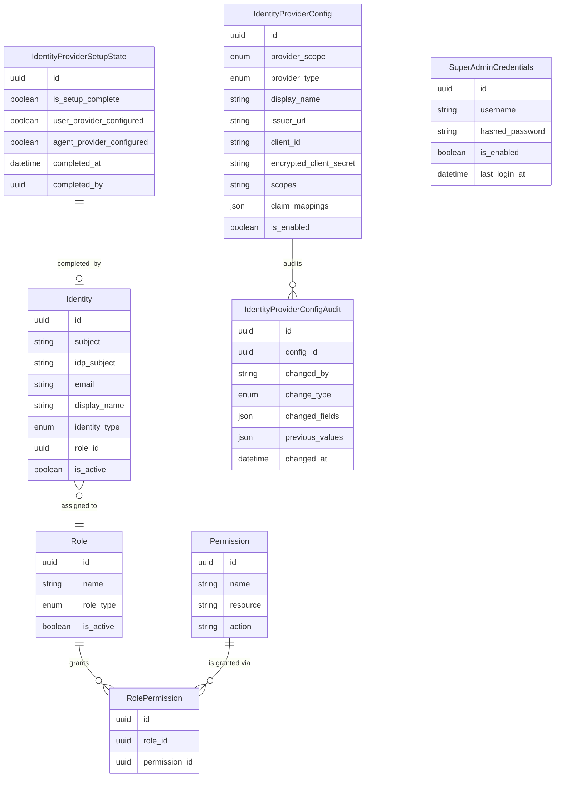
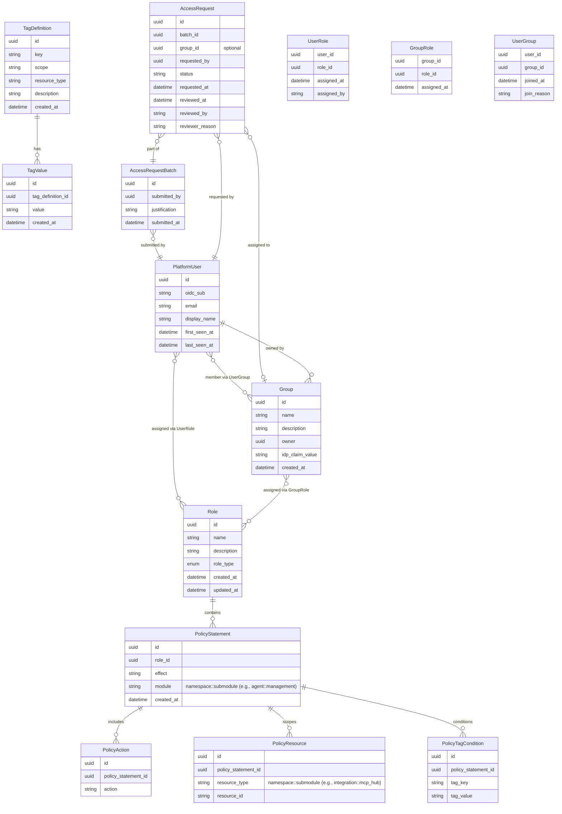
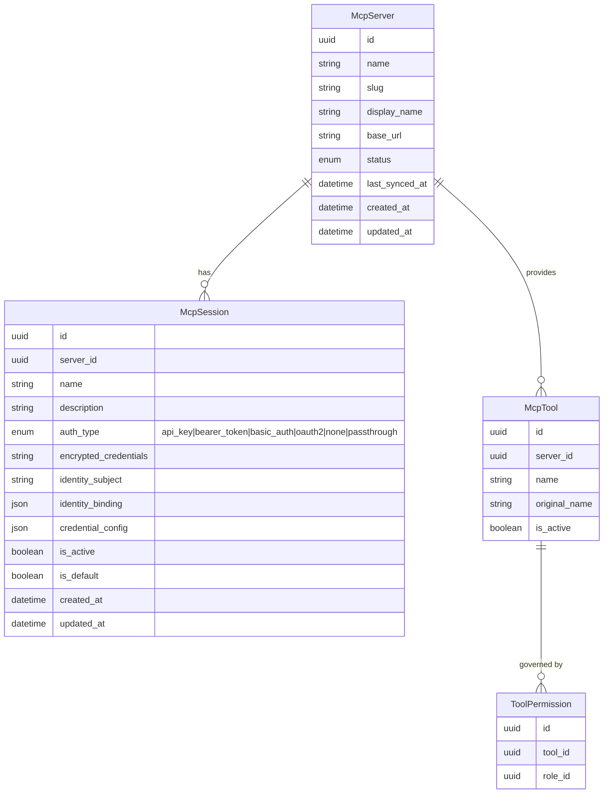
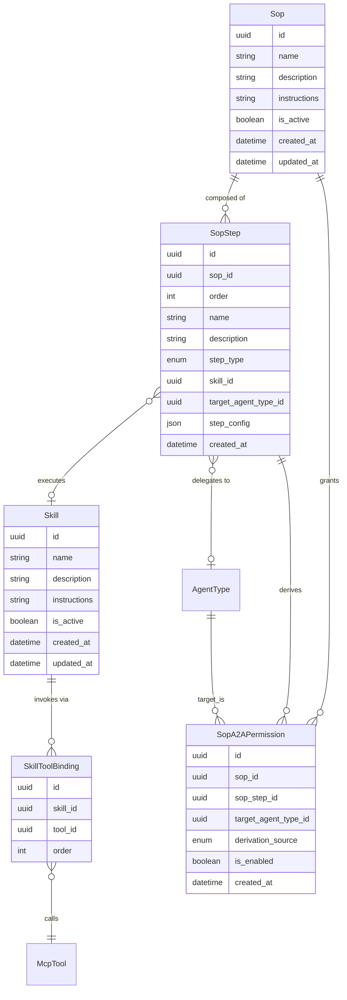
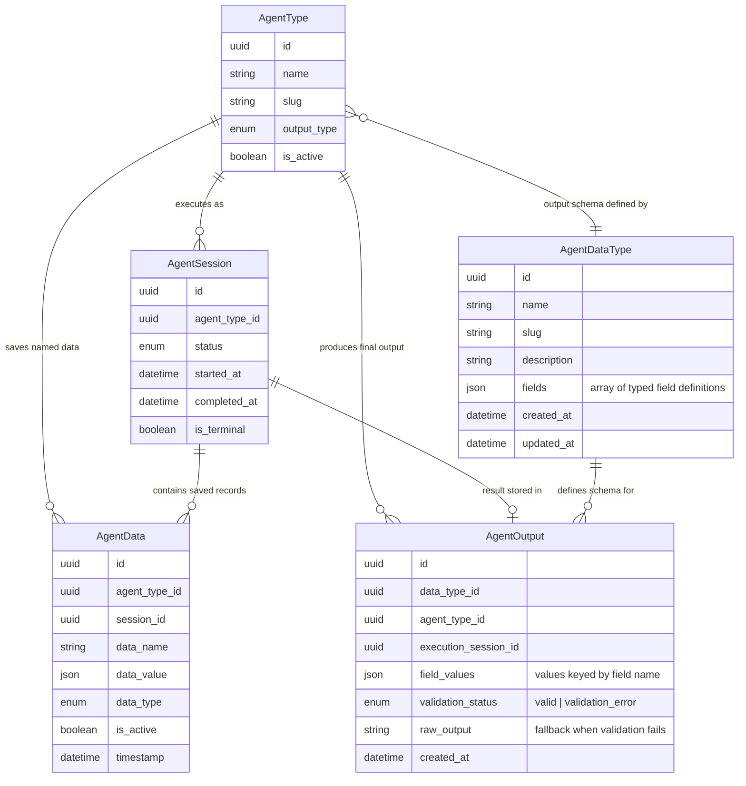
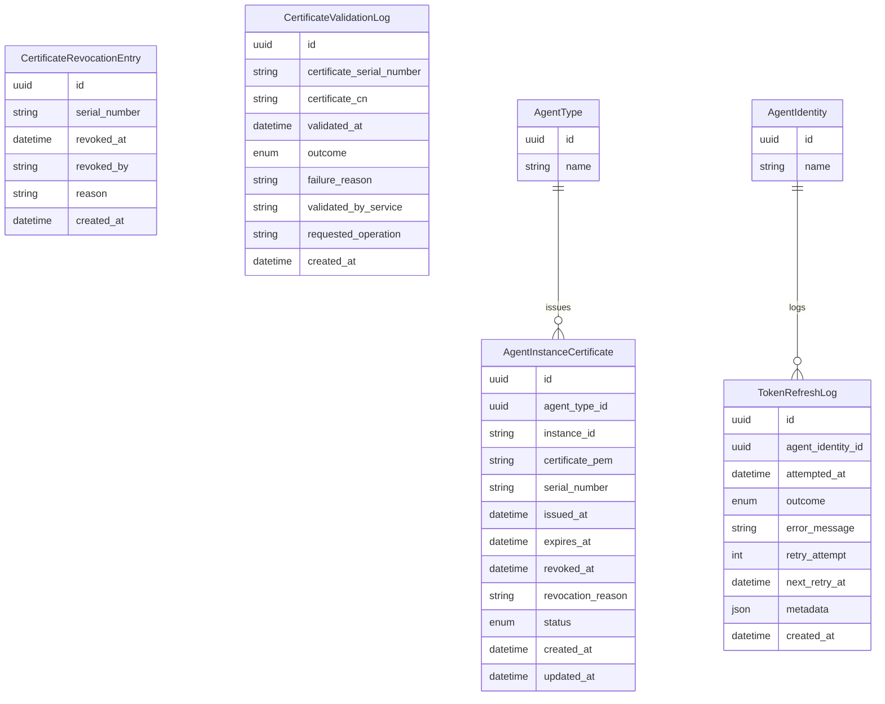
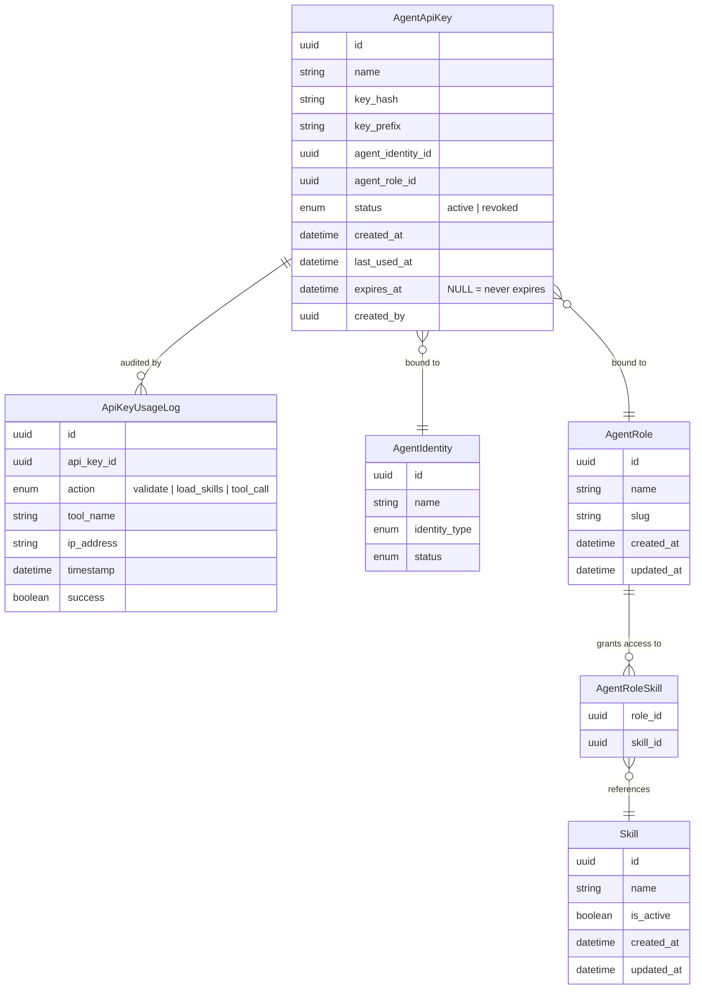
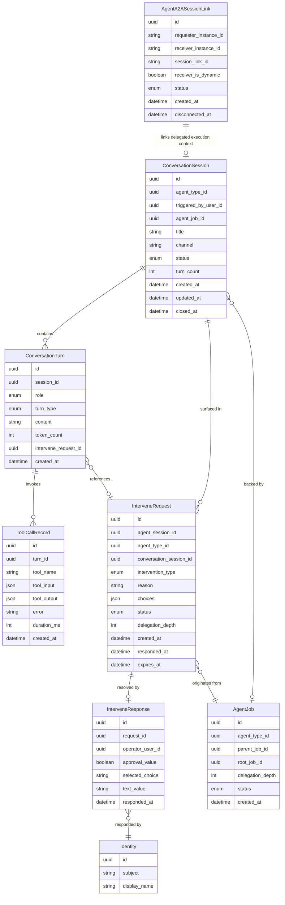
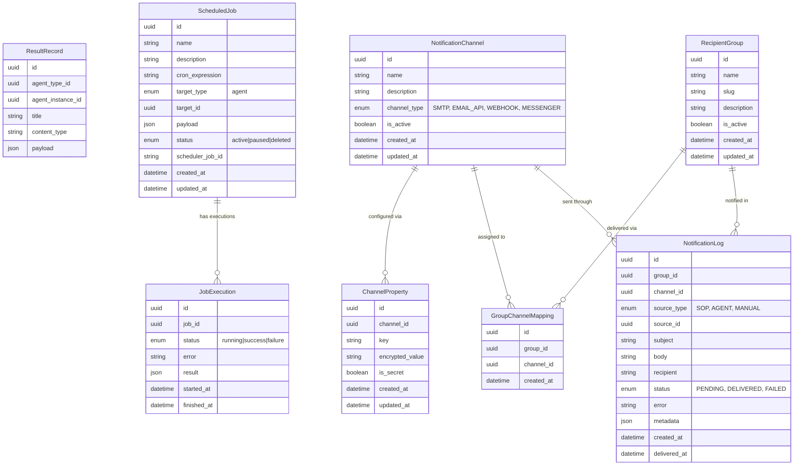
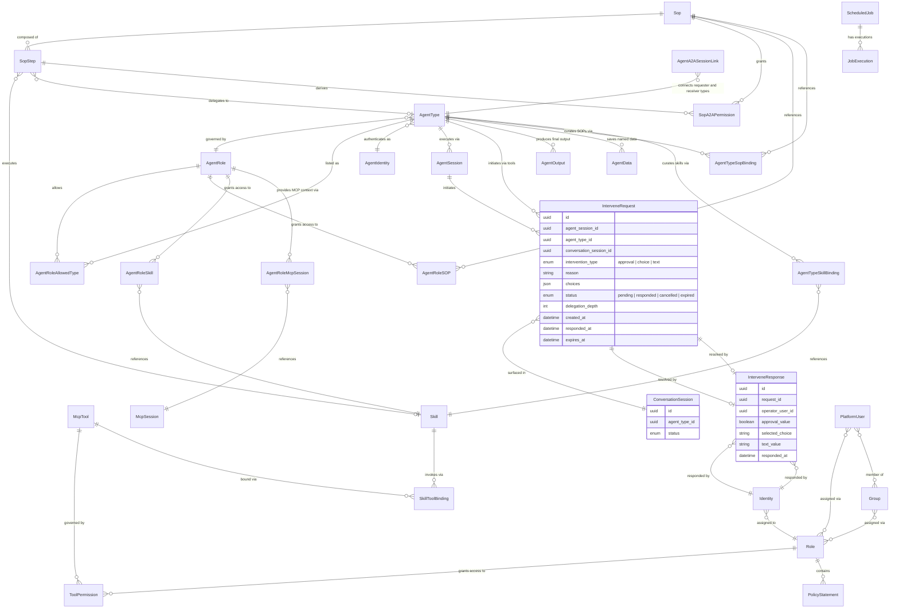

# Data Model Overview

Parthenon's data model is organised into the following domains. Each section below contains the entity-relationship diagram for that domain with key business attributes. Cross-domain links are summarised in the last section.

For entity descriptions, see the module docs in `docs/master/data-model/modules/`.
Schema source files live in `backend/app/db/models/`.

---

## Identity & Access

```mermaid
erDiagram
    Identity {
        uuid id
        string subject
        string idp_subject
        string email
        string display_name
        enum identity_type
        uuid role_id
        boolean is_active
    }
    Role {
        uuid id
        string name
        enum role_type
        boolean is_active
    }
    Permission {
        uuid id
        string name
        string resource
        string action
    }
    RolePermission {
        uuid id
        uuid role_id
        uuid permission_id
    }
    IdentityProviderConfig {
        uuid id
        enum provider_scope
        enum provider_type
        string display_name
        string issuer_url
        string client_id
        string encrypted_client_secret
        string scopes
        json claim_mappings
        boolean is_enabled
    }
    IdentityProviderConfigAudit {
        uuid id
        uuid config_id
        string changed_by
        enum change_type
        json changed_fields
        json previous_values
        datetime changed_at
    }
    IdentityProviderSetupState {
        uuid id
        boolean is_setup_complete
        boolean user_provider_configured
        boolean agent_provider_configured
        datetime completed_at
        uuid completed_by
    }
    SuperAdminCredentials {
        uuid id
        string username
        string hashed_password
        boolean is_enabled
        datetime last_login_at
    }

    Identity }o--|| Role : "assigned to"
    Role ||--o{ RolePermission : "grants"
    Permission ||--o{ RolePermission : "is granted via"
    IdentityProviderConfig ||--o{ IdentityProviderConfigAudit : "audits"
    IdentityProviderSetupState ||--o| Identity : "completed_by"
```

**Sources**: `backend/app/db/models/identity.py`, `backend/app/db/models/identity_provider_config.py`, `backend/app/db/models/identity_provider_config_audit.py`, `backend/app/db/models/identity_provider_setup_state.py`, `backend/app/db/models/super_admin_credentials.py`

---

## User Permissions

```mermaid
erDiagram
    TagDefinition ||--o{ TagValue : "has"
    Role ||--o{ PolicyStatement : "contains"
    PolicyStatement ||--o{ PolicyAction : "includes"
    PolicyStatement ||--o{ PolicyResource : "scopes"
    PolicyStatement ||--o{ PolicyTagCondition : "conditions"
    PlatformUser }o--o{ Role : "assigned via UserRole"
    PlatformUser }o--o{ Group : "member via UserGroup"
    Group }o--o{ Role : "assigned via GroupRole"
    Group }o--|| PlatformUser : "owned by"
    AccessRequestBatch }o--|| PlatformUser : "submitted by"
    AccessRequest }o--|| AccessRequestBatch : "part of"
    AccessRequest }o--o| Group : "assigned to"
    AccessRequest }o--|| PlatformUser : "requested by"

    TagDefinition {
        uuid id
        string key
        string scope
        string resource_type
        string description
        datetime created_at
    }
    TagValue {
        uuid id
        uuid tag_definition_id
        string value
        datetime created_at
    }
    Role {
        uuid id
        string name
        string description
        enum role_type
        datetime created_at
        datetime updated_at
    }
    PolicyStatement {
        uuid id
        uuid role_id
        string effect
        string module "namespace::submodule (e.g., agent::management)"
        datetime created_at
    }
    PolicyAction {
        uuid id
        uuid policy_statement_id
        string action
    }
    PolicyResource {
        uuid id
        uuid policy_statement_id
        string resource_type "namespace::submodule (e.g., integration::mcp_hub)"
        string resource_id
    }
    PolicyTagCondition {
        uuid id
        uuid policy_statement_id
        string tag_key
        string tag_value
    }
    PlatformUser {
        uuid id
        string oidc_sub
        string email
        string display_name
        datetime first_seen_at
        datetime last_seen_at
    }
    UserRole {
        uuid user_id
        uuid role_id
        datetime assigned_at
        string assigned_by
    }
    Group {
        uuid id
        string name
        string description
        uuid owner
        string idp_claim_value
        datetime created_at
    }
    GroupRole {
        uuid group_id
        uuid role_id
        datetime assigned_at
    }
    UserGroup {
        uuid user_id
        uuid group_id
        datetime joined_at
        string join_reason
    }
    AccessRequestBatch {
        uuid id
        uuid submitted_by
        string justification
        datetime submitted_at
    }
    AccessRequest {
        uuid id
        uuid batch_id
        uuid group_id "optional"
        uuid requested_by
        string status
        datetime requested_at
        datetime reviewed_at
        string reviewed_by
        string reviewer_reason
    }
```

> **Module::submodule naming convention**: `PolicyStatement.module` and `PolicyResource.resource_type` use a two-layer namespaced format (`module::submodule`, e.g. `agent::management`). There are three modules: `agent` (12 submodules — roles, identities, management, runtime_control, skills, sops, model_configs, schedules, trails, human_intervention, data_types, outputs), `integration` (mcp_hub, notifications), and `system` (observability, permissions, system_config). Wildcards are supported: `*::*` matches all resource types across all modules, and `module::*` matches all submodules within a given module. Legacy flat values (e.g. `agent`, `role`, `skill`, `mcp_server`) are no longer accepted — they have been migrated to their namespaced equivalents. Validation is enforced at the application layer via `ResourceTypeManifest`.

**Sources**: `backend/app/db/models/tag_definition.py`, `backend/app/db/models/tag_value.py`, `backend/app/db/models/role.py`, `backend/app/db/models/policy_statement.py`, `backend/app/db/models/policy_action.py`, `backend/app/db/models/policy_resource.py`, `backend/app/db/models/policy_tag_condition.py`, `backend/app/db/models/platform_user.py`, `backend/app/db/models/user_role.py`, `backend/app/db/models/group.py`, `backend/app/db/models/group_role.py`, `backend/app/db/models/user_group.py`, `backend/app/db/models/access_request_batch.py`, `backend/app/db/models/access_request.py`

---

## MCP Hub

```mermaid
erDiagram
    McpServer {
        uuid id
        string name
        string slug
        string display_name
        string base_url
        enum status
        datetime last_synced_at
        datetime created_at
        datetime updated_at
    }
    McpSession {
        uuid id
        uuid server_id
        string name
        string description
        enum auth_type "api_key|bearer_token|basic_auth|oauth2|none|passthrough"
        string encrypted_credentials
        string identity_subject
        json identity_binding
        json credential_config
        boolean is_active
        boolean is_default
        datetime created_at
        datetime updated_at
    }
    McpTool {
        uuid id
        uuid server_id
        string name
        string original_name
        boolean is_active
    }
    ToolPermission {
        uuid id
        uuid tool_id
        uuid role_id
    }

    McpServer ||--o{ McpSession : "has"
    McpServer ||--o{ McpTool : "provides"
    McpTool ||--o{ ToolPermission : "governed by"
```

**Business rules:**
- `passthrough` sessions forward the executing agent's identity to the MCP server at call time; no credentials are stored or required.
- `slug` is the canonical routing namespace for MCP tools and must be globally unique.
- At most one `McpSession` per `McpServer` may be marked `is_default = true`; a sole session is automatically treated as default.

**Source**: `backend/app/db/models/mcp_hub.py`

---

## Skills & SOPs

```mermaid
erDiagram
    Skill {
        uuid id
        string name
        string description
        string instructions
        boolean is_active
        datetime created_at
        datetime updated_at
    }
    SkillToolBinding {
        uuid id
        uuid skill_id
        uuid tool_id
        int order
    }
    Sop {
        uuid id
        string name
        string description
        string instructions
        boolean is_active
        datetime created_at
        datetime updated_at
    }
    SopStep {
        uuid id
        uuid sop_id
        int order
        string name
        string description
        enum step_type
        uuid skill_id
        uuid target_agent_type_id
        json step_config
        datetime created_at
    }
    SopA2APermission {
        uuid id
        uuid sop_id
        uuid sop_step_id
        uuid target_agent_type_id
        enum derivation_source
        boolean is_enabled
        datetime created_at
    }

    Skill ||--o{ SkillToolBinding : "invokes via"
    SkillToolBinding }o--|| McpTool : "calls"
    Sop ||--o{ SopStep : "composed of"
    SopStep }o--o| Skill : "executes"
    SopStep }o--o| AgentType : "delegates to"
    SopStep ||--o{ SopA2APermission : "derives"
    Sop ||--o{ SopA2APermission : "grants"
    AgentType ||--o{ SopA2APermission : "target_is"
```

**Source**: `backend/app/db/models/skills.py`

> **Skill versioning**: The `Skill.updated_at` timestamp is surfaced to MCP clients via the `load_skills` response. External agents use this to cache skill definitions locally and only re-download skills whose `updated_at` is newer than their cached copy.

---

## Agent Management

```mermaid
erDiagram
    ModelConfig {
        uuid id
        string name
        enum provider_type "12 providers — 4 incumbent (openai, anthropic, litellm_proxy, azure_openai) + 8 new (gemini, mistral, cohere, groq, together, fireworks, perplexity, deepseek). Adding a new value is a release-led activity."
        string api_endpoint
        string api_key_encrypted
        json enabled_models
        boolean is_active
        datetime created_at
        datetime updated_at
    }
    AgentRole {
        uuid id
        string name
        string description
        string slug
        datetime created_at
        datetime updated_at
    }
    AgentRoleAllowedType {
        uuid id
        uuid agent_role_id
        uuid allowed_agent_type_id
        datetime created_at
    }
    AgentRoleIdentity {
        uuid role_id
        uuid identity_id
        datetime assigned_at
        uuid assigned_by
        datetime created_at
    }
    AgentRoleSOP {
        uuid role_id
        uuid sop_id
    }
    AgentRoleSkill {
        uuid role_id
        uuid skill_id
    }
    AgentRoleMcpSession {
        uuid role_id
        uuid mcp_session_id
        uuid server_id
        datetime assigned_at
        uuid assigned_by
    }
    AgentIdentity {
        uuid id
        string name
        enum identity_type
        string auth_provider
        string realm_name
        string access_token_encrypted
        string refresh_token_encrypted
        string encrypted_refresh_token
        datetime token_expiry
        datetime last_token_refresh_at
        enum status
        enum token_status
        datetime created_at
        datetime updated_at
    }
    AgentType {
        uuid id
        string name
        string slug
        string display_name
        string description
        uuid identity_id
        uuid role_id
        string model_id
        string system_instruction
        enum input_type
        json input_schema
        enum output_type
        json output_schema
        uuid output_data_type_id "optional; linked when output_type=typed"
        boolean is_active
        datetime created_at
        datetime updated_at
    }
    AgentTypeSopBinding {
        uuid id
        uuid agent_type_id
        uuid sop_id
        int order
        datetime created_at
    }
    AgentTypeSkillBinding {
        uuid id
        uuid agent_type_id
        uuid skill_id
        int order
        datetime created_at
    }
    AgentSession {
        uuid id
        uuid agent_type_id
        uuid triggered_by_user_id
        uuid output_id "optional; convenience link"
        json input_data
        enum status "queued | running | waiting_for_human | completed | failed | terminated"
        datetime started_at
        datetime completed_at
        json output_data
        json conversation_history
        string error_message
        datetime created_at
    }
    AgentA2ASessionLink {
        uuid id
        string requester_instance_id
        string receiver_instance_id
        string session_link_id
        boolean receiver_is_dynamic
        enum status
        datetime created_at
        datetime disconnected_at
    }
    AgentData {
        uuid id
        uuid agent_type_id
        uuid session_id
        string data_name
        json data_value
        enum data_type
        boolean is_active
        datetime timestamp
    }
    AgentOutput {
        uuid id
        uuid data_type_id
        uuid agent_type_id
        uuid execution_session_id
        json field_values "values keyed by field name per the data type schema"
        enum validation_status "valid | validation_error"
        string raw_output "unstructured fallback when validation fails"
        datetime created_at
    }
    AgentDataType {
        uuid id
        string name
        string slug
        string description
        json fields "array of typed field definitions"
        datetime created_at
        datetime updated_at
    }

    AgentRole ||--o{ AgentRoleSOP : "grants access to"
    AgentRole ||--o{ AgentRoleSkill : "grants access to"
    AgentRole ||--o{ AgentRoleIdentity : "can be assumed by"
    AgentRole ||--o{ AgentRoleMcpSession : "provides MCP context via"
    AgentRole ||--o{ AgentRoleAllowedType : "allows"
    AgentType ||--o{ AgentRoleAllowedType : "listed as"
    AgentIdentity ||--o{ AgentRoleIdentity : "can assume"
    AgentPlan {
        uuid id
        uuid agent_type_id
        json plan_steps
        json topology
        enum generation_status
        string generation_error
        string agent_config_hash
        datetime generated_at
        datetime created_at
        datetime updated_at
    }

    AgentType }o--|| AgentRole : "governed by"
    AgentType }o--|| AgentIdentity : "authenticates as"
    AgentSession }o--|| AgentType : "executes"
    AgentType ||--o{ AgentA2ASessionLink : "participates via runtime instances"
    AgentType ||--o| AgentPlan : "has current plan"
    AgentType ||--o{ AgentInstanceCertificate : "issues"
    AgentType ||--o{ AgentTypeSopBinding : "binds SOPs via"
    AgentType ||--o{ AgentTypeSkillBinding : "binds skills via"
    AgentTypeSopBinding }o--|| Sop : "references"
    AgentTypeSkillBinding }o--|| Skill : "references"
    AgentIdentity ||--o{ TokenRefreshLog : "logs"
    AgentType ||--o{ AgentData : "saves named data"
    AgentSession ||--o{ AgentData : "contains saved records"
    AgentType ||--o{ AgentOutput : "produces final output"
    AgentSession ||--o| AgentOutput : "result stored in"
    AgentDataType ||--o{ AgentOutput : "defines schema for"
    AgentType }o--|| AgentDataType : "output schema defined by"
```

**Sources**: `backend/app/db/models/agents.py`, `backend/app/db/models/agent_data.py`, `backend/app/db/models/agent_output.py`, `backend/app/db/models/agent_data_type.py`, `backend/app/db/models/agent_security.py`

### Agent Execution Data Flow

Saved data (AgentData) is intermediate and optional — the `save_data` tool may be called zero or more times per session. Output (AgentOutput) is the final, singular result per session, produced once at execution completion.

```mermaid
erDiagram
    AgentType {
        uuid id
        string name
        string slug
        enum output_type
        boolean is_active
    }

    AgentSession {
        uuid id
        uuid agent_type_id
        enum status
        datetime started_at
        datetime completed_at
        boolean is_terminal
    }

    AgentData {
        uuid id
        uuid agent_type_id
        uuid session_id
        string data_name
        json data_value
        enum data_type
        boolean is_active
        datetime timestamp
    }

    AgentOutput {
        uuid id
        uuid data_type_id
        uuid agent_type_id
        uuid execution_session_id
        json field_values "values keyed by field name"
        enum validation_status "valid | validation_error"
        string raw_output "fallback when validation fails"
        datetime created_at
    }
    AgentDataType {
        uuid id
        string name
        string slug
        string description
        json fields "array of typed field definitions"
        datetime created_at
        datetime updated_at
    }

    AgentType ||--o{ AgentSession : "executes as"
    AgentType ||--o{ AgentData : "saves named data"
    AgentSession ||--o{ AgentData : "contains saved records"
    AgentType ||--o{ AgentOutput : "produces final output"
    AgentSession ||--o| AgentOutput : "result stored in"
    AgentDataType ||--o{ AgentOutput : "defines schema for"
    AgentType }o--|| AgentDataType : "output schema defined by"
```

**Source**: `backend/app/db/models/agent_data.py`, `backend/app/db/models/agent_output.py`, `backend/app/db/models/agent_data_type.py`

---

## Agent Runtime Security

```mermaid
erDiagram
    AgentInstanceCertificate {
        uuid id
        uuid agent_type_id
        string instance_id
        string certificate_pem
        string serial_number
        datetime issued_at
        datetime expires_at
        datetime revoked_at
        string revocation_reason
        enum status
        datetime created_at
        datetime updated_at
    }
    CertificateRevocationEntry {
        uuid id
        string serial_number
        datetime revoked_at
        string revoked_by
        string reason
        datetime created_at
    }
    TokenRefreshLog {
        uuid id
        uuid agent_identity_id
        datetime attempted_at
        enum outcome
        string error_message
        int retry_attempt
        datetime next_retry_at
        json metadata
        datetime created_at
    }
    CertificateValidationLog {
        uuid id
        string certificate_serial_number
        string certificate_cn
        datetime validated_at
        enum outcome
        string failure_reason
        string validated_by_service
        string requested_operation
        datetime created_at
    }
    AgentType {
        uuid id
        string name
    }
    AgentIdentity {
        uuid id
        string name
    }

    AgentType ||--o{ AgentInstanceCertificate : "issues"
    AgentIdentity ||--o{ TokenRefreshLog : "logs"
```

**Sources**: `backend/app/db/models/agent_security.py`

### API Key Access

```mermaid
erDiagram
    AgentApiKey {
        uuid id
        string name
        string key_hash
        string key_prefix
        uuid agent_identity_id
        uuid agent_role_id
        enum status "active | revoked"
        datetime created_at
        datetime last_used_at
        datetime expires_at "NULL = never expires"
        uuid created_by
    }
    ApiKeyUsageLog {
        uuid id
        uuid api_key_id
        enum action "validate | load_skills | tool_call"
        string tool_name
        string ip_address
        datetime timestamp
        boolean success
    }
    AgentIdentity {
        uuid id
        string name
        enum identity_type
        enum status
    }
    AgentRole {
        uuid id
        string name
        string slug
        datetime created_at
        datetime updated_at
    }
    Skill {
        uuid id
        string name
        boolean is_active
        datetime created_at
        datetime updated_at
    }
    AgentRoleSkill {
        uuid role_id
        uuid skill_id
    }

    AgentApiKey }o--|| AgentIdentity : "bound to"
    AgentApiKey }o--|| AgentRole : "bound to"
    AgentApiKey ||--o{ ApiKeyUsageLog : "audited by"
    AgentRole ||--o{ AgentRoleSkill : "grants access to"
    AgentRoleSkill }o--|| Skill : "references"
```

**Source**: `backend/app/db/models/agent_api_key.py`

**Business rules:**
- Keys inherit the full permission set of the bound `AgentRole` — no per-tool or per-SOP scoping on the key itself.
- One active key per identity-role pair at a time; `status` is `active` or `revoked`.
- `key_hash` uses SHA-256; the raw key is never stored after creation.
- `key_prefix` identifies the key type visually (e.g. `phn_sk_`) without exposing the secret.
- `last_used_at` is updated on each successful authentication.
- `expires_at` optionally sets a key expiry; `NULL` means the key never expires, and a past value causes the key to be rejected at authentication.
- `ApiKeyUsageLog` entries are append-only and capture the action type, tool name (when applicable), client IP, and success/failure for every API key operation.

---

## Communication & Conversations

```mermaid
erDiagram
    ConversationSession {
        uuid id
        uuid agent_type_id
        uuid triggered_by_user_id
        uuid agent_job_id
        string title
        string channel
        enum status
        int turn_count
        datetime created_at
        datetime updated_at
        datetime closed_at
    }
    ConversationTurn {
        uuid id
        uuid session_id
        enum role
        enum turn_type
        string content
        int token_count
        uuid intervene_request_id
        datetime created_at
    }
    ToolCallRecord {
        uuid id
        uuid turn_id
        string tool_name
        json tool_input
        json tool_output
        string error
        int duration_ms
        datetime created_at
    }
    InterveneRequest {
        uuid id
        uuid agent_session_id
        uuid agent_type_id
        uuid conversation_session_id
        enum intervention_type
        string reason
        json choices
        enum status
        int delegation_depth
        datetime created_at
        datetime responded_at
        datetime expires_at
    }
    InterveneResponse {
        uuid id
        uuid request_id
        uuid operator_user_id
        boolean approval_value
        string selected_choice
        string text_value
        datetime responded_at
    }
    AgentJob {
        uuid id
        uuid agent_type_id
        uuid parent_job_id
        uuid root_job_id
        int delegation_depth
        enum status
        datetime created_at
    }
    Identity {
        uuid id
        string subject
        string display_name
    }
    AgentA2ASessionLink {
        uuid id
        string requester_instance_id
        string receiver_instance_id
        string session_link_id
        boolean receiver_is_dynamic
        enum status
        datetime created_at
        datetime disconnected_at
    }

    ConversationSession ||--o{ ConversationTurn : "contains"
    ConversationTurn ||--o{ ToolCallRecord : "invokes"
    ConversationTurn }o--o| InterveneRequest : "references"
    InterveneRequest }o--|| ConversationSession : "surfaced in"
    InterveneRequest }o--|| AgentJob : "originates from"
    InterveneRequest ||--o| InterveneResponse : "resolved by"
    InterveneResponse }o--|| Identity : "responded by"
    ConversationSession }o--o| AgentJob : "backed by"
    AgentA2ASessionLink ||--o| ConversationSession : "links delegated execution context"
```

**Source**: `backend/app/db/models/conversations.py`, `backend/app/db/models/intervene.py`, `backend/app/db/models/agents.py`

---

## Results, Scheduling & Notifications

```mermaid
erDiagram
    ResultRecord {
        uuid id
        uuid agent_type_id
        uuid agent_instance_id
        string title
        string content_type
        json payload
    }
    ScheduledJob {
        uuid id
        string name
        string description
        string cron_expression
        enum target_type "agent"
        uuid target_id
        json payload
        enum status "active|paused|deleted"
        string scheduler_job_id
        datetime created_at
        datetime updated_at
    }
    JobExecution {
        uuid id
        uuid job_id
        enum status "running|success|failure"
        string error
        json result
        datetime started_at
        datetime finished_at
    }
    NotificationChannel {
        uuid id
        string name
        string description
        enum channel_type "SMTP, EMAIL_API, WEBHOOK, MESSENGER"
        boolean is_active
        datetime created_at
        datetime updated_at
    }
    ChannelProperty {
        uuid id
        uuid channel_id
        string key
        string encrypted_value
        boolean is_secret
        datetime created_at
        datetime updated_at
    }
    RecipientGroup {
        uuid id
        string name
        string slug
        string description
        boolean is_active
        datetime created_at
        datetime updated_at
    }
    GroupChannelMapping {
        uuid id
        uuid group_id
        uuid channel_id
        datetime created_at
    }
    NotificationLog {
        uuid id
        uuid group_id
        uuid channel_id
        enum source_type "SOP, AGENT, MANUAL"
        uuid source_id
        string subject
        string body
        string recipient
        enum status "PENDING, DELIVERED, FAILED"
        string error
        json metadata
        datetime created_at
        datetime delivered_at
    }

    ScheduledJob ||--o{ JobExecution : "has executions"
    NotificationChannel ||--o{ ChannelProperty : "configured via"
    NotificationChannel ||--o{ GroupChannelMapping : "assigned to"
    RecipientGroup ||--o{ GroupChannelMapping : "delivered via"
    RecipientGroup ||--o{ NotificationLog : "notified in"
    NotificationChannel ||--o{ NotificationLog : "sent through"
```

**Entity notes:**
- `NotificationChannel` — a configured outbound destination (SMTP relay, Email API, webhook endpoint, or Instant Messenger connector). One channel can serve multiple recipient groups.
- `ChannelProperty` — individual key-value configuration for a channel. Secret properties (`is_secret=true`) are encrypted at rest and never returned in API responses.
- `RecipientGroup` — a named, addressable audience. Agents and SOPs target a group by `slug`; the platform resolves all assigned channels and delivers to each.
- `GroupChannelMapping` — many-to-many association between recipient groups and channels.
- `NotificationLog` — immutable delivery record per channel attempt. Records source (`SOP`, `AGENT`, or `MANUAL`), delivery status, and any error detail.

**Sources**: `backend/app/db/models/results.py`, `backend/app/db/models/scheduling.py`, `backend/app/db/models/notifications.py`

---

## Cross-Domain Relationship Map

```mermaid
erDiagram
    Identity }o--|| Role : "assigned to"
    Role ||--o{ ToolPermission : "grants access to"
    McpTool ||--o{ ToolPermission : "governed by"
    McpTool ||--o{ SkillToolBinding : "bound via"
    Skill ||--o{ SkillToolBinding : "invokes via"
    Sop ||--o{ SopStep : "composed of"
    SopStep }o--o| Skill : "executes"
    SopStep }o--o| AgentType : "delegates to"
    SopStep ||--o{ SopA2APermission : "derives"
    Sop ||--o{ SopA2APermission : "grants"
    AgentType }o--|| AgentRole : "governed by"
    AgentRole ||--o{ AgentRoleAllowedType : "allows"
    AgentType ||--o{ AgentRoleAllowedType : "listed as"
    AgentRole ||--o{ AgentRoleSOP : "grants access to"
    AgentRoleSOP }o--|| Sop : "references"
    AgentRole ||--o{ AgentRoleSkill : "grants access to"
    AgentRoleSkill }o--|| Skill : "references"
    AgentRole ||--o{ AgentRoleMcpSession : "provides MCP context via"
    AgentRoleMcpSession }o--|| McpSession : "references"
    AgentType }o--|| AgentIdentity : "authenticates as"
    ConversationSession {
        uuid id
        uuid agent_type_id
        enum status
    }
    InterveneRequest {
        uuid id
        uuid agent_session_id
        uuid agent_type_id
        uuid conversation_session_id
        enum intervention_type "approval | choice | text"
        string reason
        json choices
        enum status "pending | responded | cancelled | expired"
        int delegation_depth
        datetime created_at
        datetime responded_at
        datetime expires_at
    }
    InterveneResponse {
        uuid id
        uuid request_id
        uuid operator_user_id
        boolean approval_value
        string selected_choice
        string text_value
        datetime responded_at
    }

    AgentSession ||--o{ InterveneRequest : "initiates"
    InterveneRequest }o--|| ConversationSession : "surfaced in"
    InterveneRequest ||--o| InterveneResponse : "resolved by"
    InterveneResponse }o--|| Identity : "responded by"

    AgentType ||--o{ AgentSession : "executes via"
    AgentA2ASessionLink }o--|| AgentType : "connects requester and receiver types"
    AgentType ||--o{ InterveneRequest : "initiates via tools"
    InterveneRequest ||--o| InterveneResponse : "resolved by"
    InterveneResponse }o--|| Identity : "responded by"
    AgentType ||--o{ AgentOutput : "produces final output"
    AgentType ||--o{ AgentData : "saves named data"
    AgentType ||--o{ AgentTypeSopBinding : "curates SOPs via"
    AgentTypeSopBinding }o--|| Sop : "references"
    AgentType ||--o{ AgentTypeSkillBinding : "curates skills via"
    AgentTypeSkillBinding }o--|| Skill : "references"
    ScheduledJob ||--o{ JobExecution : "has executions"
    Role ||--o{ PolicyStatement : "contains"
    PlatformUser }o--o{ Role : "assigned via"
    PlatformUser }o--o{ Group : "member of"
    Group }o--o{ Role : "assigned via"
```
