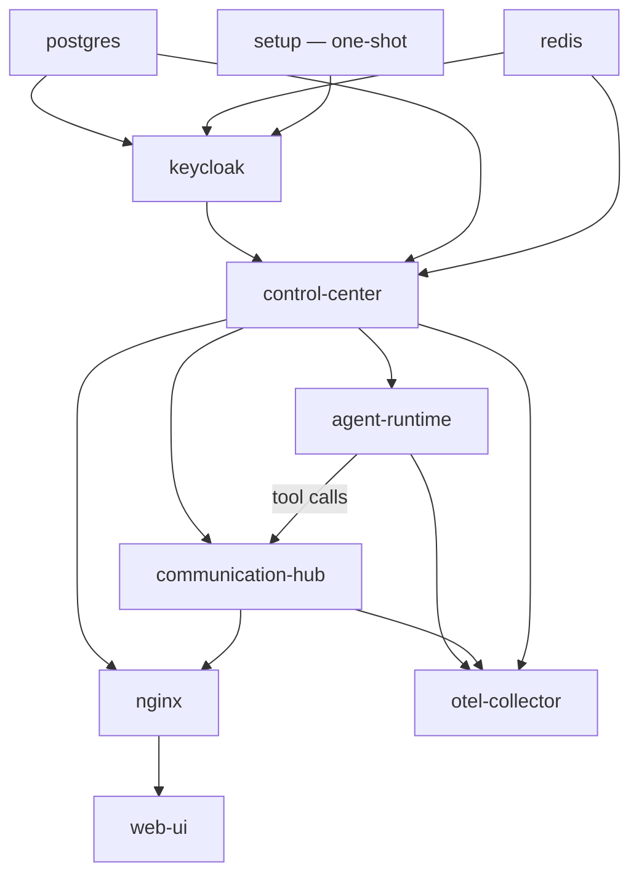

# Services — Master Inventory

All containers and pods that make up a complete Parthenon deployment. Update this file whenever a service is added, removed, or renamed.

This inventory applies to both deployment targets:
- **Docker Compose** (self-hosted / development): container names match the `Container / Pod Name` column
- **Kubernetes / Helm** (production): pod names are derived from the Helm release name and the service name using the `_helpers.tpl` `fullname` helper

---

## Service Inventory

| Service | Container / Pod Name | Role |
|---------|----------------------|------|
| API Gateway | `nginx` | Reverse proxy routing all inbound HTTP and WebSocket traffic to Control Center and Communication Hub; TLS termination in production |
| Control Center | `control-center` | Sole owner of the PostgreSQL database. Hosts the Platform REST API (identity, MCP Hub, skills, agents, scheduling, notifications, conversations, results), acts as Certificate Authority (issues X.509 certs to Agent Runtime and Communication Hub), manages identity tokens, runs the OIDC Provider Registry (dynamic discovery of identity providers configured in the database), authenticates super admin logins (local credential path for bootstrap/recovery), and triggers execution and message dispatch on peer services. At startup, validates the identity provider configuration (does NOT provision — provisioning is handled by the consolidated setup tool) and logs the configuration source for every infrastructure connection (env var, YAML, or default). |
| Setup Tool | `setup` (profiles: `[setup]`) | Consolidated setup CLI run as a one-shot service. Provisions the Keycloak realm, clients, roles, and admin user; verifies database readiness and seeds roles/permissions/skills; bootstraps the certificate authority for mTLS. Requires Keycloak admin credentials but runs independently of runtime services — never triggered by application startup. Exits after completing. |
| Agent Runtime | `agent-runtime` | Stateless LangChain executor. Receives execution triggers from Control Center over mTLS. Fetches all agent context (plan, skills, model config) from Control Center data APIs. Executes the observe-reason-act loop. Posts results back to Control Center. No direct database access. |
| Communication Hub | `communication-hub` | Message broker and agent gateway. Accepts Web UI WebSocket connections authenticated by JWT. Accepts MCP connections from external third-party agents authenticated via API key (Bearer token or query parameter) in addition to internal Agent Runtime agents authenticated via mTLS certificates. Receives message dispatch commands from Control Center over mTLS. Validates agent certificates and resolves identity per tool call via Control Center. Routes all tool calls using the unified `server____tool` convention — `system____*` to internal handlers (including `system____load_skills` for external agent skill discovery with incremental sync), `<server>____*` to MCP Hub. No direct database access. |
| Keycloak | `parthenon-keycloak` | Bundled OpenID Connect identity provider; manages the `parthenon` realm (human users) and `ai_agents` realm (agent identities). **Optional in production** — only required for dev/demo deployments or when no external OIDC providers are configured in the database. If all identity providers are configured via the System Config UI with external OIDC, the Keycloak service can be omitted. |
| Web UI | `web-ui` | React/Vite SPA providing admin configuration modules, real-time operations dashboards, observability panels, and user-to-agent chat |
| OTEL Collector | `otel-collector` | Receives OTLP telemetry (traces, metrics, logs) from all services; fans out to Prometheus, Jaeger, and Loki backends |
| PostgreSQL | `postgres` | Primary relational data store — accessed only by Control Center |
| Redis | `redis` | In-memory data store for Control Center cache/pubsub, Communication Hub session context, and Agent Session Queue |
| MCP Demo App | `parthenon-mcp-demo-app` | Standalone MCP server demonstrating end-to-end dual-identity propagation. Authenticates with the `ai_agents` realm (agent identities) and optionally the `parthenon` realm (user identities) when `KEYCLOAK_USER_REALM` is configured. Registers with the MCP Hub under slug `demo`. Exposes three tools: `helloWorld` (no role gating), `helloAgent` (requires agent `mcp_role: demo_agent`), and `helloUser` (requires user `mcp_role: demo_user`). Requires either a single realm (backward-compatible) or two realms for full dual-identity validation coverage. Keycloak data is persisted via a Docker volume to survive container restarts. |

---

## Data Access Boundaries

| Service | Database | Redis |
|---------|----------|-------|
| **Control Center** | Direct read/write (sole owner) | Read/write (cache, pubsub) |
| **Agent Runtime** | None — all data via Control Center APIs | None |
| **Communication Hub** | None — all data via Control Center APIs | Read/write (session context, pubsub) |

---

## Control Center Internal API Boundary Model

The Control Center internal API is caller-scoped and deny-by-default. Access is granted only when all of the following are true:
- caller certificate is valid and maps to a known service identity
- caller type matches policy (`agent_runtime` or `communication_hub`)
- route and method are explicitly allowlisted for that caller type

### Caller-specific deployment notes

| Caller Type | Allowed Internal API Surface | Explicitly Disallowed |
|-------------|------------------------------|-----------------------|
| Agent Runtime | Runtime-essential certificate lifecycle and execution support endpoints required to run agent sessions | Communication Hub-only internal routes, administrative policy routes, and any endpoint not explicitly in the Agent Runtime allowlist |
| Communication Hub | Hub-essential certificate validation, token-resolution support, API key validation (`POST /internal/auth/validate-api-key`), and routing support endpoints required for message and tool-call brokering | Agent Runtime-only internal routes, administrative policy routes, and any endpoint not explicitly in the Communication Hub allowlist |

### Service boundary guarantees

- Agent Runtime and Communication Hub never receive database credentials or direct database routes.
- Caller-specific policy ownership remains in Control Center and is versioned for audit and rollback.
- Unknown caller types, missing caller identity, and certificate mismatches are denied by default.

---

## Agent Execution Guardrails — Responsibility Boundaries and Rollout Order

Use this model for the `add-agent-execution-guardrails` deployment and future guardrail revisions.

### Responsibility boundaries

| Service | Guardrail responsibility |
|---------|--------------------------|
| Control Center | Policy source of truth, policy snapshot resolution, and persistence of structured guardrail stop reasons and conversational token telemetry |
| Communication Hub | Forwarding boundary that preserves policy snapshot, stop-reason metadata, and conversational token telemetry without remapping |
| Agent Runtime | Execution-time guardrail enforcement (cycle detection, cumulative iteration limits, timeout, delegation depth/step budgets, mode-aware token behavior) |

### Rollout order

1. Deploy Control Center first to ensure policy and persistence readiness.
2. Deploy Communication Hub second to preserve guardrail metadata across direct and delegated routes.
3. Deploy Agent Runtime third to activate enforcement against an already compatible policy and forwarding contract.

### Boundary guardrails

- Agent Runtime and Communication Hub must not become policy owners.
- Agent Runtime and Communication Hub must not gain direct database access.
- Guardrail metadata contracts must remain stable across service boundaries during rollout and rollback.

---

## Service Dependencies

All services depend on `postgres` and `redis` being healthy. Keycloak is optional in production — only start it for dev/demo deployments or when `SUPER_ADMIN_ENABLED=true` with no OIDC DB config and the setup wizard provisions the bundled Keycloak. Agent Runtime and Communication Hub bootstrap by requesting certificates from Control Center — Control Center must be healthy before they start. `nginx` must be deployed after all backend services are healthy. `mcp-demo-app` depends on `keycloak` (healthy) and `control-center` (healthy).

The **setup tool** (`profiles: [setup]`) is a one-shot service that runs BEFORE the runtime services. It provisions the Keycloak realm and bootstraps certificates using Keycloak admin credentials, then exits. The Control Center no longer auto-provisions Keycloak — it validates the existing configuration at startup and fails if the realm is not found.
