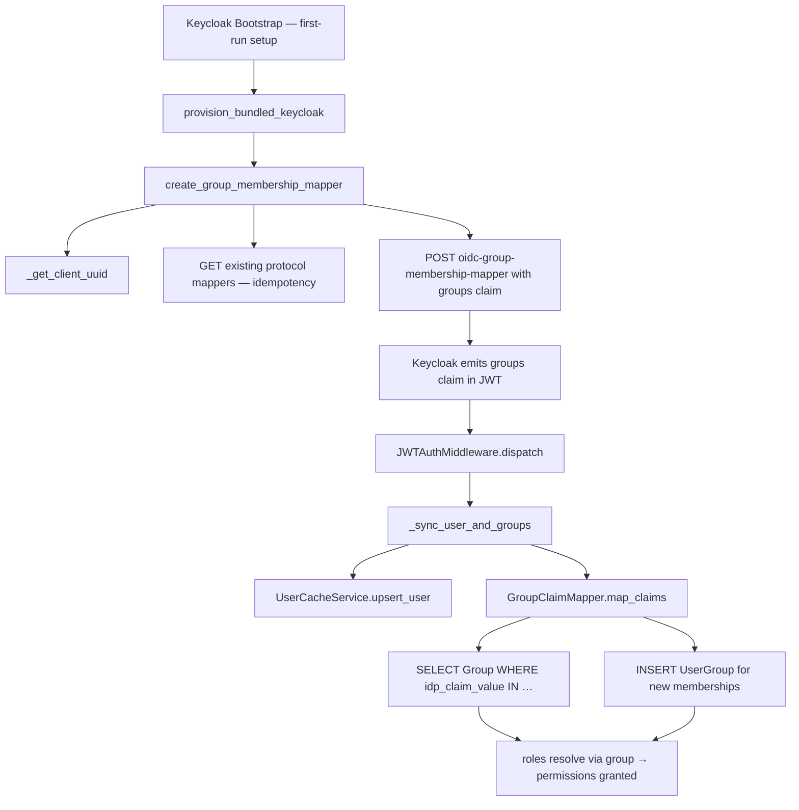

# Module: auth — Tech Spec

## Overview

The auth module covers the JWT authentication and group claim processing pipeline that bridges the identity provider (Keycloak) with the platform's internal group-based permission system. It spans three concerns:

1. **JWT Validation & User Sync**: The `JWTAuthMiddleware` validates every bearer token, stores the raw token for passthrough forwarding, upserts a `PlatformUser` record, and maps IdP group claims to `UserGroup` memberships — all as fire-and-log side effects that never block the request on failure.

2. **Group Claim Mapping**: The `GroupClaimMapper` matches JWT `groups` claim values against `Group.idp_claim_value` entries and idempotently creates `UserGroup` membership records, enabling automatic group assignment without manual intervention.

3. **Keycloak Provisioning — Group Mapper**: During bundled Keycloak bootstrap (`provision_bundled_keycloak`), the `KeycloakAdminClient.create_group_membership_mapper` method adds an OIDC "Group Membership" protocol mapper to the `{client_id}-ui` public client. This causes Keycloak to emit the `groups` claim in JWT tokens, completing the end-to-end chain: provision mapper → emit claim → map to groups.

No new API endpoints. No database changes.

> **Cross-module note**: The `JWTAuthMiddleware` class and its token validation logic are documented in the [foundation tech-spec](../foundation/tech-spec.md). The `KeycloakAdminClient`, `IdentityBootstrapService`, and `GroupClaimMapper` are documented in the [identity tech-spec](../identity/tech-spec.md). This module focuses on the auth pipeline aspects — specifically group claim provisioning, mapping, and the middleware's user/group sync integration.

---

## Key Components

### Keycloak Provisioning — Group Claim Mapper

| Component | Description |
|-----------|-------------|
| `create_group_membership_mapper` | Async, idempotent method on `KeycloakAdminClient` that adds the `oidc-group-membership-mapper` protocol mapper to a Keycloak OIDC client. Checks for existing mapper first; configures `full.path=false`, `claim.name=groups`, and `id.token.claim`/`access.token.claim`/`userinfo.token.claim` all `true`. The resulting `groups` claim feeds into `GroupClaimMapper`. |
| `_get_client_uuid` | Private helper on `KeycloakAdminClient` to resolve a Keycloak client's internal UUID from its `clientId` string; used by `create_group_membership_mapper` before creating the mapper. |
| `provision_bundled_keycloak` | Method on `IdentityBootstrapService`; calls `create_group_membership_mapper` after creating the `{client_id}-ui` public client during first-run setup. Wrapped in try-except (fire-and-log) so mapper failure does not block provisioning. |

### JWT Auth Middleware — User & Group Sync

| Component | Description |
|-----------|-------------|
| `JWTAuthMiddleware._sync_user_and_groups` | Private method on `JWTAuthMiddleware`; called after every successful JWT validation. Upserts the `PlatformUser` record via `UserCacheService`, stores `request.state.platform_user_id`, and if the token contains a `groups` claim, delegates to `GroupClaimMapper.map_claims()` to create `UserGroup` memberships. All failures are logged at WARNING level without failing the request. |

### Group Claim Mapping

| Component | Description |
|-----------|-------------|
| `GroupClaimMapper.map_claims` | Idempotently maps a list of JWT group claim strings to `UserGroup` records. Queries `Group` rows where `idp_claim_value` matches a claim, compares against existing memberships for the user, and creates new `UserGroup` records with join reason `"Auto-assigned via IdP claim mapping"`. Returns the list of newly assigned group IDs. |

---

## End-to-End Flow

---

## Code Reference Map

### Keycloak Provisioning — Group Mapper

| Symbol | Type | Description | File |
|--------|------|-------------|------|
| `create_group_membership_mapper` | method | Adds OIDC group membership mapper to a Keycloak client (idempotent); configures `groups` claim for ID, access, and userinfo tokens | `backend/app/services/identity/keycloak_admin_client.py` |
| `_get_client_uuid` | private method | Helper to fetch Keycloak internal UUID for a client by clientId | `backend/app/services/identity/keycloak_admin_client.py` |
| `provision_bundled_keycloak` | method | Calls `create_group_membership_mapper` after client creation during first-run setup | `backend/app/services/identity/bootstrap_service.py` |

### Group Claim Processing

| Symbol | Type | Description | File |
|--------|------|-------------|------|
| `GroupClaimMapper.map_claims` | method | Maps JWT `groups` claim values to `UserGroup` membership records (idempotent); returns newly assigned group IDs | `backend/app/services/permissions/group_claim_mapper.py` |
| `JWTAuthMiddleware._sync_user_and_groups` | method | Extracts `groups` claim from JWT after validation; upserts `PlatformUser` via `UserCacheService`; delegates group claim mapping to `GroupClaimMapper`; fire-and-log on failure | `backend/app/middleware/auth.py` |
